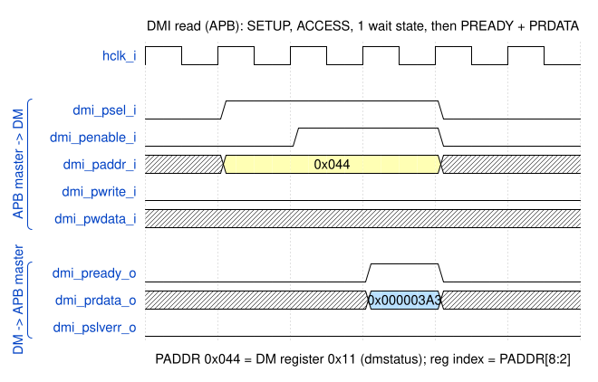
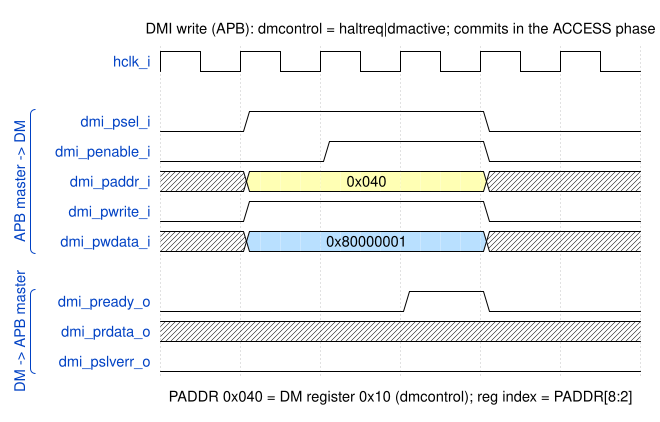
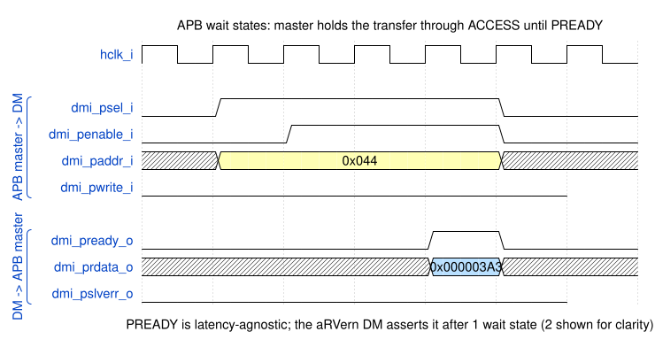
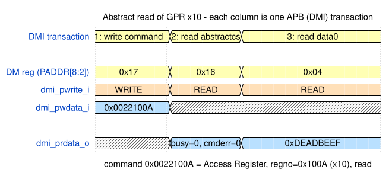

<h1>
  
   
  aRVern External Debug Interface
   
</h1>

aRVern's external debug interface lets an off-chip debugger take control of the
running core: halt the hart, read and write its GPRs, CSRs, and memory,
single-step instructions, and set hardware breakpoints and watchpoints. It is
aRVern's implementation of the **RISC-V Debug Specification 1.0** (ratified), so
with the JTAG DTM it works with standard tooling (OpenOCD/GDB) without modification;
the host tools for the other transports are listed in
[§5 DTM integration](#dtm-integration-arv_dtm).

The feature is configurable by parameter and **disabled by default**
(`DEBUG_EN = 0`). With `DEBUG_EN=0` the DM, DMI, SBA and trigger logic are not
instantiated and every debug port is tied off. This document is the reference for
the feature *as it exists in the RTL*: the top-level interface, the DMI bus protocol
(an APB4 slave), the Debug Module register map, the hart-side debug CSRs, and the
Sdtrig triggers.

**Audience.** Two readers:

- **Debug-tool integrators** — authors of a Debug Transport Module (JTAG, a serial
  transport or cJTAG) or of debug software (OpenOCD/GDB) targeting aRVern: §3–§6.
- **Firmware developers** — code that meets Debug Mode from the hart side (`ebreak`,
  single-step, `dcsr`/`dpc`, triggers): §7–§8.

If you are wiring debug into an SoC, start instead with
[`integration_guide.md` §10](integration_guide.md#10-external-debug-interface) for
the pinout, reset domains, and clock requirements — this document is the
protocol-level detail behind it.

## Table of Contents

1. [Overview](#1-overview)
2. [Parameters (in `arvern.v`)](#2-parameters-in-arvernv)
3. [Top-level interface](#3-top-level-interface)
4. [Reset domains — `hresetn` / `dbgresetn` / `ndmreset`](#4-reset-domains--hresetn--dbgresetn--ndmreset)
5. [DMI bus protocol (APB4)](#5-dmi-bus-protocol-apb4) — includes [DTM integration](#dtm-integration-arv_dtm)
6. [Debug Module register map (DMI address space)](#6-debug-module-register-map-dmi-address-space) — includes [OpenOCD usage](#openocd-usage)
7. [Hart-side Debug CSRs](#7-hart-side-debug-csrs)
8. [Sdtrig triggers (mcontrol6)](#8-sdtrig-triggers-mcontrol6)

## 1. Overview

The design keeps a generic register bus in the core and defers the physical
debug transport module (DTM) to SoC integration. The four spec building blocks map
onto aRVern as follows:

| RISC-V Debug Spec block         | aRVern implementation                               |
|---------------------------------|-----------------------------------------------------|
| Debug Module (DM)               | **`arv_debug_dm.v`** — inside `arvern.v`            |
| Debug Module Interface (DMI)    | **APB4 slave bus** in the `hclk` domain (§5)        |
| Debug Transport Module (DTM)    | **external IP** (`arv_dtm`; §5), drives the DMI bus |
| Sdtrig triggers                 | **`arv_debug_trigger.v`**                           |

The DM sits inside the core because it needs hart side-ports; the transport is
left outside so the physical layer can be chosen at integration time.

### Access model: registers need a halt, memory does not

The Debug Module reaches processor state over **two independent paths**, with
**different halt requirements**:

| Target        | Mechanism                      | Hart must be halted?           |
|---------------|--------------------------------|--------------------------------|
| GPRs and CSRs | abstract Access Register (§6)  | **Yes**                        |
| Memory        | System Bus Access — SBA (§6)   | **No** — halted *or* running   |

- **GPRs and CSRs — halted only.** aRVern is **frozen-hart**: while halted the hart
  **does not execute**, and there is **no Program Buffer / debug ROM**. The DM instead
  reaches the register and CSR files directly, through dedicated side-ports into
  `arv_int_registers.v` and `arv_csr_top.v`. That is safe *because* the hart is frozen
  (no pipeline hazard) — which is exactly why this path requires a halt.
- **Memory — halted or running.** SBA is a dedicated AHB-Lite master that shares the
  core's data AHB port and **arbitrates** for it, so a debugger can read and write
  memory on a **running** target without halting it first. The hart is stalled only
  for the few cycles of a granted transfer, and only if it wants the data bus then;
  instruction fetch is never affected.

### What is implemented

- **Run control** — halt, resume, and reset-halt requests (§6 `dmcontrol`).
- **Abstract access** — Access Register command for GPRs and CSRs, with
  `aarpostincrement` + `abstractauto` register-file streaming; no Program Buffer (§6).
- **System Bus Access** — memory reads/writes via a dedicated AHB-Lite master, on a
  halted **or running** hart (§6).
- **Debug-Mode entry** — `ebreak`→Debug Mode, single-step, and halt-on-reset
  (`resethaltreq`, `dcsr.cause=5`) (§4, §7).
- **Counter/timer freeze** — `dcsr.stopcount` / `dcsr.stoptime` (§7).
- **Triggers** — Sdtrig `mcontrol6`, execute-address + load/store-address match,
  NAPOT ranges, per-trigger `hit0` (§8).

The DTM (JTAG, UART, I2C or cJTAG) is a separate IP — `arv_dtm` (§5).

## 2. Parameters (in `arvern.v`)

| Parameter       | Default | Meaning                                                      |
| --------------- | ------- | ------------------------------------------------------------ |
| `DEBUG_EN`      | 0       | Master enable. 0 ⇒ no DM/DMI; debug CSRs `0x7B0-0x7B3` raise illegal-instruction; all debug/DMI/SBA ports tied off. 1 ⇒ Debug Module + DMI bus + abstract Access Register + System Bus Access. |
| `DM_TRIGGER_NR` | 0       | Number of Sdtrig hardware triggers (0–8). 0 ⇒ no triggers (the trigger CSRs raise illegal-instruction, §8). Values above 8 are treated as 8. Forced off when `DEBUG_EN=0`. |

## 3. Top-level interface

All debug ports exist on the boundary in every config (Verilog cannot remove ports
conditionally); with `DEBUG_EN=0` they are tied off. The DMI is an **APB4 slave**
(PCLK = `hclk_i`, PRESETn = `dbgresetn_i`) which connects point to point to the
**DTM APB4 master.** Every DMI/status port is synchronous to `hclk`.

| Port | Dir | Width | Description |
|------|-----|-------|-------------|
| `dbgresetn_i`     | in  | 1  | Debug-Module reset (active-low), = APB PRESETn. Separate from `hresetn_i`; see §4. |
| `dbg_ndmreset_o` | out | 1 | `dmcontrol.ndmreset` — system-reset request (level). |
| `dbg_debug_mode_o` | out | 1 | Hart is in Debug Mode. |
| `dbg_halted_o` | out | 1 | Hart has halted (drain-qualified). |
| `dbg_stoptime_o` | out | 1 | `dcsr.stoptime` & Debug Mode: SoC should freeze `mtime`. |
| `dmi_psel_i`     | in  | 1  | APB select. |
| `dmi_penable_i`  | in  | 1  | APB enable (ACCESS phase). |
| `dmi_paddr_i`    | in  | 9  | APB byte address; DM register index = `dmi_paddr_i[8:2]`. |
| `dmi_pwrite_i`   | in  | 1  | 1 = write, 0 = read. |
| `dmi_pwdata_i`   | in  | 32 | APB write data. |
| `dmi_pprot_i`    | in  | 3  | APB protection — ignored (standard APB4 signal; unused). |
| `dmi_pready_o`   | out | 1  | APB ready (1 wait state). |
| `dmi_prdata_o`   | out | 32 | APB read data. |
| `dmi_pslverr_o`  | out | 1  | APB slave error — **always 0** at the core boundary (§5). |
| `data_hmaster_o`  | out | 1  | Data-AHB transfer tag: 1 = Debug-Module SBA access, 0 = hart software access. |

## 4. Reset domains — `hresetn` / `dbgresetn` / `ndmreset`

aRVern exposes **two active-low reset inputs**:

| Pin | Resets | Notes |
|-----|--------|-------|
| `hresetn_i`   | the **hart** (fetch/decode/ALU/regfile/LSU/CSRs incl. the debug CSRs & triggers) | the normal core reset |
| `dbgresetn_i` | the **Debug Module** only (`dmcontrol`/`dmstatus`/abstract engine/SBA/APB bus) | must **survive** an `ndmreset` so the debugger stays connected |

This split is what implements `ndmreset` ("**non-debug-module** reset") and
**halt-on-reset**. Because the DM must remember `resethaltreq` across the reset it
triggers, the DM is on `dbgresetn_i` and the hart is on `hresetn_i`.

`dmactive` (dmcontrol[0]) is a **second, soft-reset level**: while `dmactive=0`, all
DM/SBA architectural state is held at its reset value; `dmactive` itself and the APB
response flops reset on `dbgresetn` alone, so the bus can always raise `dmactive`.
Clearing `dmactive` while an SBA transfer is on the bus lets that transfer finish
before the SBA state resets.

**SoC integration contract (when `DEBUG_EN=1` and halt-on-reset is used):**

- **Power-on / full-chip reset:** assert **both** `hresetn_i` and `dbgresetn_i`
  together. (The simplest integration ties `dbgresetn_i = hresetn_i`; halt-on-reset
  then does not function, which is fine if unused — but `dmstatus.hasresethaltreq`
  still reads 1, so prefer the split below.)
- **Debugger `ndmreset`:** the core exports `dbg_ndmreset_o` (= `dmcontrol.ndmreset`,
  a level). The SoC reset controller drives **`hresetn_i` from that level** (hart held
  in reset while `ndmreset=1`, released when the debugger writes 0) while holding
  **`dbgresetn_i` HIGH**. The hart then resets and — if `resethaltreq` is set — halts
  out of reset at the reset vector with `dcsr.cause=5`, while the DM and the debug
  session survive. Reset-synchronizer and clock requirements are in
  [`integration_guide.md` §10.3](integration_guide.md#103-integration-requirements).
- **Never `dbgresetn_i` alone** while the hart runs: Debug 1.0 §3.2 requires any
  DM reset other than `dmactive` to "also reset all the harts accessible to the DM".
  An SBA transfer on the bus is cut mid data phase (a write may land with the reset
  value of its data). To stop the DM without touching the hart, clear `dmactive`.

## 5. DMI bus protocol (APB4)

The DMI is exposed at the `arvern` top level as an **APB4 slave** in the `hclk` domain
(PCLK = `hclk_i`, PRESETn = `dbgresetn_i`); a DTM is the APB4 master and bridges its
transport clock (TCK for JTAG) to this bus internally. The RISC-V spec does not define
the DTM↔DM signaling, so APB is an aRVern implementation choice; the DM *register map
and semantics* (§6) are the spec.

**Transfer (as built in `arv_debug_dm.v`):**

- **Standard APB two-phase.** SETUP (`psel`, `~penable`) then ACCESS (`psel`,
  `penable`); the transfer completes on `penable & pready`.
- **1 wait state.** The DM registers `pready`, so it asserts the cycle after ACCESS
  begins; `prdata` is combinational from flop-sourced register state and is stable
  while `pready` is high. A write commits **in the ACCESS phase** (no SETUP-phase side
  effects).
- **Single outstanding** is inherent to APB: no new transfer starts until the current
  one completes.
- **Address.** `dmi_paddr_i` is a byte address; the DM register index is
  `dmi_paddr_i[8:2]` (i.e. `PADDR = reg << 2`).
- **Direction.** `dmi_pwrite_i` = 1 write / 0 read; a "nop" is simply no transfer
  (`psel` low).

**`dmi_pslverr_o` is hardwired to 0 at the core boundary.** The core does not report
bus errors on the transport — command/bus errors surface in `abstractcs.cmderr` and
`sbcs.sberror`, never on `pslverr`. (`dmi_pslverr_o` and the ignored `dmi_pprot_i` are
standard APB4 signals with no function in this point-to-point connection.) The
`busy`/`failed` op-response codes a DTM reports (a JTAG DTM exposes them in its `dmi`
register — see the DTM documentation below) are a **DTM-level** concept the DTM
synthesizes from its own CDC/sticky state.

**Read**

**Write**

**Wait state** (the DM holds `pready` low for the first ACCESS cycle, then completes)

### Clock keep-alive

The core gates `hclk` during WFI sleep (`hclk_en_o`). `hclk_en_o` includes two debug
keep-alive terms: `dmi_psel_i` (a pending DMI transaction ungates the clock for its
whole SETUP+ACCESS span, so a debugger can halt a clock-gated WFI-sleeping hart and the
DM never stalls mid-transfer) and `sbcs.sbbusy` (an accepted SBA access outlives the
DMI transaction that triggered it). The DM and hart therefore share one edge-identical
clock; there is no clock-domain crossing inside the core. The consequence for the
integrator — `dmi_psel_i` must come from an always-on domain — is stated in
[`integration_guide.md` §10.3](integration_guide.md#103-integration-requirements).

### DTM integration (`arv_dtm`)

The Debug Transport Module (DTM) is **not** part of the core — it plugs onto the DMI
bus **point-to-point**. The DTM is the **APB4 master** and aRVern's DMI is the sole
**APB4 slave** on that bus (PCLK = `hclk_i`, PRESETn = `dbgresetn_i`). Because there
is exactly one master and one slave, **no APB interconnect, address decode, or
arbitration is needed** — wire the DTM's `dmi_p*` master ports straight to the core's
`dmi_p*` slave ports (§3). The DTM also owns the **only clock-domain crossing** in the
whole debug path (its transport clock ⇄ `hclk`); everything on the core side is
synchronous to `hclk`.

A ready-to-use DTM ships **outside** the core as a dedicated FuseSoC IP,
**`arvern:ips:arv_dtm`** (<https://github.com/Arvern-Silicon/arvern-ips>, directory
`arv_dtm/`). One wrapper, `arv_dtm`, selects the transport at elaboration with
`DTM_TYPE`:

| `DTM_TYPE` | Transport | Module | Host tools |
|-----------|-----------|--------|---------|
| 0 | JTAG (IEEE 1149.1) | `arv_dtm_jtag` | OpenOCD with any adapter it supports, a J-Link, or `arvern-tools` (FT232H) |
| 1 | UART | `arv_dtm_uart` | `arvern-tools` (<https://github.com/Arvern-Silicon/arvern-tools>) |
| 2 | I2C (shareable bus) | `arv_dtm_i2c` | `arvern-tools` |
| 3 | cJTAG (IEEE 1149.7 OScan1, 2 pins, point-to-point only) | `arv_dtm_cjtag` | a J-Link in its cJTAG mode: SEGGER Ozone (select cJTAG as the target interface when connecting) or the J-Link GDB Server. OpenOCD over cJTAG is not validated; `arvern-tools` cJTAG support is planned. |

All transports share one transport-agnostic DMI master (`arv_dtm_dmi_master`, the
APB4 master). See `arv_dtm/doc/arv_dtm.md` in that repository for the transport-level
detail (register models, wire formats, busy/sticky-error and CDC handshake,
parameters, ports, and block-level testbenches).

## 6. Debug Module register map (DMI address space)

| Addr  | Name          | Access | Notes |
|-------|---------------|--------|-------|
| 0x04  | `data0`       | R/W    | Abstract command argument / result (`datacount = 1`). |
| 0x10  | `dmcontrol`   | R/W    | Run control + reset. |
| 0x11  | `dmstatus`    | RO     | Hart status. |
| 0x12  | `hartinfo`    | RO     | Reads **0** (`nscratch = 0`, no data regs) — consistent with no-progbuf / no-dscratch. |
| 0x16  | `abstractcs`  | R/W    | `busy`, `cmderr` (W1C), `datacount = 1`, `progbufsize = 0`. |
| 0x17  | `command`     | W      | Access Register. **WARZ — reads 0.** |
| 0x18  | `abstractauto`| R/W    | `autoexecdata0` (bit 0) R/W; bits [31:1] WARL-0 (no Program Buffer). When set, any `data0` access re-runs the last command — see §6 streaming. |
| 0x38  | `sbcs`        | R/W    | System Bus Access control/status. |
| 0x39  | `sbaddress0`  | R/W    | SBA address. |
| 0x3c  | `sbdata0`     | R/W    | SBA data. |
| 0x40  | `haltsum0`    | RO     | Halt Summary 0 (Debug Spec 1.0): bit 0 = this hart halted; bits [31:1] = 0. |

Any address not listed reads 0. Single hart: `hartsel`/`hasel`/`hartreset` are RAZ/WI.

### dmcontrol (0x10)

| Bits | Field | Access | Notes |
|------|-------|--------|-------|
| 31   | `haltreq`         | R/W (level) | drives the hart halt request |
| 30   | `resumereq`       | W1          | resume handshake (self-clearing via `resumeack`); **ignored when `haltreq` is written 1 in the same access** (halt wins, per Debug Spec 1.0); a single write with `haltreq=0, resumereq=1` clears the halt request and resumes. Ignored if the hart is not (drain-qualified) halted. The hart-side resume is held off while an SBA transfer is in flight or an abstract command is starting/busy — the request stays latched and completes when the engine drains. |
| 28   | `ackhavereset`    | W1          | clears the sticky `havereset` |
| 3    | `setresethaltreq` | W1          | request halt-on-reset (pair with bit 2); does not halt a running hart — it acts only at the next hart reset |
| 2    | `clrresethaltreq` | W1          | clear halt-on-reset — **wins if both written** |
| 1    | `ndmreset`        | R/W         | system-reset request → `dbg_ndmreset_o` |
| 0    | `dmactive`        | R/W         | DM soft-reset level; the only bit alive while DM is reset |

Set `dmactive=1` in its own write and poll it back as 1 before writing
`haltreq`/`resumereq`/`setresethaltreq`: fields written in the same access that raises
`dmactive` are discarded.

`setresethaltreq`/`clrresethaltreq` control a single internal per-hart halt-on-reset
state (not directly readable, per spec). It is soft-reset by `dmactive`/`dbgresetn`
but **survives the `ndmreset` it triggers** (that reset arrives on the hart's
`hresetn`; the DM is on `dbgresetn`). **Readback:** only `ndmreset[1]` and
`dmactive[0]` read back their state; all W1/WARZ fields read 0.

### dmstatus (0x11, read-only)

`version[3:0]=3` (Debug Spec 1.0) · `hasresethaltreq[5]=1` · `authenticated[7]=1` ·
`anyhalted[8]`/`allhalted[9]` (= hart halted) · `anyrunning[10]`/`allrunning[11]`
(= not halted, including the few cycles between halt entry and `allhalted` while the
hart drains a multi-cycle op or a posted store) · `anyunavail[12]`/`allunavail[13]`
(= hart held in reset by `ndmreset`) · `anyresumeack[16]`/`allresumeack[17]` ·
`anyhavereset[18]`/`allhavereset[19]`. The single-hart implementation guarantees
**exactly one** of the halted / running / unavailable states is reported at any time.
`havereset` is set on power-on, on an `ndmreset`, **and on a SoC-initiated hart-only
reset** (any assertion of the hart's `hresetn`, not just DM-driven `ndmreset`); it is
sticky until `ackhavereset`.

### Abstract command engine (command 0x17, Access Register)

Only the **Access Register** command is supported, and only in its 32-bit form:
`cmdtype = 0`, `aarsize = 2` (32-bit), `postexec = 0`. `aarpostincrement` **is**
supported. The command word is decoded live on the write (the register is WARZ /
reads 0). The access is performed in a **single busy cycle** while the hart is halted.
`transfer = 0` is a **legal no-op** (per spec, `regno`/`write` are ignored when
`transfer = 0`): the command completes with `cmderr = 0` and touches no register.

**`regno` target classes:**

| `regno`        | Target        | Path |
|----------------|---------------|------|
| `0x1000–0x101F`| GPR x0–x31    | side-port into `arv_int_registers.v` (RV32E: x16–x31 do not exist → `cmderr=3`) |
| `0x7B0–0x7B3`  | debug CSRs    | side-port into `arv_csr_debug.v` — `dcsr`/`dpc`; `dscratch0/1` do not exist → `cmderr=3` |
| `0x000–0x0FFF` (other) | general CSR | driven through the EX CSR datapath, privilege-bypassed |
| any other      | —             | FPRs (`0x1020–0x103F`), vector and custom `regno`s: the hart has none → `cmderr=3` |

**`cmderr` (abstractcs[10:8], sticky, W1C):**

| Code | Meaning | Cause |
|------|---------|-------|
| 0 | none | — |
| 1 | busy | a command written while `busy=1`. Unreachable over the DMI: the command takes a single cycle and the DMI has one wait state, so a DTM can never observe `busy=1`; the spec's `data0`-access-while-busy rule is consequently not implemented. A DTM therefore never sees `cmderr = 1` from this DM. |
| 2 | not supported | non-Access-Register cmd, `aarsize ≠ 2`, `postexec` set, or reserved bit 23 of the command word set (note: `transfer = 0` is *not* an error — it is a legal no-op; `aarpostincrement` *is* supported) |
| 3 | exception | the register does not exist in the hart (`dscratch0/1`; x16–x31 on RV32E; any `regno` outside the CSR and GPR ranges — FPR, vector, custom), or a general-CSR access reported a structural fault (nonexistent / read-only / absent CSR) |
| 4 | halt/resume | a command was issued while the hart was **not halted** |

An error latches only from `cmderr == 0`; while `cmderr ≠ 0` no new command is acted
on (clear via W1C). A **read** captures its result into `data0` only on a non-faulting
access. A **write** takes its data from `data0`.

- **`time`/`timeh` (0xC01/0xC81) are unsupported via abstract access → `cmderr=2`.**
  They use an off-core req/gnt handshake (not a single-cycle read), so a debugger must
  read memory-mapped `mtime` over SBA instead.

**Register-file streaming (`aarpostincrement` + `abstractauto`).** When a command sets
`aarpostincrement`, the effective `regno` increments by 1 after each **successful**
transfer (`transfer=0` no-ops and faulting accesses do not increment; the 16-bit
`regno` wraps, and running off a valid range simply yields an eventually-invalid
`regno` reported via `cmderr`). Paired with `abstractauto.autoexecdata0` (which re-runs
the last command on every `data0` access), this **streams consecutive registers with
one command write + N `data0` accesses** instead of N command/`data0` pairs — e.g. read
`x0` with `aarpostincrement=1`, set `autoexecdata0`, then read `data0` 32 times to dump
`x0…x31`. This is the fast path GDB/OpenOCD use for whole-register-file reads. (There is
no Program Buffer, so this is the only `autoexec` use; SBA — not abstract commands —
carries block **memory** transfers.)

**Abstract read of a GPR** (transaction sequence; each column is one DMI transaction):

### System Bus Access (sbcs 0x38 / sbaddress0 0x39 / sbdata0 0x3c)

A single-transfer AHB-Lite master (`arv_debug_sba.v`) that **shares the core's data
AHB port** and **arbitrates** for it at the `arvern` top level, so it is serviced with
the hart **halted or running**. Debugger transfers are tagged `data_hmaster_o = 1` so
the SoC can memory-protect them per region; `integration_guide.md` §10.3 covers how to
carry that tag through the bundled interconnect as an HMASTER bit.

**Arbitration.** An accepted access parks the engine in a request state (`sbbusy` stays
1) until it is granted a cycle in which the load/store unit is not issuing an address
phase and the bus is ready; any hart data phase still in flight retires on that same
edge. The engine then owns the port for its whole address+data phase while the LSU is
held off with a wait state — the same path the pipeline already takes for a slow slave.
A hart transfer is never retracted, so no AHB output carries a combinational term from
the arbiter. Consequences worth knowing:

- The hart stalls only for the duration of a granted SBA transfer, and only if it
  wants the data bus in those cycles. Instruction fetch is unaffected.
- The grant waits for a gap in the hart's data-bus traffic — bounded by the length of
  a back-to-back load/store run, and negligible against DMI latency.
- An SBA bus error is reported in `sberror` only. It cannot reach the hart as a
  data-bus-error RNMI or any other trap, and SBA read data cannot reach the hart's
  register file: the LSU sees `HREADY`/`HRESP` masked for the whole time the SBA
  master owns the port (regression test `sim/rtl_sim/src/debug_sba_running.s` checks all three on a running hart).
- SBA transfers **bypass the hart's PMP checkers** and appear on the data bus as
  M-mode privileged data accesses (`hprot = 4'b0011`, `hsmode = 0`, `hmastlock = 0`);
  `data_hmaster_o = 1` is the only discriminator — route it into the fabric's HMASTER
  if debugger accesses must be protected.
- If the hart is wedged on a slave that never returns `HREADY`, SBA is blocked too —
  the shared-port trade-off. `sbbusy` stays 1 and no `sberror` is latched.
- `hclk_en_o` is held high while `sbbusy` is set, so an access started against a
  WFI-sleeping hart cannot be cut short by SoC clock gating.

`sbcs` fields: `sbversion[31:29]=1` (RO) · `sbbusyerror[22]` (W1C) · `sbbusy[21]` (RO)
· `sbreadonaddr[20]` (R/W) · `sbaccess[19:17]` (R/W, reset 2; size 0/1/2 = 8/16/32-bit)
· `sbautoincrement[16]` (R/W) · `sbreadondata[15]` (R/W) · `sberror[14:12]` (W1C) ·
`sbasize[11:5]=32` (RO) · `sbaccess32/16/8[2:0]=1` (RO; `sbaccess128/64=0`).

`sberror`: 0 = none · 2 = address (aRVern maps **any AHB `HRESP` error to 2**) · 3 =
alignment · 4 = unsupported size. While `sberror ≠ 0` or `sbbusyerror ≠ 0`, no new
access is initiated (clear via W1C).

**Access triggers:** a `sbaddress0` write with `sbreadonaddr` starts a read; a
`sbdata0` write starts a write; a `sbdata0` read with `sbreadondata` starts the next
read (returning the previous value first); `sbautoincrement` adds the access size in
bytes after each access that completes without error. The triggering DMI write returns
immediately; `sbbusy` covers the background AHB transaction, which the debugger polls.

`sbbusyerror` is raised by an `sbaddress0` write, an `sbdata0` write or an `sbdata0`
read while `sbbusy=1`; the register write itself is dropped. A read of `sbaddress0`
does not set it.

### OpenOCD usage

Frozen-hart cores use abstract register access + SBA. Configure
`riscv set_mem_access sysbus`; no program buffer is required. The debugger reads `hartinfo` at connect and sees `nscratch = 0` /
no progbuf, consistent with the frozen-hart model. Because the SBA master arbitrates
for the data port rather than requiring a halted hart, memory windows and `monitor`
memory commands also work on a **running** target — no halt is needed first.
Whole-register-file reads take the `abstractauto` + `aarpostincrement` fast path
(above) — one command + N `data0` reads — rather than the program-buffer path, which
the core does not provide.

Two more settings a board configuration needs:

- No SRST/TRST pin is needed: `reset_config none` makes OpenOCD reset through
  `dmcontrol.ndmreset` (§4), so the SoC must route `dbg_ndmreset_o` into its system reset.
- By default OpenOCD does not halt the hart when GDB attaches. Add
  `<target> configure -event gdb-attach { halt }` so that an IDE attaching to a running
  hart can insert breakpoints.

A complete example is the DE0-Nano-SoC board configuration
[`arvern-ft232h-gdb.cfg`](https://github.com/Arvern-Silicon/arvern-soc/blob/main/fpga/alteral_de0_nano_soc/debug/arvern-ft232h-gdb.cfg).

## 7. Hart-side Debug CSRs

D-mode-only; an in-hart `csrr`/`csrw` to `0x7B0–0x7B3` raises illegal-instruction
(they are reached only through the abstract-access debug side-port).

### dcsr — Debug Control and Status (0x7B0)

| Bits   | Field      | Notes (aRVern) |
|--------|------------|----------------|
| 31:28  | debugver   | reads `4` (external debug 1.0) |
| 27:24  | extcause   | 0 |
| 19     | cetrig     | 0 (WARL, Smdbltrp) — a hart in the critical-error state asserts `lockup_o` to the platform and never self-halts into Debug Mode; see [`spec_compliance_notes.md`](spec_compliance_notes.md) |
| 18     | pelp       | 0 (no Zicfilp) |
| 17,16  | ebreakvs/vu| 0 (no H-ext) |
| 15     | ebreakm    | R/W — ebreak in M-mode enters Debug Mode |
| 13     | ebreaks    | R/W when `SU_MODE_EN=1`, else 0 |
| 12     | ebreaku    | R/W when `SU_MODE_EN=1`, else 0 |
| 11     | stepie     | R/W — allow interrupts during single-step (default 0 = masked) |
| 10     | stopcount  | R/W — freeze `mcycle`/`minstret`/`mhpmcounter*` increments in Debug Mode |
| 9      | stoptime   | R/W — drive `dbg_stoptime_o` = (Debug Mode & stoptime) so the SoC freezes `mtime` |
| 8:6    | cause      | R — reason for Debug-Mode entry (below) |
| 5      | v          | 0 (no H-ext) |
| 4      | mprven     | WARL, ties 0 (frozen-hart memory access is via SBA, not MPRV) |
| 3      | nmip       | R — NMI pending: the `nmi_i` pin or a data-bus-error RNMI |
| 2      | step       | R/W — single-step enable |
| 1:0    | prv        | WARL — privilege before/at entry (0=U, 1=S, 3=M). `3` is always legal; `0`/`1` are legal only when `SU_MODE_EN=1`; an illegal write (including `2`) stores `3`. |

**cause[8:6]:** 1 = ebreak · 2 = trigger · 3 = haltreq · 4 = step · 5 = resethaltreq.
Priority (highest→lowest): **resethaltreq(5) > haltreq(3) > trigger(2) > ebreak(1) >
step(4)**. Code 6 (halt group) does not apply to a single-hart core; code 7
(critical-error entry) is not produced because `dcsr.cetrig` is hardwired 0.

**On entry:** `dpc` ← next instruction that would have retired; `dcsr.cause` ← reason;
`dcsr.prv` ← current privilege. **On resume:** privilege restored from `dcsr.prv`,
PC ← `dpc`.

### dpc (0x7B1)
32-bit resume PC (parked on halt). WARL-aligned to IALIGN: bit 0 always reads 0, and on
a **non-C build** (`C_EXTENSION=0`, IALIGN=32) bit 1 reads 0 as well — i.e. `dpc[1:0]=00`
on non-C, `dpc[0]=0` on C.

**Critical-error state.** A hart in the Smdbltrp critical-error state (`lockup_o`
asserted) can be halted; `dpc` names the instruction it stopped on, and resume returns
the hart to the critical-error state. See [`spec_compliance_notes.md`](spec_compliance_notes.md).

### dscratch0/1 (0x7B2/0x7B3) — not implemented
Optional per spec; they exist only for Program-Buffer/debug-ROM scratch, gated by
`hartinfo.nscratch`. aRVern is frozen-hart with **no Program Buffer** and reports
`hartinfo.nscratch = 0`, so a conformant debugger never accesses them. An abstract
access to `0x7B2`/`0x7B3` fails with `cmderr = 3` (the register does not exist,
Debug 1.0 Access Register).

### No `dret` instruction (frozen-hart resume)
Because the halted hart does not execute, there is no debug ROM to run a `dret`.
Resume is a **DM handshake**: `resumereq` → the hart-side FSM pulses a redirect to
`dpc` and restores `dcsr.prv`, through the same trap-return path `mret`/`sret`/`mnret`
use. `dret` (`0x7B200073`) is therefore **not decoded** — it is only meaningful for the
program-buffer model aRVern does not implement. Where other aRVern documents say
"`dret`", they mean this DM resume handshake. The resume applies the Debug 1.0 §4.8
side effects: `mstatus.MPRV` is cleared when `dcsr.prv < M`, `mstatus.MDT` when
`dcsr.prv ≠ M`, and `sstatus.SDT` when `dcsr.prv = U`. Conversely, a halt *entry*
(haltreq, step re-halt, trigger) is deferred while an older EX/WB fault is still being
classified or a Zcmp `cm.popret` return is in flight, so the exception is taken first
(the step then halts at the handler) and `dpc` always names an instruction the hart
would really execute next.

### Halt during WFI — `dpc = WFI + 4`
The spec mandates that a halt requested while `wfi` is executing completes the
instruction and then enters Debug Mode, with `dpc` pointing **after** the WFI (resume
must not re-sleep). Both halves are implemented: `dpc = WFI_PC + 4` (mirroring the
IRQ-during-WFI `mepc = ex_pc + 4` rule), and the in-flight WFI state is cleared on
halt so the hart does not re-enter sleep on resume.

## 8. Sdtrig triggers (mcontrol6)

Present when `DM_TRIGGER_NR > 0` (and `DEBUG_EN=1`); implemented in
`arv_debug_trigger.v`. The trigger CSRs are **ordinary M-mode CSRs** (`0x7A0–0x7A5`,
decoded in the general CSR path), so they are reachable both by M-mode `csrr`/`csrw`
and by the debugger via abstract access. The bank decode admits only `0x7A0–0x7A5`.
With `DM_TRIGGER_NR=0` (or `DEBUG_EN=0`) all six raise **illegal-instruction**, not
RAZ/WI — a firmware probe of `tselect` traps on a no-trigger build.

| Addr  | Name      | Notes |
|-------|-----------|-------|
| 0x7A0 | `tselect` | WARL index of the selected trigger. Only the low 3 bits of the written value are considered; a 3-bit value beyond `DM_TRIGGER_NR-1` clamps to `DM_TRIGGER_NR-1`. The read-back therefore differs from the written index in every out-of-range case (Debug 1.0 §5.7.1 permits any different read-back value), which is what terminates a debugger's enumeration loop. |
| 0x7A1 | `tdata1`  | `mcontrol6` (`type=6`). Fields: `type[31:28]` **WARL, always reads 6**, `dmode[27]`, `hit0[22]` (see below), `action[15:12]` {0=breakpoint-exception, 1=enter-Debug}, `match[10:7]`, `size[18:16]`, `select[21]`, `m/s/u[6/4/3]` (`s`/`u` read 0 when `SU_MODE_EN=0`), `execute/store/load[2/1/0]`. |
| 0x7A2 | `tdata2`  | 32-bit match value. |
| 0x7A3 | `tdata3`  | `textra` — not implemented, RAZ/WI. |
| 0x7A4 | `tinfo`   | RO; `info[15:0]` = supported-type bitmask (bit 6 set → mcontrol6), `version[31:24] = 1` (ratified Debug Spec 1.0 Sdtrig). Value `0x0100_0040`. |
| 0x7A5 | `tcontrol`| `mte[3]`/`mpte[7]` (M-mode-trigger gating for action=0). |

> **`tdata1.type` reads 6 for every implemented trigger, including a reset/disarmed one.**
> `mcontrol6` is the only type this core implements, so `type` is WARL with a single
> legal value: any write yields 6. Type **0** is reserved by the Debug Spec for *"there
> is no trigger at this `tselect`"* and **terminates** a debugger's enumeration loop, so
> a present-but-unconfigured trigger must never report it — a core that did would show
> up as `Found 0 triggers` in OpenOCD and offer no hardware breakpoints. Enumeration
> ends instead on the `tselect` read-back mismatch above, which is the discovery method
> the spec describes. A trigger is **disarmed** by clearing `execute`/`store`/`load`
> (and/or `m`/`s`/`u`) — which is exactly what a `tdata1 = 0` write leaves behind, so
> `csrw tdata1, x0` still disarms.

**WARL invariants:** `type` is WARL with the single legal value 6 — every write reads
back 6; the spec-forbidden `dmode=0 & action=1` is prevented (action forced to
breakpoint unless `dmode=1`); `dmode` is settable only from Debug Mode. **`dmode`
write-protection is whole-register:** when a trigger's stored `dmode=1`, its entire
`tdata1`+`tdata2` are read-only to M-mode software and writable only from the debug
path.

**Execute (instruction-address) triggers** (`execute=1`): when an enabled trigger's
`tdata2` matches the PC of the instruction about to execute, it fires **before that
instruction retires**:
- `action=1` → enter Debug Mode, `dcsr.cause=2`, `dpc` = matching PC (rides the
  `ebreak`-into-debug path).
- `action=0` → breakpoint exception: `mcause=3`, `mepc` = matching PC, `mtval=0`. For
  M-mode triggers, `tcontrol.mte` gates firing and auto-clears on M-trap entry
  (restored by `mret`), so a breakpoint does not re-fire in its own handler. An
  RNMI entry clears `mte` the same way but saves it in an internal shadow that
  `mnret` restores — `mpte` is left untouched, so an interrupted M-mode handler's
  own saved value survives the NMI. A native breakpoint inside the RNMI handler
  (where `NMIE=0` makes any trap unexpected) is therefore impossible unless the
  handler re-arms `mte` itself; action=1 (enter Debug Mode) triggers are not
  gated by `mte` and keep working there.
- The trigger fires on **any valid instruction** at the matched PC, including an
  **illegal** one — per the spec exception-priority order the instruction-address
  breakpoint outranks the illegal-instruction exception (the handler / debugger sees
  `mcause=3` / `dcsr.cause=2`, not `mcause=2`).

How the decode stage holds a matched instruction, and the timing structure behind
it, is described in [`microarchitecture.md` §13](microarchitecture.md#13-external-debug-debug_en).

**Load/store (data-address) watchpoints** (`load`/`store=1`, `select=0`): when
`tdata2` matches the data address, the trigger fires at **EX, before the access
completes** (store does not modify memory; load does not update its destination):
- `action=1` → Debug Mode, `dcsr.cause=2`, `dpc` = the load/store instruction's PC (an
  EX-stage event: `dpc` captures `ex_pc`).
- `action=0` → breakpoint exception: `mcause=3`, `mepc` = the load/store PC, **`mtval`
  = the data address** (the address-misalign analog). Same `tcontrol.mte` gating.
- `size` (`tdata1.size` {0=any, 1=8b, 2=16b, 3=32b}) gates by access size. Execute matches
  do not qualify on instruction size: `size` is WARL 0 for an execute-only trigger; on a
  trigger that also has `load`/`store`, `size` qualifies the data access only. A watchpoint
  firing inside a Zcmp micro-op sequence aborts and restarts the whole macro-op
  (sp updated last → idempotent).

**Match types:** `match=0` (exact) and `match=1` (NAPOT range), for both execute and
load/store; other values WARL-coerce to 0. If multiple triggers match in one cycle,
`action=1` wins over `action=0`.

**`hit0` (which trigger fired).** Each trigger has a `tdata1.hit0` status bit (bit 22).
Hardware **sets** it when *that* trigger fires, whatever its action (Debug Mode entry or
breakpoint exception);
software **clears** it by writing `tdata1` with `hit0=0` (the whole-register `dmode`
write-protection still applies, so only the debug path can clear it while `dmode=1`).
After a halt (or in a breakpoint handler), each trigger's `tdata1[22]` identifies exactly
which trigger fired — the mcontrol6 status a tool uses to attribute a hit when several
triggers are armed. `hit1` (bit 25) is **not implemented** (reads 0; it is the
chained-trigger indicator, and chaining is unsupported).

**Known gaps (documented, not bugs):** `tdata1.select=1` (data-**value** match) is not
implemented — `select` WARL-coerces to 0 (address match). `chain` (multi-trigger
range) is **WARL-0** — it always reads back 0 (chaining unsupported; each trigger
evaluates independently). A software-written (`csrw`) trigger takes effect
only after the write retires, so it cannot match the immediately-following
instruction/access (a debugger arming via abstract access while halted is unaffected).
Privilege match uses the effective privilege, not the `MPRV`/`MPP`-effective privilege
for loads/stores (identical when `MPRV=0`).

## References
- **`arv_dtm` DTM IP** (JTAG, UART, I2C and cJTAG transports; the reference DTM for
  this DMI bus): <https://github.com/Arvern-Silicon/arvern-ips>, directory `arv_dtm/`,
  documented in `arv_dtm/doc/arv_dtm.md`.
- RISC-V Debug Specification (source): https://github.com/riscv/riscv-debug-spec
  (`Sdext.adoc` for hart-side Debug Mode; generated `core_registers` for bitfields).
- Ratified PDF: https://docs.riscv.org/reference/debug/_attachments/riscv-debug-specification.pdf
- WaveDrom sources for the DMI diagrams: `doc/img/dmi_*.json` (render with
  `wavedrom-cli -i <f>.json -s <f>.svg`).

---

## See Also

- [`integration_guide.md` §10](integration_guide.md#10-external-debug-interface) — SoC-side debug pinout, reset domains, and clock requirements
- [`traps_and_interrupts.md`](traps_and_interrupts.md) — trap/CSR interaction with Debug Mode entry/exit
- [`arvern_instructions.md`](arvern_instructions.md) — CSR map including the Sdext/Sdtrig debug bank
- [`memory_and_ahb.md`](memory_and_ahb.md) — the data AHB port that System Bus Access arbitrates for
- [`microarchitecture.md` §13](microarchitecture.md#13-external-debug-debug_en) — the debug logic's place in the pipeline
