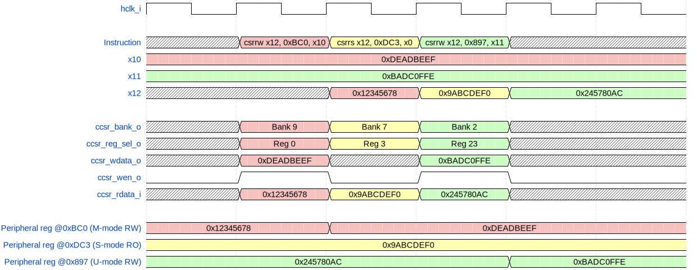
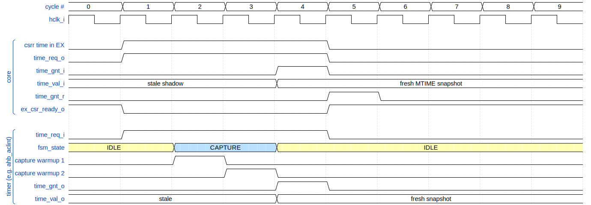

<h1>
  
  <br>
  aRVern SoC Integration Guide
  <br clear="all">
</h1>

This document is the reference for integrating the aRVern RISC-V processor core into a SoC. It covers all ports, parameters, and integration requirements.

---

## Table of Contents

1. [Configuration Parameters](#1-configuration-parameters)
2. [Clock](#2-clock)
3. [Reset](#3-reset)
4. [AHB Bus Interfaces](#4-ahb-bus-interfaces)
5. [Interrupt Interface](#5-interrupt-interface)
6. [NMI Interface](#6-nmi-interface-smrnmi)
7. [Custom CSR Interface](#7-custom-csr-interface)
8. [Zicntr Time Interface](#8-zicntr-time-interface)
9. [HPM Platform Events](#9-hpm-platform-events)
10. [Miscellaneous Ports](#10-miscellaneous-ports)
11. [Spec Compliance Notes](#11-spec-compliance-notes)
12. [Coding Style and Tool Compatibility](#12-coding-style-and-tool-compatibility)

---

## 1. Configuration Parameters

All parameters are set at instantiation time and select optional hardware features. There
are no run-time configuration registers for these choices.

| Parameter | Default | Legal values | Description |
|-----------|---------|--------------|-------------|
| `RV32E_EN` | `0` | `0`, `1` | `0` = RV32I (32 integer registers);<br/>`1` = RV32E (16 integer registers) |
| `M_EXTENSION` | `2` | `0`–`2` | `0` = no multiply/divide;<br/>`1` = Zmmul (multiply only); `2` = M (multiply + divide) |
| `MUL_TYPE` | `1` | `1`–`3` | Multiplier implementation (only used when `M_EXTENSION >= 1`):<br/>`1` = single-cycle;<br/>`2` = 4-cycle;<br/>`3` = 16-cycle |
| `DIV_TYPE` | `3` | `1`–`3` | Divider implementation (only used when `M_EXTENSION == 2`):<br/>`1` = radix-8 (12 cycles);<br/>`2` = radix-4 (17 cycles);<br/>`3` = radix-2 (33 cycles) |
| `B_EXTENSION` | `0` | `0`–`4` | Bit manipulation:<br/>`0` = none;<br/>`1` = Zbb;<br/>`2` = Zbb+Zba;<br/>`3` = Zbb+Zba+Zbs;<br/>`4` = Zbb+Zba+Zbs+Zbc |
| `C_EXTENSION` | `1` | `0`–`4` | Compressed instructions:<br/>`0` = none;<br/>`1` = Zca;<br/>`2` = Zca+Zcb;<br/>`3` = Zca+Zcb+Zcmp;<br/>`4` = Zca+Zcb+Zcmp+Zcmt |
| `NMI_EN` | `0` | `0`, `1` | `0` = Smrnmi absent (NMI CSRs 0x740–0x744 raise illegal instruction, `nmi_i` ignored);<br/>`1` = Smrnmi present (mnscratch/mnepc/mncause/mnstatus + mnret) |
| `SU_MODE_EN` | `1` | `0`, `1` | `0` = M-mode only (S-mode CSRs at 0x100–0x17F and `satp` RAZ/WI; `mideleg`/`medeleg` RAZ/WI; `sret` raise illegal-instruction; `mstatus.MPP` forced to M; `misa[18]` (S) and `misa[20]` (U) both report 0.<br/>`1` = M+S+U privilege modes per RISC-V spec; |
| `ZICNTR_EN` | `1` | `0`, `1` | `0` = Zicntr absent (cycle/time/instret CSRs return 0);<br/>`1` = Zicntr present (mcycle, minstret, mcounteren, user shadows, `time_req_o` interface active) |
| `ZIHPM_NR` | `0` | `0`–`8` | Number of hardware performance monitor counters (mhpmcounter3–mhpmcounter10); `0` disables all HPM logic |
| `CCSR_EN` | `0` | `0`, `1` | `0` = custom CSR interface absent (CCSR port group unused);<br/>`1` = custom CSR interface present. |
| `SINGLE_CYCLE_BRANCH` | `0` | `0`, `1` | Taken-branch latency:<br/>`0` = one-bubble (highest Fmax, lower IPC);<br/>`1` = zero-bubble (highest IPC, lower Fmax —  `inst_haddr_o` branch target is a combinational function of `inst_hrdata_i`). |
| `ASYNC_RST_EN` | `1` | `0`, `1` | Reset architecture:<br/>`1` = asynchronous active-low reset (`posedge hclk_i or negedge hresetn_i`; integrator must synchronize deassertion — see §3.1);<br/>`0` = synchronous reset (the async-reset term is tied high so flops infer a sync-reset FF; requires a running `hclk_i` during reset assertion). |
| `MVENDORID` | `32'h0` | any 32-bit JEDEC-encoded value | Value returned by the read-only `mvendorid` CSR (0xF11). Set this to the integrating chip vendor's JEDEC manufacturer ID (see "mvendorid / JEDEC encoding" below). `0` = non-commercial / not implemented (spec-legal default) |

### Parameter dependencies

- `MUL_TYPE` is only meaningful when `M_EXTENSION >= 1`; otherwise ignored.
- `DIV_TYPE` is only meaningful when `M_EXTENSION == 2`; otherwise ignored.
- `ZIHPM_NR > 0` requires `ZICNTR_EN == 1` for `mcounteren`/`mcountinhibit` to function correctly.
- When `NMI_EN == 0`, tie `nmi_i` low and `nmi_vector_i` to any value.
- When `SU_MODE_EN == 0`, firmware must run entirely from M-mode. Integrators downstream of HPROT[1]/HSMODE can rely on the privileged signalling being constant.
- When `ZICNTR_EN == 0`, tie `time_gnt_i` low and `time_val_i` to any value; `time_req_o` will not toggle.
- When `ZIHPM_NR == 0`, tie `hpm_platform_events_i` to `8'h0`.
- When `CCSR_EN == 0`, tie `ccsr_rdata_i` to `32'h0`; leave all `ccsr_*_o` outputs unconnected.

### mvendorid / JEDEC encoding

`MVENDORID` is the **only** ID register the integrator sets — it identifies the *chip
vendor*, not the core. It is **not** the raw JEDEC code; it is the spec-defined encoding of
the JEDEC JEP106 manufacturer ID (RISC-V Privileged spec §3.1.1):

- bits `[31:7]` = the JEDEC **bank**: the number of one-byte continuation codes (`0x7F`)
  that precede the final ID byte in your JEP106 assignment.
- bits `[6:0]` = the final JEDEC ID byte with the **odd-parity bit (bit 7) cleared**.

So `MVENDORID = (num_0x7F_continuation_codes << 7) | (final_id_byte & 7'h7F)`.

Worked example: a manufacturer whose JEP106 ID is *2 continuation codes (`0x7F 0x7F`)
followed by final byte `0x8A`* (parity bit set, value `0x0A` with parity stripped) →
`MVENDORID = (2 << 7) | (0x8A & 0x7F) = 0x100 | 0x0A = 32'h0000_010A`.

The default `32'h0` is spec-legal and means "non-commercial implementation / vendor ID not
implemented" — leave it at `0` if you do not have a JEDEC assignment.

> `marchid` (0xF12, architecture ID) and `mimpid[31:20]` (RTL version) are **core-owned**
> and deliberately *not* integration parameters — they identify the aRVern core itself and
> are fixed in the RTL. `marchid` reads `0` until an official ID is allocated to aRVern by
> RISC-V International. Integrators must not attempt to override them.

---

## 2. Clock

| Port | Dir | Width | Description |
|------|-----|-------|-------------|
| `hclk_i` | in | 1 | Main processor clock |
| `hclk_en_o` | out | 1 | Clock enable output for SoC-level clock gating |

All pipeline flip-flops, CSRs, and AHB interfaces are synchronous to `hclk_i`. No internal
clock gating or generation is performed inside the core.

### 2.1 Clock enable (`hclk_en_o`)

`hclk_en_o` is deasserted when the core executes a `WFI` instruction and there are no
pending interrupts. The SoC can use this signal to gate `hclk_i` to save power:

```verilog
// Example: SoC clock gate controlled by hclk_en_o
CLKGATE u_cg (.CLK(sys_clk), .EN(hclk_en_o), .GCLK(hclk_i));
```

If no clock gating is required, connect `hclk_i` directly to the system clock and leave
`hclk_en_o` unconnected.

---

## 3. Reset

| Port | Dir | Width | Description |
|------|-----|-------|-------------|
| `hresetn_i` | in | 1 | Active-low asynchronous or synchronous reset |

### 3.1 Reset architecture select (`ASYNC_RST_EN`)

The reset style is a build-time parameter, `ASYNC_RST_EN` (default `1`), threaded from
`arvern.v` to every submodule:

- **`ASYNC_RST_EN = 1` (asynchronous, default):** all flip-flops use
  `always @(posedge hclk_i or negedge hresetn_i)` — asynchronous assertion, synchronous
  deassertion expected at the SoC boundary.
- **`ASYNC_RST_EN = 0` (synchronous):** the asynchronous reset term is tied high internally
  (`async_rst_n = 1'b1`) so each flop infers a **synchronous-reset** FF; the `if (!hresetn_i)`
  clause then applies the reset on the clock edge. **A running `hclk_i` is required during reset
  assertion** for the flops to initialize.

**Async mode — external synchronizer requirement.** The reset synchronizer is *not* inside the
core. The SoC integrator must provide one such that:
- `hresetn_i` assertion (low) may be asynchronous — safe; immediately resets all FFs.
- `hresetn_i` deassertion (high) must be **synchronous to `hclk_i`**, via at least a 2-FF synchronizer.

```verilog
// 2-FF reset synchronizer — place in SoC wrapper, NOT inside aRVern (async mode)
always @(posedge hclk or negedge por_n) begin
    if (!por_n) {hresetn_sync, hresetn_meta} <= 2'b00;
    else        {hresetn_sync, hresetn_meta} <= {hresetn_meta, 1'b1};
end
// Connect hresetn_sync to aRVern's hresetn_i
```

**Rationale:** Asynchronous reset with synchronous deassertion (the default) is a standard ASIC
practice — all FFs reach a known state immediately on assertion, while synchronous deassertion
prevents metastability. Synchronous-reset mode (`ASYNC_RST_EN = 0`) suits flows that prefer it
(simpler reset-net timing closure, no recovery/removal checks, scan-friendly) at the cost of
needing a clock during reset. Both modes are regression-swept.

---

## 4. AHB Bus Interfaces

The core presents two independent AHB-Lite master interfaces. Both follow the ARM
AMBA AHB-Lite protocol.

| Interface | Port prefix | Purpose |
|-----------|------------|---------|
| Instruction bus | `inst_h*` | Read-only fetch; always 32-bit word transfers |
| Data bus | `data_h*` | Load/store; byte/halfword/word transfers |

### 4.1 Instruction bus ports

| Port | Dir | Width | Description |
|------|-----|-------|-------------|
| `inst_hrdata_i` | in | 32 | Read data from instruction memory |
| `inst_hready_i` | in | 1 | Slave extends transfer when low |
| `inst_hresp_i` | in | 1 | Error response; raises instruction access fault when high |
| `inst_haddr_o` | out | 32 | Byte address of instruction fetch |
| `inst_htrans_o` | out | 2 | Transfer type: IDLE (`2'b00`) or NONSEQ (`2'b10`) |
| `inst_hsize_o` | out | 3 | Transfer size: always word (`3'b010`) |
| `inst_hburst_o` | out | 3 | Burst type: always SINGLE (`3'b000`) |
| `inst_hwrite_o` | out | 1 | Write enable: always low (fetch is read-only) |
| `inst_hwdata_o` | out | 32 | Write data: always `32'h0` (unused) |
| `inst_hmastlock_o` | out | 1 | Locked transfer: always low (unused) |
| `inst_hprot_o` | out | 4 | Protection: `[3]`=cacheable, `[2]`=bufferable, `[1]`=privileged, `[0]`=data (always 0 for fetch)<br/>`HPROT[1]=0` the instruction is fetched while in U-mode.<br/>`HPROT[1]=1` the instruction is fetched while in M or S mode. |
| `inst_hsmode_o` | out | 1 | Supervisor mode flag: high when core is in S-mode (only). Combine with `HPROT[1]` to fully decode M/S/U:<br/>`HPROT[1]=1 & HSMODE=0` → M-mode;<br/>`HPROT[1]=1 & HSMODE=1` → S-mode;<br/>`HPROT[1]=0` → U-mode.<br/>Connect to `HAUSER` of the AHB interconnect for privilege-aware bus routing |

### 4.2 Data bus ports

| Port | Dir | Width | Description |
|------|-----|-------|-------------|
| `data_hrdata_i` | in | 32 | Read data from data memory or peripheral |
| `data_hready_i` | in | 1 | Slave extends transfer when low |
| `data_hresp_i` | in | 1 | Error response; raises load/store access fault when high |
| `data_haddr_o` | out | 32 | Byte address of load/store |
| `data_htrans_o` | out | 2 | Transfer type: IDLE (`2'b00`) or NONSEQ (`2'b10`) |
| `data_hsize_o` | out | 3 | Transfer size: byte (`3'b000`), halfword (`3'b001`), or word (`3'b010`) |
| `data_hburst_o` | out | 3 | Burst type: always SINGLE (`3'b000`) |
| `data_hwrite_o` | out | 1 | Write enable: high for stores, low for loads |
| `data_hwdata_o` | out | 32 | Write data for store instructions |
| `data_hmastlock_o` | out | 1 | Locked transfer: always low (unused) |
| `data_hprot_o` | out | 4 | Protection: `[3]`=cacheable, `[2]`=bufferable, `[1]`=privileged, `[0]`=data (always 1 for data bus)<br/>`HPROT[1]=0` the load-store operation is done while in U-mode.<br/>`HPROT[1]=1` the load-store operation is done while in M or S mode. |
| `data_hsmode_o` | out | 1 | Supervisor mode flag: high when core is in S-mode (only), MPRV-aware. Combine with `HPROT[1]` to fully decode M/S/U (see `inst_hsmode_o` above).<br/>Connect to `HAUSER` of the AHB interconnect |

### 4.3 Notes

- Both buses issue only SINGLE, NONSEQ transfers — no burst or locked sequences.
- `inst_hresp_i = 1` triggers an instruction access fault (mcause 1).
- `data_hresp_i = 1` triggers a load access fault (mcause 5) or store access fault (mcause 7).
- The core does not implement AHB split or retry responses.

### 4.4 Privilege encoding on the AHB bus

Two signals together encode the full three-level RISC-V privilege mode on the AHB bus:

| `HPROT[1]` (privileged) | `HSMODE` | Privilege mode |
|:-----------------------:|:--------:|----------------|
| `1` | `0` | Machine mode (M-mode) |
| `1` | `1` | Supervisor mode (S-mode) |
| `0` | `0` | User mode (U-mode) |
| `0` | `1` | — (unused combination) |

`HPROT[1]` is asserted in both Machine and Supervisor modes, and deasserted in User
mode. `HSMODE` (`inst_hsmode_o` / `data_hsmode_o`) distinguishes between M-mode and
S-mode when `HPROT[1]` is high. The AHB interconnect or memory protection unit can use
this encoding to enforce per-region access policies.

---

## 5. Interrupt Interface

### 5.1 Standard interrupts

| Port | Dir | MIP bit | Description |
|------|-----|---------|-------------|
| `irq_m_software_i` | in | MSIP [3] | Machine software interrupt. Typically driven by the MSWI register output of a CLINT/ACLINT. Read-only in MIP — cleared by writing the memory-mapped register. |
| `irq_s_software_i` | in | SSIP [1] | Supervisor software interrupt. Typically driven by the SSWI register output of an ACLINT. Delivered to S-mode when `mideleg.SSI = 1`. OR'd internally with the CSR-writable SSIP bit (see note below). Tie low if no S-mode SSWI source exists or in M-only systems. |
| `irq_m_timer_i` | in | MTIP [7] | Machine timer interrupt. Typically driven by the `mtime >= mtimecmp` comparator of a CLINT/ACLINT MTIMER. Read-only in MIP — cleared by writing `mtimecmp`. |
| `irq_m_external_i` | in | MEIP [11] | Machine external interrupt. Connect to the **M-mode context** output of the PLIC (context 0 for hart 0). Always delivered to M-mode regardless of `mideleg`. |
| `irq_s_external_i` | in | SEIP [9] | Supervisor external interrupt. Connect to the **S-mode context** output of the PLIC (context 1 for hart 0). Delivered to S-mode when `mideleg.SEI = 1`. Fully independent from `irq_m_external_i`. Tie low if no S-mode PLIC context exists. |

`irq_m_external_i` / `irq_s_external_i` and `irq_m_software_i` / `irq_s_software_i`
are independent signal pairs designed for a two-context PLIC + ACLINT. In M-mode-only
systems (`SU_MODE_EN=0` or no S-mode IPs), tie `irq_s_software_i` and `irq_s_external_i`
to `1'b0`.

> **SSIP semantics — hardware edge-set, S-mode CSR-clearable.** Per the RISC-V
> privileged spec, MIP[1] (SSIP) is software-writable from M-mode (always) and from
> S-mode (when `mideleg.SSI=1`). The aRVern core additionally latches a HW edge from
> `irq_s_software_i` into the SSIP flop, matching the ACLINT 1.0-rc4 SSWI model
> (Chapter 4): the IP emits a one-cycle pulse, the core's flop sets, and S-mode clears
> via `csrc sip, (1<<1)`. Same-cycle HW-edge + SW-clear resolves to SET (HW wins).
> The HW path is gated by `SU_MODE_EN` (tied 0 in M-only builds). No state is held in
> the ACLINT SSWI device itself; all SSIP retention is in the core's MIP CSR.
>
> MTIP and MSIP follow the simpler "pure hardware level input" model — they read
> directly from `irq_m_timer_i` / `irq_m_software_i` with no CSR-writable flop, matching
> the ACLINT MTIMER comparator-output and MSWI MSIP-register-output respectively.

#### Connection cookbook — ACLINT / PLIC → aRVern

For a single-hart SoC integrating `arvern-ips/ahb_aclint` and `arvern-ips/ahb_plic`,
each IP exposes a one-bit-per-hart vector; the bit-0 slot wires straight into the
matching aRVern input:

| aRVern input          | Connect to                                                          |
|-----------------------|---------------------------------------------------------------------|
| `irq_m_software_i`    | `ahb_aclint.irq_m_software_o[0]`                                     |
| `irq_s_software_i`    | `ahb_aclint.irq_s_software_o[0]` (tie `1'b0` when `SU_MODE_EN=0`)    |
| `irq_m_timer_i`       | `ahb_aclint.irq_m_timer_o[0]`                                        |
| `irq_m_external_i`    | `ahb_plic.irq_m_external_o[0]`                                      |
| `irq_s_external_i`    | `ahb_plic.irq_s_external_o[0]` (tie `1'b0` when `SU_MODE_EN=0`)     |

For multi-hart SoCs, replicate the same hookup at each hart's index — `arvern_inst[h]`
connects to `irq_*_o[h]` of each IP, and the IPs are sized via their respective
`NUM_HARTS` parameters.

> **PLIC source ownership.** `ahb_plic` maintains a single `in_service`
> bit per source, shared across all M/S contexts. Each external interrupt
> source should be enabled for **exactly one** context at any given time.
> For M-supervises-S delegation, enable the source only on the S-context
> and route the delivery through `mideleg.SEI=1`; the M-context never
> needs to see the source. Same rule applies across harts. See
> [`ahb_plic.md` — Claim/Complete handshake](https://github.com/Arvern-Silicon/arvern-ips/tree/main/ahb_plic/doc/ahb_plic.md#claim--complete-handshake)
> for the failure mode if this is violated.

### 5.2 Platform interrupts

| Port | Dir | MIP bits | Description |
|------|-----|---------|-------------|
| `irq_platform_i[15:0]` | in | [31:16] | Platform-designated interrupt pending bits, mapped to MIP[31:16]. Each bit gets a unique mcause code (16, 17, …, 31). |

**When to use platform IRQs instead of the PLIC.** Platform IRQs bypass the PLIC's
priority/threshold/enable matrix and the claim/complete AHB round-trip — the path
from `irq_platform_i[n]` asserting to the core taking a trap is roughly one
synchroniser stage plus one cycle of decision (vs. ~5–10 hclk extra through the
PLIC). Typical use cases:

- **Low-latency events** — watchdog bark, error/parity faults, DMA done, debug
  request, high-rate sample interrupts where the PLIC round-trip is a meaningful
  fraction of the ISR budget.
- **Unique mcause codes** — each `irq_platform_i[n]` traps with `mcause = 16+n`,
  letting the handler dispatch directly without a `claim` read.
- **Small SoCs that omit the PLIC entirely** — up to 16 IRQs fit straight onto
  `irq_platform_i` with no PLIC IP needed.
- **S-mode-delivered fast IRQs** — `mideleg[31:16]` lets each platform-IRQ bit be
  delegated to S-mode independently (same mechanism as SSI/STI/SEI), keeping the
  latency advantage end-to-end.

The trade-off is no built-in priority/threshold — each platform IRQ is "on or off,"
and if multiple bits assert together the handler does its own software priority
(typically a `clz` over `mip[31:16] & mie[31:16]`). For fan-outs above ~16 IRQs
or for a system that needs runtime priority/masking, use the PLIC.

**CDC synchronization required.** `irq_platform_i` is fed directly into registered
pipeline control logic without any synchronizer inside the core. If this signal
originates from a clock domain other than `hclk_i`, a 2-FF synchronizer must be
provided externally:

```verilog
// 2-FF synchronizer for irq_platform_i — place in SoC wrapper
always @(posedge hclk or negedge hresetn) begin
    if (!hresetn) {irq_platform_sync, irq_platform_meta} <= 32'h0;
    else          {irq_platform_sync, irq_platform_meta} <= {irq_platform_meta, irq_platform_raw};
end
// Connect irq_platform_sync[15:0] to aRVern's irq_platform_i
```

If all platform interrupts are register outputs clocked by `hclk_i`, no synchronizer
is needed.

---

## 6. NMI Interface (Smrnmi)

The NMI interface is present only when `NMI_EN == 1`. When `NMI_EN == 0`, tie `nmi_i`
low and leave `nmi_vector_i` at any value.

| Port | Dir | Width | Description |
|------|-----|-------|-------------|
| `nmi_i` | in | 1 | Non-maskable interrupt input. Level-sensitive, active high. Cannot be masked by software. |
| `nmi_vector_i` | in | 32 | Handler address. Loaded into the PC when the NMI is taken. Must be aligned to a 4-byte boundary. |

The NMI is handled via the Smrnmi resumable NMI extension. When `nmi_i` is asserted,
the core saves state to `mnepc`/`mncause`/`mnstatus` and jumps to `nmi_vector_i`.
`mnret` resumes execution.

---

## 7. Custom CSR Interface

The custom CSR interface is present only when `CCSR_EN == 1`. When `CCSR_EN == 0`,
tie `ccsr_rdata_i` to `32'h0` and leave all `ccsr_*_o` ports unconnected.

| Port | Dir | Width | Description |
|------|-----|-------|-------------|
| `ccsr_rdata_i` | in | 32 | Read data from the custom CSR register selected by `ccsr_bank_o` × `ccsr_reg_sel_o`. Must be valid within the same clock cycle as the CSR access (combinational response — no wait states). |
| `ccsr_bank_o` | out | 11 | **One-hot** bank select. Bit N is asserted when the CSR address falls in the Nth implemented custom-CSR window. The 11 windows cover the four U-mode RW ranges, one U-mode RO range, two S-mode RW ranges, one S-mode RO range, one M-mode RW range, and one M-mode RO range (see `rtl/verilog/arv_csr_top.v` for the exact address-to-bank mapping). All zeros when no CCSR access is in progress. |
| `ccsr_reg_sel_o` | out | 64 | **One-hot** register select within the addressed bank, decoded from the low 6 bits of the CSR address. Exactly one bit is asserted during a CCSR access; all zeros otherwise. |
| `ccsr_wdata_o` | out | 32 | Write data for the selected custom CSR register. |
| `ccsr_wen_o` | out | 1 | Write enable: high for one cycle during a CSR write (`csrrw` / `csrrs` / `csrrc` with non-zero mask); low during a pure read. |

The custom CSR interface is a single-cycle, zero-wait-state extension mechanism for
SoC-specific CSR registers. Every CCSR access — read, write, or read-modify-write — is
one cycle: the core drives `ccsr_bank_o` + `ccsr_reg_sel_o` + (for writes) `ccsr_wdata_o`
and `ccsr_wen_o`; the external logic muxes the selected register's value onto
`ccsr_rdata_i` combinationally and (if `ccsr_wen_o` is high) latches `ccsr_wdata_o` on
the next clock edge.



**Reading the waveform.** Three back-to-back CCSR accesses targeting different banks:

1. `csrrw x12, 0xBC0, x10` — M-mode RW window. The core asserts `ccsr_bank_o[9]`
   (`0xBC0-0xBFF`), `ccsr_reg_sel_o[0]` (lowest register in the bank),
   `ccsr_wdata_o = 0xDEADBEEF` (from `x10`), and `ccsr_wen_o = 1`. The peripheral drives
   the old register value `0x12345678` on `ccsr_rdata_i` combinationally — the core
   writes that to `x12` and the peripheral updates its register on the next clock edge.
2. `csrrs x12, 0xDC3, x0` — S-mode RO window. `csrrs` with `rs1 = x0` is a pure read, so
   `ccsr_wen_o` stays low while `ccsr_bank_o[7]` (`0xDC0-0xDFF`) and `ccsr_reg_sel_o[3]`
   are asserted. The peripheral drives `0x9ABCDEF0`; the core captures it in `x12`. The
   register's value is unchanged.
3. `csrrw x12, 0x897, x11` — U-mode RW window. Same shape as access 1, but in
   `ccsr_bank_o[2]` (`0x880-0x8BF`), register 23.

Two things to notice that govern integration: (a) `ccsr_rdata_i` is **always** sampled
on the access cycle, so the external read mux must be purely combinational — adding a
flop here breaks reads of pre-existing register values during read-modify-write; (b) all
CCSR outputs return to all-zeros between accesses, so a peripheral can use
`|ccsr_bank_o == 1'b1` (or equivalently `|ccsr_reg_sel_o`) as a transaction-valid signal.

**Reference implementation.** A drop-in example peripheral — including the combinational
read mux, per-register write-enable decode, and a small register file across all four
privilege/access-mode windows — lives in the
[`arv_custom_csr`](https://github.com/Arvern-Silicon/arvern-ips/tree/main/arv_custom_csr)
IP of the `arvern-ips` repository. Useful as a starting template for SoC-specific
custom-CSR peripherals.

---

## 8. Zicntr Time Interface

The time interface is active only when `ZICNTR_EN == 1`. When `ZICNTR_EN == 0`, tie
`time_gnt_i` low and `time_val_i` to any value.

| Port | Dir | Width | Description |
|------|-----|-------|-------------|
| `time_req_o` | out | 1 | Asserted while a `time`/`timeh` CSR read is waiting for the timer value. Stays low if `time_gnt_i` is tied high. |
| `time_gnt_i` | in | 1 | Timer-coherent strobe. When asserted, `time_val_i` must hold the current real-time counter value. |
| `time_val_i` | in | 64 | Real-time counter value. Read **combinationally**; the core registers the grant and samples this on the cycle **after** `time_gnt_i`, so it must stay valid until `time_req_o` is observed deasserted. |

The `time` and `timeh` CSRs are read-only views of the SoC real-time counter (typically
the CLINT `mtime` register). The handshake lets the timer absorb clock-domain-crossing
latency. The core registers the grant (to keep `time_val_i` off the Fmax path), so it
samples `time_val_i` on the cycle *after* `time_gnt_i` is asserted. A `time`/`timeh` read
cannot linger in the execute stage past that cycle, so the timer never has to hold the
value beyond the cycle it observes `time_req_o` deasserted. A ±1-tick read uncertainty is
architecturally fine — `time` only requires a monotonic wall-clock.

**Simple integration (free-running `hclk`-synchronous counter):** if the real-time counter
is synchronous to `hclk_i` and always up to date, tie `time_gnt_i` permanently high
(`1'b1`) and connect `time_val_i` directly to the counter. `time_req_o` then never toggles
and the `time`/`timeh` read never stalls — the core reads the live counter combinationally.

**Latched integration (counter in another clock domain, e.g. a 32 kHz xtal):** on
`time_req_o`, a small peripheral FSM CDC-captures the counter; once the synchronized value
is stable it asserts `time_gnt_i` and drives that value on `time_val_i`, holding both until
it observes `time_req_o` deasserted, then returns to idle (the synchronizer may be powered
down between requests — the value need not be retained afterwards). The FSM's registered
"return-to-idle on `time_req_o` low" naturally keeps `time_val_i` stable through the core's
registered-grant sample cycle, so no value-capture flop is required on either side. The
core stalls the CSR read until the grant is registered.

**Cycle-by-cycle handshake.** The waveform below shows a latched integration (e.g. the
`ahb_aclint` IP) where the timer needs several hclk cycles to capture a fresh value across
a clock-domain boundary. `time_req_o` is held high for the entire duration the
`csrr time` instruction is waiting in EX; the timer pulses `time_gnt_i` for one cycle
alongside a valid `time_val_i`; the core registers the grant and on the next cycle (when
`time_gnt_r` becomes 1) deasserts `time_req_o`, raises `ex_csr_ready_o`, and retires the
instruction reading `time_val_i` on the same edge.



| Cycle | Core                                                                                            | Timer                                                                          |
|:-----:|-------------------------------------------------------------------------------------------------|--------------------------------------------------------------------------------|
| 0     | idle                                                                                            | `IDLE`                                                                         |
| 1     | `csrr time` enters EX → `time_req_o = 1`, `ex_csr_ready_o = 0` (pipeline stalls in EX)          | `IDLE` samples `time_req_i = 1`, next-state `CAPTURE`                          |
| 2     | stalled, `time_req_o` held high                                                                 | `CAPTURE`, capture warmup cycle 1                                              |
| 3     | stalled                                                                                         | `CAPTURE`, capture warmup cycle 2 (the snapshot is now valid); next-state `IDLE` |
| 4     | sees `time_gnt_i = 1`; registers it (NBA → `time_gnt_r` next cycle)                             | `IDLE`; `time_gnt_o = 1` (1-cycle pulse); `time_val_o = MTIME snapshot`         |
| 5     | `time_gnt_r = 1` → `time_req_o = 0`, `ex_csr_ready_o = 1`; `csrr time` retires reading `time_val_i` | `IDLE`; `time_gnt_o = 0`; `time_val_o` still held                              |
| 6+    | back to normal pipeline flow                                                                    | `IDLE`; `time_val_o` continues to hold until the next request                  |

The number of stall cycles between assertion of `time_req_o` and the grant pulse is fully
under the timer's control — the core honours `time_req_o`/`time_gnt_i` as a level/pulse
contract with no timing assumption. In the **simple integration** above (where `time_gnt_i`
is tied permanently high), the diagram collapses: cycles 1 and 5 occur on the same hclk
edge, the pipeline never stalls on a `csrr time`, and `time_val_i` is read live.

For the `ahb_aclint` integration with the gray-sync read path, the stall window between
cycles 1 and 4 is **3 hclk cycles** (independent of `clk_lf_i` frequency) — the timer's
two warmup cycles dominate. For a hypothetical handshake-based timer with a slow LF
counter, the stall could be much longer; the core does not care either way.

**Back-to-back reads see only 1 hclk cycle of stall, not 3.** During the 1-cycle window in
which the core has captured `time_gnt_i` but `time_req_o` is still high (waiting for the
registered `time_gnt_r` to combinationally drop it), the ACLINT FSM observes
`IDLE & time_req_i = 1` and launches another gray-sync warmup. That spurious launch primes
the pipeline so the next `csrr time` reaches EX with `mtime_valid` about to fire — the
grant then arrives one cycle after `time_req_o`. It is benign (the shadow is refreshed
with a consistent gray-decoded value), and the canonical RV32 `csrr timeh; csrr time;
csrr timeh` retry sequence therefore pays **3 + 1 + 1 = 5 hclk stall cycles** total
instead of 3 + 3 + 3 = 9.

---

## 9. HPM Platform Events

The HPM event interface is used only when `ZIHPM_NR > 0`. When `ZIHPM_NR == 0`, tie
`hpm_platform_events_i` to `8'h0`.

| Port | Dir | Width | Description |
|------|-----|-------|-------------|
| `hpm_platform_events_i[7:0]` | in | 8 | Platform-defined hardware performance monitoring event inputs. Each bit corresponds to one event source. A high pulse on a bit increments the associated `mhpmcounter` when the corresponding event selector is configured. |

Up to 8 platform events are supported (one per possible HPM counter). Events are sampled
synchronously to `hclk_i` — no synchronization is performed inside the core. If event
inputs come from another clock domain, add 2-FF synchronizers externally.

---

## 10. Miscellaneous Ports

| Port | Dir | Width | Description |
|------|-----|-------|-------------|
| `hartid_i` | in | 8 | Hart identifier. Drives the `mhartid` CSR read value. Set to `8'h0` for a single-hart system. |
| `reset_vector_i` | in | 32 | Initial PC value after reset deassertion. Must be 4-byte aligned. Typically points to the start of boot ROM. |
| `lockup_o` | out | 1 | Asserted when the core enters lockup state (an unrecoverable error: double fault with no valid handler). The SoC should treat this as a fatal condition and assert `hresetn_i`. |

---

## 11. Spec Compliance Notes

aRVern's behaviour in places where the RISC-V spec is UNSPECIFIED, implementation-defined,
or permissive is documented along with a small set of acknowledged gray-area choices where
the spec's intent is ambiguous. Each entry includes spec posture, behaviour, rationale, and
an audit hook for any future stricter-platform port. The full reference is
**[`spec_compliance_notes.md`](spec_compliance_notes.md)**.

Summary (read the full file before committing to an integration):

- Reserved OP / OP-IMM `funct7` (and reserved shift `imm[11:5]`) execute as the nearest
  defined op — UNSPECIFIED per spec; no illegal-instruction trap.
- Non-existent CSRs in known banks read 0 / drop writes (bank-level decode, not per-CSR);
  unknown banks still trap normally.
- `minstret` counts trapping instructions (dispatch-stage count); off-by-one only when a
  synchronous exception is taken.
- `mcycle` freezes during `WFI` sleep (one gated clock domain at SoC ICG).
- RV32E (`RV32E_EN=1`) x16–x31 read 0 / writes dropped, no trap — narrowing lives in the
  flop array only; decode is RV32I/RV32E bit-identical.
- Instruction-bus address phase not held stable across wait states when
  `SINGLE_CYCLE_BRANCH=1` — intrinsic to the speculative-fetch + single-cycle
  `inst_hrdata→inst_haddr` branch path. **No functional impact on any
  conformant AHB-Lite consumer** (conformant slaves and interconnects commit
  the address phase only on the HREADY-high cycle, where the presented address
  is always architecturally correct). A strict AHB protocol checker that
  monitors intra-wait transient stability will flag this.
- Store-access-fault may be lost if an NMI/IRQ preempts an in-flight posted erroring
  store — "posted-store-issued = committed" is standard for pipelined RISC-V cores.

---

## 12. Coding Style and Tool Compatibility

aRVern targets **Verilog-2001 (IEEE 1364-2001)** as its baseline, deliberately avoiding
SystemVerilog constructs to maximise compatibility with the broadest possible range of EDA tools,
including open-source simulators and synthesis front-ends that do not fully support SystemVerilog.

A small number of well-supported Verilog-2001 features that would be unreasonably inconvenient
to avoid — such as `localparam` and `generate`/`endgenerate` blocks — are used freely, as they
are universally accepted by all modern tools.

### Constructs intentionally avoided

| SystemVerilog construct        | aRVern equivalent          |
|-------------------------------|------------------------------|
| `always_ff @(posedge clk)`    | `always @(posedge clk)`      |
| `always_comb`                 | `always @(*)`                |
| `logic` type                  | `reg` / `wire`               |
| Interfaces and modports       | Explicit port lists          |
| Packages and `import`         | `define` / inline parameters |
| Enumerated types (`enum`)     | `parameter` constants        |

### Verilog-2001 features in use

The following Verilog-2001 constructs are used throughout the design, as they are supported
by all relevant tools:

- **ANSI-style port declarations** — direction and type combined in the port list
- **`localparam`** — for module-local constants that must not be overridden at instantiation
- **`generate` / `endgenerate`** — for parameter-driven structural replication and conditional logic
- **`always @(*)`** — implicit sensitivity list for combinational blocks

### Rationale

- **Icarus Verilog**: `always_comb`, `logic`, and other SystemVerilog constructs require
  `-g2012` (SystemVerilog mode). The simulation scripts do not pass this flag, so
  SystemVerilog constructs would cause immediate parse errors.
- **Verilator**: Generally supports a wide subset of SystemVerilog, but avoiding SV constructs
  removes any version-gating issues.
- **Legacy synthesis tools**: Some older FPGA and ASIC synthesis front-ends accept only
  IEEE 1364-2001. Plain `always @(*)` is unambiguous to all of them.
- **Readability and portability**: Verilog-2001 constructs have well-understood, consistent
  semantics across all tools; there is no risk of subtle behavioural differences from
  tool-specific SystemVerilog interpretations.

### For integrators adding wrapper logic

If you write SoC wrapper code around aRVern, you may freely use SystemVerilog constructs
in your own files — the restriction only applies to the core RTL files under `rtl/verilog/`.
Mixed-language projects (Verilog-95 core + SystemVerilog wrappers) compile and simulate
correctly with all major tools.
