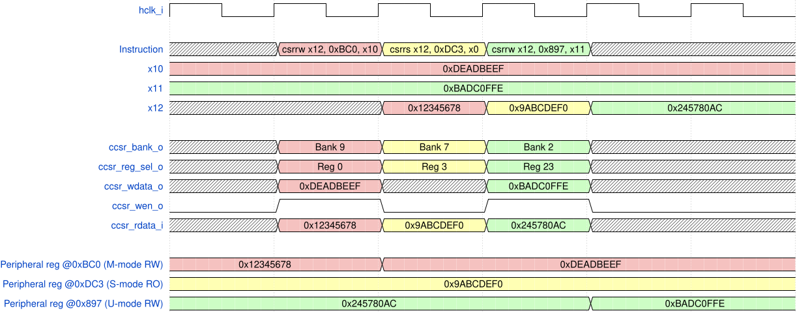

<h1>
  
  <br>
  aRVern SoC Integration Guide
  <br clear="all">
</h1>

This document is the reference for integrating the aRVern RISC-V processor core into a SoC. It covers all ports, parameters, and integration requirements.

---

## Table of Contents

1. [Configuration Parameters](#1-configuration-parameters)
2. [Clock](#2-clock)
3. [Reset](#3-reset)
4. [AHB Bus Interfaces](#4-ahb-bus-interfaces)
5. [Interrupt Interface](#5-interrupt-interface)
6. [NMI Interface](#6-nmi-interface-smrnmi)
7. [Custom CSR Interface](#7-custom-csr-interface)
8. [Zicntr Time Interface](#8-zicntr-time-interface)
9. [HPM Platform Events](#9-hpm-platform-events)
10. [External Debug Interface](#10-external-debug-interface)
11. [Miscellaneous Ports](#11-miscellaneous-ports)
12. [Spec Compliance Notes](#12-spec-compliance-notes)
13. [Coding Style and Tool Compatibility](#13-coding-style-and-tool-compatibility)
- [Appendix A — Port summary and tie-offs](#appendix-a--port-summary-and-tie-offs)

---

## 1. Configuration Parameters

All parameters are set at instantiation time and select optional hardware features. There
are no run-time configuration registers for these choices.

| Parameter | Default | Legal values | Description |
|-----------|---------|--------------|-------------|
| `RV32E_EN` | `0` | `0`, `1` | `0` = RV32I (32 integer registers);<br/>`1` = RV32E (16 integer registers) |
| `M_EXTENSION` | `2` | `0`–`2` | `0` = no multiply/divide;<br/>`1` = Zmmul (multiply only); `2` = M (multiply + divide) |
| `MUL_TYPE` | `1` | `1`–`3` | Multiplier implementation (only used when `M_EXTENSION >= 1`):<br/>`1` = single-cycle;<br/>`2` = 4-cycle;<br/>`3` = 16-cycle |
| `DIV_TYPE` | `3` | `1`–`3` | Divider implementation (only used when `M_EXTENSION == 2`):<br/>`1` = radix-8 (12 cycles);<br/>`2` = radix-4 (17 cycles);<br/>`3` = radix-2 (33 cycles) |
| `B_EXTENSION` | `1` | `0`–`4` | Bit manipulation:<br/>`0` = none;<br/>`1` = Zbb;<br/>`2` = Zbb+Zba;<br/>`3` = Zbb+Zba+Zbs;<br/>`4` = Zbb+Zba+Zbs+Zbc |
| `C_EXTENSION` | `1` | `0`–`4` | Compressed instructions:<br/>`0` = none;<br/>`1` = Zca;<br/>`2` = Zca+Zcb;<br/>`3` = Zca+Zcb+Zcmp;<br/>`4` = Zca+Zcb+Zcmp+Zcmt |
| `SU_MODE_EN` | `0` | `0`, `1` | `0` = M-mode only — see [What `SU_MODE_EN = 0` removes](#what-su_mode_en--0-removes);<br/>`1` = M+S+U privilege modes per the RISC-V spec, including **Ssdbltrp** (S-mode double trap: `sstatus.SDT`, `menvcfgh.DTE` — resets to 1 — and `mtval2`; see `traps_and_interrupts.md` §6) |
| `PMP_NR` | `0` | `0`, `4`, `8`, `16` | Physical Memory Protection — number of **writable** entries. `0` = absent (`pmpcfg*`/`pmpaddr*`/`mseccfg` raise illegal-instruction, both checkers removed); non-zero instantiates PMP **and Smepmp** (`mseccfg` MML/MMWP/RLB). Sixteen entries always exist architecturally; entries at or above `PMP_NR` are read-only zero, which Priv 3.7.1 permits and which software discovers by WARL probing. Granularity `G = 0`, so NA4 is selectable. In synthesis, values that are not 0/4/8/16 snap **down** to the next legal count; in simulation they abort elaboration (see below). See §4.6 and §4.7 |
| `ZICNTR_EN` | `1` | `0`, `1` | `0` = Zicntr absent — with `ZIHPM_NR == 0` as well, `cycle`/`time`/`instret`, `mcycle`/`minstret` and their `h` halves raise illegal-instruction (the bank is absent, like the S-mode bank at `SU_MODE_EN = 0`); with `ZIHPM_NR > 0` the counter bank still exists and the Zicntr offsets read 0. `time_req_o` is tied 0 either way;<br/>`1` = Zicntr present (mcycle, minstret, mcounteren, user shadows, `time_req_o` interface active) |
| `ZIHPM_NR` | `0` | `0`–`8` | Number of hardware performance monitor counters (mhpmcounter3–mhpmcounter10); `0` disables all HPM logic |
| `CCSR_EN` | `0` | `0`, `1` | `0` = custom CSR interface absent (CCSR port group unused);<br/>`1` = custom CSR interface present. |
| `DEBUG_EN` | `0` | `0`, `1` | `0` = no external debug (Debug Module, DMI bus, SBA and debug CSRs absent; all debug ports tied off; core bit-identical to a no-debug build);<br/>`1` = RISC-V Debug 1.0 external debug present — see §10 and `debug_interface.md`. |
| `DM_TRIGGER_NR` | `0` | `0`–`8` | Number of Sdtrig hardware triggers (`mcontrol6`). `0` = none. Requires `DEBUG_EN=1` (forced off otherwise). |
| `SINGLE_CYCLE_BRANCH` | `1` | `0`, `1` | Taken-branch latency — a frequency/IPC trade-off:<br/>`0` = one-bubble, registered branch target (higher clock frequency, lower IPC);<br/>`1` = zero-bubble (higher IPC, lower clock frequency — the `inst_haddr_o` branch target is a combinational function of `inst_hrdata_i`). |
| `ASYNC_RST_EN` | `1` | `0`, `1` | Reset architecture:<br/>`1` = asynchronous active-low reset (integrator must synchronize deassertion — see §3.1);<br/>`0` = synchronous reset (requires a running `hclk_i` during reset assertion, also while clock-gated in WFI — see §2.1 and §3.1). |

The RTL carries simulation-only (`translate_off`) `$fatal` range checks on every parameter:
an illegal value (`PMP_NR = 12`, `ZIHPM_NR = 9`, …) aborts elaboration in simulation, whereas
synthesis silently snaps or clamps it (`PMP_NR` down to the next legal count,
`MUL_TYPE`/`DIV_TYPE` to `1`).

> The core-identity CSRs (`mvendorid`/`marchid`/`mimpid`) are **not** parameters — they are
> fixed core-owned constants. See "Core identity registers" below.

> The defaults above are the `classic` integration profile: RV32I + M + Zbb + Zca, M-mode
> only, zero-bubble branch, no PMP and no external debug. Instantiating `arvern` without
> overriding anything therefore gives a configuration that is synthesized, linted and
> regressed as a named persona, with published area figures.

### What `SU_MODE_EN = 0` removes

Firmware runs entirely in M-mode. The S-mode CSR bank (0x100–0x1BF, `satp` included) is
absent: any access raises illegal-instruction, not RAZ/WI. `mideleg`, `medeleg`,
`mcounteren`, `menvcfg` and `menvcfgh` likewise raise illegal-instruction — each exists only
to serve a lower privilege. `sret` raises illegal-instruction, `mstatus.MPP` is forced to M,
and `misa[18]` (S) and `misa[20]` (U) read 0. `HPROT[1]`/`HSMODE` on both buses signal
M-mode constantly (§4.5). (`sfence.vma` raises illegal-instruction in every configuration —
the core has no address translation.)

### Parameter dependencies

- `MUL_TYPE` is only meaningful when `M_EXTENSION >= 1`; otherwise ignored.
- `DIV_TYPE` is only meaningful when `M_EXTENSION == 2`; otherwise ignored.
- `ZIHPM_NR` and `ZICNTR_EN` are independent: `mcounteren`/`mcountinhibit` bits [10:3] belong to the Zihpm block and bits [2:0] to the Zicntr block, so a `ZICNTR_EN = 0, ZIHPM_NR > 0` build has working HPM counters while `cycle`/`time`/`instret` are absent (illegal-instruction).
- Smrnmi is unconditional. If the SoC has no NMI source, tie `nmi_i` low — the RNMI vector
  must still point at a valid handler, since a data-bus error also vectors there.
- When `ZICNTR_EN == 0`, tie `time_gnt_i` low and `time_val_i` to any value; `time_req_o` will not toggle.
- When `ZIHPM_NR == 0`, tie `hpm_platform_events_i` to `8'h0`.
- When `CCSR_EN == 0`, tie `ccsr_rdata_i` to `32'h0`; leave all `ccsr_*_o` outputs unconnected.
- When `DEBUG_EN == 0`, tie `dbgresetn_i` high (or to `hresetn_i`), tie the APB slave inputs (`dmi_psel_i`/`dmi_penable_i`/`dmi_paddr_i`/`dmi_pwrite_i`/`dmi_pwdata_i`/`dmi_pprot_i`) low, and leave the `dmi_p*_o` / `dbg_*_o` outputs unconnected. `DM_TRIGGER_NR` is forced to `0`.

### Core identity registers (`mvendorid` / `marchid` / `mimpid`)

These three read-only CSRs are **fixed, core-owned constants — not integration parameters**.
They identify the *core* (its provider, architecture, and version) and are hardwired in the
RTL (`mvendorid`/`marchid` in `arv_csr_ids.v`; `mimpid` from the `RTL_VERSION` localparam,
as `{major, minor, patch}` one byte each). The *build configuration* is reported separately
by `marv_cfg` (0xFFF), which is derived from the elaboration parameters rather than fixed. An integrator does **not** set them; the *chip's* identity is the JTAG DTM
**`IDCODE`** (integrator-set — see
[`arv_dtm_jtag.md`](https://github.com/Arvern-Silicon/arvern-ips/tree/main/arv_dtm/doc/arv_dtm_jtag.md)).

This mirrors the ARM model: the core reports its vendor and part
(`CPUID.Implementer`/`PartNo` ≙ `mvendorid`/`marchid`), while the chip vendor's identity
lives in the device ID (`IDCODE`), never in the core CSRs.

| CSR | Identifies | Value |
|-----|-----------|-------|
| `mvendorid` (0xF11) | **provider** of the core — ArvernSilicon | **`32'h0000_08FB`** — Arvern Silicon's JEDEC JEP106 ID (bank 18, final byte `0xFB`) |
| `marchid` (0xF12) | the **core** — aRVern microarchitecture | **54** (`32'h0000_0036`) — allocated to aRVern in the RISC-V International open-source registry (MSB=0) |
| `mimpid` (0xF13) | core **version** | `RTL_VERSION` in `arvern.v`: **minor** changes when firmware-visible behaviour changed since the previous version, **patch** when nothing did |

`mvendorid` uses the JEDEC JEP106 encoding (RISC-V Priv. §3.1.1): bits `[31:7]` = number of
`0x7F` continuation codes (JEDEC bank − 1), bits `[6:0]` = the final ID byte with the
odd-parity bit cleared, i.e.
`mvendorid = (num_0x7F_continuation_codes << 7) | (final_id_byte & 7'h7F)`.

Arvern Silicon's assignment is **JEDEC bank 18, final byte `0xFB`**, so:

```
bank 18 -> 17 continuation codes            -> 17 << 7 = 0x880
final byte 0xFB, odd-parity bit stripped    -> 0x7B
mvendorid = 0x880 | 0x7B                    =  32'h0000_08FB
```

Note this encoding is **exact** — unlike the 11-bit manufacturer field in a JTAG `IDCODE`,
which compresses the continuation count modulo 16 and therefore aliases banks 16 apart
(IEEE 1149.1-2001 §12.2.1). `mvendorid` has the room to carry the identity unambiguously;
see [`arv_dtm_jtag.md`](https://github.com/Arvern-Silicon/arvern-ips/tree/main/arv_dtm/doc/arv_dtm_jtag.md) for the JTAG side.

**These are not to be changed.** They identify the core's *provider*, *architecture*, and
*version* — not your chip — and they are hardwired precisely so an integrator cannot rebrand
the core as their own. There is no parameter, no define, and no supported override. If you
need your own identity in silicon, that is what the DTM's `IDCODE` is for (see above).

---

## 2. Clock

| Port | Dir | Width | Description |
|------|-----|-------|-------------|
| `hclk_i` | in | 1 | Main processor clock |
| `hclk_en_o` | out | 1 | Clock enable output for SoC-level clock gating |

All pipeline flip-flops, CSRs, and AHB interfaces are synchronous to `hclk_i`. No internal
clock gating or generation is performed inside the core.

### 2.1 Clock enable (`hclk_en_o`)

`hclk_en_o` drops only when the hart is asleep in `WFI` **and both AHB masters are drained**
(`HTRANS = IDLE` with `HREADY = 1` on `inst_h*` and on `data_h*`). It stays high while any
enabled interrupt or NMI is pending, while the hart is halted in Debug Mode, while a DMI
transaction is pending (`dmi_psel_i` high), while an SBA access is in flight, and while
firmware holds `marv_ctl[3]` set (a software override that keeps the clock on). The wake
term is **combinational from `irq_*_i`, `nmi_i` and `dmi_psel_i`**: the ICG enable has an
input-pin path the integrator must time, which is one more reason those pins must already be
`hclk_i`-synchronous (§5, §6). The SoC can use the signal to gate `hclk_i`:

```verilog
// Example: SoC clock gate controlled by hclk_en_o
CLKGATE u_cg (.CLK(sys_clk), .EN(hclk_en_o | ~hresetn_i), .GCLK(hclk_i));
```

**Reset must reach a sleeping hart.** `hclk_en_o` is driven by core state and stays low
while the hart sleeps in `WFI`. With `ASYNC_RST_EN = 0` (synchronous reset) a flop only
resets on a clock edge, so an ICG enabled *purely* by `hclk_en_o` can never reset a
sleeping hart: the enable never rises, the clock never arrives. The integrator must OR
the reset into the gate enable as above (or bypass the ICG while reset is asserted) —
which is standard ICG practice and harmless for async-reset builds, where it just
wakes the clock during reset.

If no clock gating is required, connect `hclk_i` directly to the system clock and leave
`hclk_en_o` unconnected.

---

## 3. Reset

| Port | Dir | Width | Description |
|------|-----|-------|-------------|
| `hresetn_i` | in | 1 | Active-low reset for the hart (async or sync per `ASYNC_RST_EN`). |
| `dbgresetn_i` | in | 1 | Active-low reset for the Debug Module only (`DEBUG_EN=1`). Must **survive** an `ndmreset` — see §3.2. Tie high (or to `hresetn_i`) when `DEBUG_EN=0`. |

### 3.1 Reset architecture select (`ASYNC_RST_EN`)

Every flop in the core is an instance of the `arv_dff` / `arv_dff_sinit` primitives. The
build-time parameter `ASYNC_RST_EN` (default `1`) is threaded from `arvern.v` to every
submodule and selects, once, the generate branch inside those primitives (`g_async_rst` /
`g_sync_rst`); no module carries its own reset `always` block.

- **`ASYNC_RST_EN = 1` (asynchronous, default):** asynchronous assertion, synchronous
  deassertion expected at the SoC boundary (below).
- **`ASYNC_RST_EN = 0` (synchronous):** the primitives infer synchronous-reset FFs.
  **A running `hclk_i` is required during reset assertion** for the flops to initialize —
  including a hart that is asleep behind a clock gate, see §2.1.

**Async mode — external synchronizer requirement.** The reset synchronizer is *not* inside the
core. The SoC integrator must provide one such that:
- `hresetn_i` assertion (low) may be asynchronous — safe; immediately resets all FFs.
- `hresetn_i` deassertion (high) must be **synchronous to `hclk_i`**, via at least a 2-FF synchronizer.

```verilog
// 2-FF reset synchronizer — place in SoC wrapper, NOT inside aRVern (async mode)
always @(posedge hclk or negedge por_n) begin
    if (!por_n) {hresetn_sync, hresetn_meta} <= 2'b00;
    else        {hresetn_sync, hresetn_meta} <= {hresetn_meta, 1'b1};
end
// Connect hresetn_sync to aRVern's hresetn_i
```

**Rationale:** Asynchronous reset with synchronous deassertion (the default) is a standard ASIC
practice — all FFs reach a known state immediately on assertion, while synchronous deassertion
prevents metastability. Synchronous-reset mode (`ASYNC_RST_EN = 0`) suits flows that prefer it
(simpler reset-net timing closure, no recovery/removal checks, scan-friendly) at the cost of
needing a clock during reset.

### 3.2 Debug reset domain and `ndmreset` (`DEBUG_EN = 1`)

When external debug is enabled the core has **two** reset inputs so the Debug Module can
survive a system reset the debugger itself triggers:

| Pin | Resets |
|-----|--------|
| `hresetn_i`   | the hart (pipeline, CSRs, incl. the debug CSRs and triggers) |
| `dbgresetn_i` | the Debug Module only (APB bus, `dmcontrol`/`dmstatus`, abstract engine, SBA) |

- **Power-on / full-chip reset:** assert **both** together.
- **Debugger `ndmreset`:** the SoC reset controller drives **`hresetn_i`** from the
  **`dbg_ndmreset_o`** level (= `dmcontrol.ndmreset`) while holding **`dbgresetn_i` high**,
  so the hart resets and the DM and the debug session survive.
- Tying `dbgresetn_i = hresetn_i` is legal; `ndmreset` then also resets the DM (`dmactive`
  falls and the debugger reconnects), and halt-on-reset is unavailable although
  `dmstatus.hasresethaltreq` still advertises it — prefer the split domain whenever
  `DEBUG_EN = 1`.
- Never assert `dbgresetn_i` without `hresetn_i` (Debug 1.0 §3.2; an in-flight SBA transfer
  would be cut). `dmactive = 0` is the DM-only reset.
- Apply the same async-mode deassertion synchronizer (§3.1) on the `dbgresetn_i` boundary.

See [`debug_interface.md` §4](debug_interface.md) for the rationale and the halt-on-reset
behaviour.

---

## 4. AHB Bus Interfaces

The core presents two independent AHB-Lite master interfaces. Both follow the ARM
AMBA AHB-Lite protocol.

| Interface | Port prefix | Purpose |
|-----------|------------|---------|
| Instruction bus | `inst_h*` | Read-only fetch; always 32-bit word transfers |
| Data bus | `data_h*` | Load/store; byte/halfword/word transfers |

This section is the pinout. Transfer semantics, byte lanes, wait states, the error
protocol and address-phase behaviour are specified in
[`memory_and_ahb.md`](memory_and_ahb.md).

### 4.1 Instruction bus ports

| Port | Dir | Width | Description |
|------|-----|-------|-------------|
| `inst_hrdata_i` | in | 32 | Read data |
| `inst_hready_i` | in | 1 | Transfer complete; the slave extends the transfer when low |
| `inst_hresp_i` | in | 1 | Error response (two-cycle ERROR). Reported as a synchronous instruction access fault, `mcause = 1` — see §4.3 |
| `inst_haddr_o` | out | 32 | Fetch address, always word-aligned |
| `inst_htrans_o` | out | 2 | IDLE (`2'b00`) or NONSEQ (`2'b10`) |
| `inst_hsize_o` | out | 3 | Always word (`3'b010`) |
| `inst_hburst_o` | out | 3 | Always SINGLE (`3'b000`) |
| `inst_hwrite_o` | out | 1 | Always low |
| `inst_hwdata_o` | out | 32 | Always `32'h0` |
| `inst_hmastlock_o` | out | 1 | Always low |
| `inst_hprot_o` | out | 4 | `[3:2] = 2'b00` (non-cacheable, non-bufferable); `[1]` = privileged (fetch in M or S mode); `[0] = 0` (opcode fetch) |
| `inst_hsmode_o` | out | 1 | High while fetching in S-mode; with `HPROT[1]` decodes M/S/U — see §4.5. Connect to `HAUSER` of the AHB interconnect for privilege-aware routing |

### 4.2 Data bus ports

| Port | Dir | Width | Description |
|------|-----|-------|-------------|
| `data_hrdata_i` | in | 32 | Read data |
| `data_hready_i` | in | 1 | Transfer complete; the slave extends the transfer when low |
| `data_hresp_i` | in | 1 | Error response (two-cycle ERROR). On the data phase it raises a **resumable NMI** (`mncause = 0x8000_0003`), not a synchronous access fault — see §4.4 |
| `data_haddr_o` | out | 32 | Byte address of the load/store |
| `data_htrans_o` | out | 2 | IDLE (`2'b00`) or NONSEQ (`2'b10`) |
| `data_hsize_o` | out | 3 | Byte (`3'b000`), halfword (`3'b001`) or word (`3'b010`) |
| `data_hburst_o` | out | 3 | Always SINGLE (`3'b000`) |
| `data_hwrite_o` | out | 1 | High for stores, low for loads |
| `data_hwdata_o` | out | 32 | Store data; byte and halfword data is replicated across all four lanes |
| `data_hmastlock_o` | out | 1 | Always low |
| `data_hprot_o` | out | 4 | `[3:2] = 2'b00` (non-cacheable, non-bufferable); `[1]` = privileged, from the *effective* privilege (MPRV-aware); `[0] = 1` (data access) |
| `data_hsmode_o` | out | 1 | High when the effective privilege (MPRV-aware) is S-mode; with `HPROT[1]` decodes M/S/U — see §4.5. Connect to `HAUSER` of the AHB interconnect |
| `data_hmaster_o` | out | 1 | Transfer-master tag: `1` for both phases of a Debug Module SBA (debugger) transfer, `0` for hart accesses. Tied `0` when `DEBUG_EN = 0`. Routing advice in §10.3 |

### 4.3 Notes

- Both buses issue only SINGLE, NONSEQ transfers — no burst or locked sequences.
- The core does not implement AHB split or retry responses.
- **An error must be the two-cycle AHB response.** Both masters detect an ERROR on its
  first cycle (`HRESP = 1` with `HREADY = 0`); a one-cycle `HRESP = 1` with `HREADY = 1`
  is not seen.
- `inst_hresp_i = 1` on a fetch that is executed raises an instruction access fault
  (`mcause = 1`); a PMP execute denial raises the same cause — see §4.6. An ERROR on a
  discarded speculative or prefetched fetch is dropped silently, so prefetch running off
  the end of a ROM into an unmapped region is harmless.
- `data_hresp_i = 1` raises a **resumable NMI** (`mncause = 0x8000_0003`), **not** a
  synchronous `mcause` 5/7 — see §4.4.
- **Combinational input-to-output paths exist on the instruction bus and nowhere else.**
  `inst_htrans_o` is a combinational function of `inst_hready_i` (NONSEQ is presented only
  on accept cycles), and with `SINGLE_CYCLE_BRANCH = 1` `inst_haddr_o` is a combinational
  function of `inst_hrdata_i` (the branch target). An interconnect or default slave that
  derives `HREADYOUT` combinationally from `HTRANS` forms a loop with the first path; time
  both. `data_htrans_o` and the SBA request come from registered state.
- When `DEBUG_EN=1`, the Debug Module's System Bus Access (SBA) master is muxed onto
  the **data** bus and arbitrates for it, with the hart halted **or running**: it is
  granted on a cycle where the LSU issues no address phase, owns the bus for one
  transfer while the LSU sees a wait state, and then releases it. No third bus master
  is added. SBA transfers are tagged `data_hmaster_o=1` and drive `HPROT = 4'b0011`,
  `HSMODE = 0`, so they present as M-mode data accesses and bypass PMP; the tag is the
  fabric's hook for restricting them. See `debug_interface.md` §6.

### 4.4 Platform contract: data-bus errors are machine-level and non-delegable

A data-bus error is reported asynchronously, as a resumable NMI to M-mode. This is a
deliberate platform contract, not an implementation detail:

- **Machine-level and non-delegable.** RNMIs are M-only by the Smrnmi definition. An
  S-mode access that AHB-ERRORs escalates *past* the supervisor to M-mode. For a
  containment breach that is defensible — but it means an S-mode OS cannot handle its own
  bus faults.
- **`mcause` 5 and 7 mean a PMP denial, and nothing else.** That separation is the point:
  a permission violation is decided before the access is issued, so it is precise and
  recoverable, while a bus error is known only afterwards. Keeping the second out of those
  cause codes is what lets the first mean one thing. Both are normal delegatable
  exceptions via `medeleg[5]`/`[7]` when `PMP_NR > 0`; without PMP nothing produces cause
  5/7 and those bits read 0.
- **Instruction-bus errors are unaffected** — `inst_hresp_i` still produces a synchronous
  `mcause = 1`, and `medeleg[1]` is a normal, writable delegation bit.

<u>Why asynchronous NMI instead of synchronous cause 5/7:</u> a late bus response is genuinely asynchronous, and reporting it as a
synchronous exception would claim an attribution the hardware cannot support. See
[`spec_compliance_notes.md`](spec_compliance_notes.md) for the full rationale and the
evidence CSRs (`marv_epc` / `marv_eaddr` / `marv_estat`).

### 4.5 Privilege encoding on the AHB bus

Two signals together encode the three-level RISC-V privilege mode on each bus: `HPROT[1]`
is `1` in M-mode and S-mode and `0` in U-mode; `HSMODE` (`inst_hsmode_o` /
`data_hsmode_o`) is `1` only in S-mode. `{HPROT[1], HSMODE}` therefore reads `10` for M,
`11` for S and `00` for U (`01` never occurs). The data bus signals the *effective*
privilege (MPRV-aware); the instruction bus signals the current mode. With
`SU_MODE_EN = 0` both buses signal M-mode constantly. The decode table and wiring advice
are in [`memory_and_ahb.md` §5](memory_and_ahb.md#5-hprot-and-hsmode--privilege-encoding).

### 4.6 Platform contract: PMP and the instruction bus (`PMP_NR > 0`)

**The instruction bus must not reach non-idempotent slaves.** A slave is non-idempotent if
a read can have a side effect — a FIFO that pops, a status register that clears on read, a
peripheral that acknowledges. Map only memory-like slaves (ROM, RAM, XIP flash) onto
`inst_h*`.

This requirement is **not introduced by PMP**. The fetch unit prefetches sequentially and
speculates on branches, discarding what it does not use, so it reads addresses that are
never executed — Priv 3.6.7 forbids exactly that against non-idempotent regions. With
`PMP_NR > 0` the same requirement also carries access control: a fetch denied by a PMP rule
is still issued on the bus, and only its *use* is suppressed. The returned parcel is refused
entry to the instruction buffer and never decoded, so no instruction executes from a
non-executable region — but the read did happen.

If the instruction bus is memory-only, as it should be, this is invisible. If it is not, a
denied fetch can trigger a side effect the PMP rule was written to prevent.

The **data** bus carries no such requirement: the load/store checker gates the address
phase, so a denied load or store produces no bus transfer at all.

### 4.7 Protection in the fabric: `HPROT[1]` / `HSMODE` with or without PMP

The core tags every access on both buses with its privilege: `HPROT[1]` and `HSMODE`
(§4.5), driven from the *effective* privilege — the data bus reflects `mstatus.MPRV`,
the instruction bus always the true current mode. A protection unit in the fabric can
therefore enforce per-region policy per privilege level, with the checks placed where the
platform's timing budget can absorb them. Two ways to use that:

**Without PMP (`SU_MODE_EN = 1`, `PMP_NR = 0`)** — a supported configuration, not an
oversight. S/U privilege separation and in-core memory protection are independent
choices, and an integrator with a protection unit in the fabric may want the former
without the latter. What is lost is the architectural interface: software sees no
`pmpcfg`/`pmpaddr` (accesses raise illegal-instruction, not RAZ/WI), so a portable
supervisor cannot discover or program the protection.

**Alongside PMP (`PMP_NR > 0`)** — split the job by what each mechanism is good at. PMP
is precise, architecturally programmable and reports a synchronous `mcause` 5/7 with the
faulting address, but it has few entries (4/8/16) and NAPOT/TOR granularity: use it for
the memories, where regions are few and large. The peripheral space is sparse and
fine-grained — dozens of small blocks, some of them M-mode only — and would exhaust PMP
entries quickly; let the fabric gate it on `HPROT[1]`/`HSMODE` per block instead, which
costs no PMP entries and no core timing.

The [arvern-ips](https://github.com/Arvern-Silicon/arvern-ips) peripherals show the
pattern: [`ahb_interconnect`](https://github.com/Arvern-Silicon/arvern-ips/tree/main/ahb_interconnect/doc/ahb_interconnect.md)
carries `HSMODE` on its `HAUSER` sideband next to `HPROT`, and
[`ahb_aclint`](https://github.com/Arvern-Silicon/arvern-ips/tree/main/ahb_aclint/doc/ahb_aclint.md),
[`ahb_plic`](https://github.com/Arvern-Silicon/arvern-ips/tree/main/ahb_plic/doc/ahb_plic.md)
and [`ahb_periph_example`](https://github.com/Arvern-Silicon/arvern-ips/tree/main/ahb_periph_example/doc/ahb_periph_example.md)
each decode `{HPROT[1], HSMODE}` into M/S/U and apply a policy inside the IP: the
ACLINT's MSWI/MTIMER windows are M-only while SSWI is S-accessible, and the PLIC's enable
and target registers follow the context's privilege (both behind their `PRIV_CHECK_EN`
parameter); the example peripheral has no such parameter and always applies its
`MDELEG` `WR_PRIV`/`RD_PRIV` gates. A denied access returns a
two-cycle AHB ERROR, so the fabric needs no address-map knowledge of the policy.

Faults the fabric raises surface however it reports them — typically an AHB error
response, which on the data bus arrives as the RNMI of §4.4 (with the faulting address in
`marv_eaddr`) rather than as `mcause` 5/7, and on the instruction bus as `mcause` 1.

---

## 5. Interrupt Interface

### 5.1 Standard interrupts

| Port | Dir | MIP bit | Description |
|------|-----|---------|-------------|
| `irq_m_software_i` | in | MSIP [3] | Machine software interrupt. Typically driven by the MSWI register output of a CLINT/ACLINT. Read-only in MIP — cleared by writing the memory-mapped register. |
| `irq_s_software_i` | in | SSIP [1] | Supervisor software interrupt. Typically driven by the SSWI register output of an ACLINT. Delivered to S-mode when `mideleg.SSI = 1`. **Pulse-set** — see the note below; do not hold it high. Tie low if no S-mode SSWI source exists or in M-only systems. |
| `irq_m_timer_i` | in | MTIP [7] | Machine timer interrupt. Typically driven by the `mtime >= mtimecmp` comparator of a CLINT/ACLINT MTIMER. Read-only in MIP — cleared by writing `mtimecmp`. |
| `irq_m_external_i` | in | MEIP [11] | Machine external interrupt. Connect to the **M-mode context** output of the PLIC (context 0 for hart 0). Always delivered to M-mode regardless of `mideleg`. |
| `irq_s_external_i` | in | SEIP [9] | Supervisor external interrupt. Connect to the **S-mode context** output of the PLIC (context 1 for hart 0). Delivered to S-mode when `mideleg.SEI = 1`. Fully independent from `irq_m_external_i`. Tie low if no S-mode PLIC context exists: in M-only builds `mip[9]` still mirrors the pin (it can never be enabled), so a stray high level is visible to software. |

`irq_m_external_i` / `irq_s_external_i` and `irq_m_software_i` / `irq_s_software_i`
are independent signal pairs designed for a two-context PLIC + ACLINT. In M-mode-only
systems (`SU_MODE_EN=0` or no S-mode IPs), tie `irq_s_software_i` and `irq_s_external_i`
to `1'b0`.

**Input registering.** Every `irq_*_i` pin and `nmi_i` is registered once inside the core
before it reaches `mip` and the trap logic: one cycle of latency, and a single flop — not a
synchronizer. A pin that is not already `hclk_i`-synchronous needs an external 2-FF
synchronizer (§5.2, §6).

> **SSIP semantics — hardware pulse-set, S-mode CSR-clearable.** Per the privileged spec,
> MIP[1] (SSIP) is software-writable from M-mode and, when `mideleg.SSI = 1`, from S-mode
> via `sip`. The core additionally latches a one-cycle pulse on `irq_s_software_i` into
> the SSIP flop, matching the ACLINT SSWI model: the IP emits a pulse, the core's flop
> sets, and S-mode clears it via `csrc sip, (1<<1)`. A same-cycle hardware set and
> software clear resolve to SET. Both the hardware path and the M-mode/S-mode CSR write
> paths are gated by `SU_MODE_EN`: in M-only builds `mip[1]` reads 0 and is unwritable.
> No state is held in the ACLINT SSWI device itself; all SSIP retention is in the core's
> MIP CSR.
>
> MTIP and MSIP follow the simpler "pure hardware level input" model — `mip.MTIP` /
> `mip.MSIP` mirror `irq_m_timer_i` / `irq_m_software_i` through the input register, with
> no CSR-writable flop, matching the ACLINT MTIMER comparator output and MSWI register
> output respectively.

#### Connection cookbook — ACLINT / PLIC → aRVern

For a single-hart SoC integrating `arvern-ips/ahb_aclint` and `arvern-ips/ahb_plic`,
each IP exposes a one-bit-per-hart vector; the bit-0 slot wires straight into the
matching aRVern input:

| aRVern input          | Connect to                                                          |
|-----------------------|---------------------------------------------------------------------|
| `irq_m_software_i`    | `ahb_aclint.irq_m_software_o[0]`                                     |
| `irq_s_software_i`    | `ahb_aclint.irq_s_software_o[0]` (tie `1'b0` when `SU_MODE_EN=0`)    |
| `irq_m_timer_i`       | `ahb_aclint.irq_m_timer_o[0]`                                        |
| `irq_m_external_i`    | `ahb_plic.irq_m_external_o[0]`                                      |
| `irq_s_external_i`    | `ahb_plic.irq_s_external_o[0]` (tie `1'b0` when `SU_MODE_EN=0`)     |

For multi-hart SoCs, replicate the same hookup at each hart's index — `arvern_inst[h]`
connects to `irq_*_o[h]` of each IP, and the IPs are sized via their respective
`NUM_HARTS` parameters.

> **PLIC claim and complete.** A source may be enabled for several contexts
> (the PLIC specification's multicast): all of them are notified, the first
> claim wins and the others find the source no longer pending. `ahb_plic`
> keeps one `in_service` bit per source, the specification's per-source gateway
> state, so a handler must complete only the ID its own claim returned:
> completing an ID another context claimed clears that bit under the claimer's
> handler and lets the source pend again. For M-supervises-S delegation, the
> simplest arrangement is to enable the source only on the S-context and
> deliver it through `mideleg.SEI=1`. See
> [`ahb_plic.md` — Claim/Complete handshake](https://github.com/Arvern-Silicon/arvern-ips/tree/main/ahb_plic/doc/ahb_plic.md#claim--complete-handshake).

### 5.2 Platform interrupts

| Port | Dir | MIP bits | Description |
|------|-----|---------|-------------|
| `irq_platform_i[15:0]` | in | [31:16] | Platform-designated interrupt pending bits, mapped to MIP[31:16]. Each bit gets a unique mcause code (16, 17, …, 31). |

**When to use platform IRQs instead of the PLIC.** Platform IRQs bypass the PLIC's
priority/threshold/enable matrix and the claim/complete AHB round-trip — the path
from `irq_platform_i[n]` asserting to the core taking a trap is the input register,
the pending latch (`mip[16+n]`), then the trap decision (vs. ~5–10 hclk extra through
the PLIC). Typical use cases:

- **Low-latency events** — watchdog bark, error/parity faults, DMA done, debug
  request, high-rate sample interrupts where the PLIC round-trip is a meaningful
  fraction of the ISR budget.
- **Unique mcause codes** — each `irq_platform_i[n]` traps with `mcause = 16+n`,
  letting the handler dispatch directly without a `claim` read.
- **Small SoCs that omit the PLIC entirely** — up to 16 IRQs fit straight onto
  `irq_platform_i` with no PLIC IP needed.
- **S-mode-delivered fast IRQs** — `mideleg[31:16]` lets each platform-IRQ bit be
  delegated to S-mode independently (same mechanism as SSI/STI/SEI), keeping the
  latency advantage end-to-end.

The trade-off is no built-in priority/threshold — each platform IRQ is "on or off,"
and if multiple bits assert together the handler does its own software priority
(typically a `clz` over `mip[31:16] & mie[31:16]`). For fan-outs above ~16 IRQs
or for a system that needs runtime priority/masking, use the PLIC.

**Pending bits are sticky.** `mip[31:16]` are latches, not level mirrors: a one-cycle pulse
on `irq_platform_i[n]` is remembered until software writes the bit to 0 through `mip` (or
`sip` when delegated), and the bit cannot be cleared while the pin is still high. Level and
pulse sources both work; the ISR must clear the bit (`csrc mip, …`) after the source has
dropped.

**CDC synchronization required.** `irq_platform_i` is fed directly into registered
pipeline control logic without any synchronizer inside the core. If this signal
originates from a clock domain other than `hclk_i`, it must be synchronized externaly.

If all platform interrupts are register outputs clocked by `hclk_i`, no synchronizer
is needed.

---

## 6. NMI Interface (Smrnmi)

The NMI interface is always present. If the SoC
has no external NMI source, tie `nmi_i`
low; the RNMI vector defaults to `reset_vector_i + 4` and firmware may relocate it.

| Port | Dir | Width | Description |
|------|-----|-------|-------------|
| `nmi_i` | in | 1 | NMI request. Level-sensitive, active high. Sampled in the `hclk_i` domain — **synchronize it externally** if it originates in another clock domain (the core adds no metastability guard). Hold it asserted until the handler is observed to enter (`mnstatus.NMIE` falls), then deassert; a pulse shorter than the sampling window, or one landing while `NMIE = 0`, may be missed. |

The NMI is handled via the Smrnmi resumable NMI extension. When `nmi_i` is taken, the core
saves state to `mnepc`/`mncause`/`mnstatus` and jumps to the address in `marv_nmvec`
(CSR 0x7FD, reset `reset_vector_i + 4`); `mnret` resumes.

> **Firmware boot requirement.** `mnstatus.NMIE` (bit 3 of CSR `0x744`) **resets to 0**,
> which suppresses NMIs *and* holds off all interrupt delivery; `mstatush.MDT` **resets to
> 1**, which makes every M-mode trap "unexpected" (RNMI divert, or `lockup_o` while
> `NMIE = 0`). Boot code must set NMIE (`csrsi 0x744, 8`) and **then** clear MDT — in that
> order; clearing MDT alone leaves every M-mode trap unexpected. NMIE is
> **software-set-only**: writing 0 has no effect (it auto-clears on NMI entry and is
> restored by `mnret`). The sequence is in
> [`software_guide.md` §2](software_guide.md#2-boot-flow).

---

## 7. Custom CSR Interface

The custom CSR interface is present only when `CCSR_EN == 1`. When `CCSR_EN == 0`,
tie `ccsr_rdata_i` to `32'h0` and leave all `ccsr_*_o` ports unconnected.

| Port | Dir | Width | Description |
|------|-----|-------|-------------|
| `ccsr_rdata_i` | in | 32 | Read data from the custom CSR register selected by `ccsr_bank_o` × `ccsr_reg_sel_o`. Must be valid within the same clock cycle as the CSR access (combinational response — no wait states). |
| `ccsr_bank_o` | out | 11 | **One-hot** bank select. Bit N is asserted when the CSR address falls in the Nth custom-CSR window (table below). All zeros when no CCSR access is in progress. |
| `ccsr_reg_sel_o` | out | 64 | **One-hot** register select within the addressed bank, decoded from the low 6 bits of the CSR address. Exactly one bit is asserted during a CCSR access; all zeros otherwise. |
| `ccsr_wdata_o` | out | 32 | Write data for the selected custom CSR register. |
| `ccsr_wen_o` | out | 1 | Write enable: high for one cycle during a CSR write — `csrrw`/`csrrwi` always, `csrrs`/`csrrc` with `rs1 != x0` (`csrrsi`/`csrrci` with `uimm != 0`), regardless of the operand value; low during a pure read. |

| Bank | Address range | Privilege / access |
|:---:|---|---|
| 0 | `0x800–0x83F` | U-mode RW |
| 1 | `0x840–0x87F` | U-mode RW |
| 2 | `0x880–0x8BF` | U-mode RW |
| 3 | `0x8C0–0x8FF` | U-mode RW |
| 4 | `0xCC0–0xCFF` | U-mode RO |
| 5 | `0x5C0–0x5FF` | S-mode RW |
| 6 | `0x9C0–0x9FF` | S-mode RW |
| 7 | `0xDC0–0xDFF` | S-mode RO |
| 8 | `0x7C0–0x7FF` | M-mode RW |
| 9 | `0xBC0–0xBFF` | M-mode RW |
| 10 | `0xFC0–0xFFF` | M-mode RO |

The custom CSR interface is a single-cycle, zero-wait-state extension mechanism for
SoC-specific CSR registers. Every CCSR access — read, write, or read-modify-write — is
one cycle: the core drives `ccsr_bank_o` + `ccsr_reg_sel_o` + (for writes) `ccsr_wdata_o`
and `ccsr_wen_o`; the external logic muxes the selected register's value onto
`ccsr_rdata_i` combinationally and (if `ccsr_wen_o` is high) latches `ccsr_wdata_o` on
the next clock edge.

- **Transaction-valid signal: use `|ccsr_reg_sel_o`, not `|ccsr_bank_o`.** The core
  reserves seven addresses inside the M-mode banks for its own CSRs — `0x7FD`–`0x7FF`
  (`marv_nmvec`, `marv_estat`, `marv_ctl`; bank 8) and `0xFFC`–`0xFFF` (`marv_epc`,
  `marv_eaddr`, `reset_vector`, `marv_cfg`; bank 10). At those addresses it asserts
  `ccsr_bank_o` (and `ccsr_wen_o` on a write) but **masks `ccsr_reg_sel_o` to all-zeros**:
  the core consumes the access internally and ignores `ccsr_rdata_i`. Gating on
  `|ccsr_reg_sel_o` excludes them; gating on `|ccsr_bank_o` fires spuriously. A peripheral
  register placed at one of the seven addresses is unreachable. The core's own custom CSRs
  are described in [`arvern_instructions.md`](arvern_instructions.md).
- **`ccsr_rdata_i` is always sampled on the access cycle**, so the external read mux must
  be purely combinational — a flop here breaks reads of the pre-existing value during a
  read-modify-write.
- **The core enforces access rules; the peripheral does not need to.** Privilege
  (`csr[9:8]`), read-only windows (`csr[11:10] = 11`) and illegal accesses are checked
  before any select is asserted: a failing access raises an illegal-instruction exception
  and asserts no bank, select or write enable. With `SU_MODE_EN = 0` the S-mode windows (banks 5,
  6, 7) remain accessible from M-mode, unlike the standard S-mode CSRs; a peripheral that
  should not expose them leaves those registers out (in `arv_custom_csr`,
  `NR_SUP_RW = NR_SUP_RO = 0`).



**Reading the waveform.** Three back-to-back CCSR accesses targeting different banks:

1. `csrrw x12, 0xBC0, x10` — M-mode RW window. The core asserts `ccsr_bank_o[9]`
   (`0xBC0-0xBFF`), `ccsr_reg_sel_o[0]` (lowest register in the bank),
   `ccsr_wdata_o = 0xDEADBEEF` (from `x10`), and `ccsr_wen_o = 1`. The peripheral drives
   the old register value `0x12345678` on `ccsr_rdata_i` combinationally — the core
   writes that to `x12` and the peripheral updates its register on the next clock edge.
2. `csrrs x12, 0xDC3, x0` — S-mode RO window. `csrrs` with `rs1 = x0` is a pure read, so
   `ccsr_wen_o` stays low while `ccsr_bank_o[7]` (`0xDC0-0xDFF`) and `ccsr_reg_sel_o[3]`
   are asserted. The peripheral drives `0x9ABCDEF0`; the core captures it in `x12`. The
   register's value is unchanged.
3. `csrrw x12, 0x897, x11` — U-mode RW window. Same shape as access 1, but in
   `ccsr_bank_o[2]` (`0x880-0x8BF`), register 23.

`ccsr_bank_o`, `ccsr_reg_sel_o` and `ccsr_wen_o` are all-zeros outside a CCSR access;
`ccsr_wdata_o` is meaningful only while `ccsr_wen_o` is high.

**Reference implementation.** A drop-in example peripheral — including the combinational
read mux, per-register write-enable decode, and read-write and read-only register groups
for each of the three privilege levels, over all eleven banks — lives in the
[`arv_custom_csr`](https://github.com/Arvern-Silicon/arvern-ips/tree/main/arv_custom_csr)
IP of the `arvern-ips` repository. Useful as a starting template for SoC-specific
custom-CSR peripherals.

---

## 8. Zicntr Time Interface

The time interface is active only when `ZICNTR_EN == 1`. When `ZICNTR_EN == 0`, tie
`time_gnt_i` low and `time_val_i` to any value.

| Port | Dir | Width | Description |
|------|-----|-------|-------------|
| `time_req_o` | out | 1 | Level request: high while a `time`/`timeh` CSR read waits for a timer value; drops on the cycle the read completes. Never asserts when `time_gnt_i` is tied high. |
| `time_gnt_i` | in | 1 | Grant: asserted — pulsed or held — while `time_val_i` presents the current real-time counter value. Registered inside the core; the read completes one cycle after the grant is seen. |
| `time_val_i` | in | 64 | Real-time counter value, **owned and held by the timer** (the timer owns any CDC). Read **live** on the completion cycle — there is no core-side capture register — so it must stay stable from the grant cycle until `time_req_o` deasserts. |

The `time`/`timeh` CSRs are read-only views of the SoC real-time counter (typically the
ACLINT `mtime` register). The handshake lets the timer absorb clock-domain-crossing latency
while keeping `time_val_i` off the core's critical path. A ±1-tick read uncertainty is
architecturally fine — `time` only requires a monotonic wall clock.

**Contract.**

- A read completes only on a grant observed while its own request is outstanding: a grant
  that arrives after a trap has killed the request produces no completion, and a stale grant
  cannot complete a later read.
- A new request is raised only after the previous grant has been observed low (4-phase
  closure), so consecutive `time`/`timeh` reads each pay the timer's grant latency — the
  canonical RV32 `csrr timeh; csrr time; csrr timeh` retry loop included. That is the cost
  of the guarantee that no read returns a value left over from an earlier grant.
- The number of cycles between request and grant is the timer's to choose; the core makes
  no timing assumption.

Three grant styles are supported:

**Tied grant (free-running `hclk_i`-synchronous counter):** tie `time_gnt_i = 1'b1` and
wire `time_val_i` straight to the counter. No request is ever issued and the read completes
with **zero stall** from the live synchronous value.

**Pulse grant (the `ahb_aclint` IP):** on `time_req_o` the timer pulses `time_gnt_i` for
one cycle with a valid `time_val_i` and holds the value until the next refresh.
`ahb_aclint` grants one `hclk` after the request (two cycles total for a `csrr time`), or
after its MTIME mirror revalidates out of reset / deep-sleep exit.

**Hold grant (counter in another clock domain):** a small peripheral FSM asserts
`time_gnt_i` and drives `time_val_i`, holds both until it observes `time_req_o` deasserted,
then returns to idle (its synchronizer may be powered down between requests).

---

## 9. HPM Platform Events

The HPM event interface is used only when `ZIHPM_NR > 0`. When `ZIHPM_NR == 0`, tie
`hpm_platform_events_i` to `8'h0`.

| Port | Dir | Width | Description |
|------|-----|-------|-------------|
| `hpm_platform_events_i[7:0]` | in | 8 | Platform event inputs. Event-selector value `0x0B + n` in any `mhpmevent3–10` selects bit `n`; the input is sampled every cycle and the selecting counter increments on every cycle the bit is high. |

Any counter may select any of the eight events. To count *events*, drive one-cycle strobes;
a held level counts *cycles*. Events are sampled synchronously to `hclk_i` — no
synchronization is performed inside the core; add 2-FF synchronizers externally for sources
in another clock domain. The full selector table is in
[`arvern_instructions.md`](arvern_instructions.md#hardware-performance-counters-zihpm).

---

## 10. External Debug Interface

Present only when `DEBUG_EN == 1`: a RISC-V Debug 1.0 Debug Module whose DMI is exposed as
an **APB4 slave**, with abstract Access-Register access to GPRs/CSRs and System Bus Access
(SBA) for memory (the frozen hart has no program buffer). When `DEBUG_EN == 0` every port
below is tied off and the core is bit-identical to a no-debug build.

The DMI is an APB slave synchronous to `hclk` (PCLK = `hclk_i`, PRESETn = `dbgresetn_i`).
The Debug Transport Module (DTM — JTAG, etc.) is the APB master, sits **outside** the core,
and is to be connected point-to-point to the aRVern DMI APB slave.

The full protocol, DMI register map, abstract-command
and hart-side CSR detail live in [`debug_interface.md`](debug_interface.md); this section is
the pinout and the SoC-integration requirements.

### 10.1 DMI bus ports (APB4 slave)

| Port | Dir | Width | Description |
|------|-----|-------|-------------|
| `dmi_psel_i` | in | 1 | APB select. |
| `dmi_penable_i` | in | 1 | APB enable (ACCESS phase). |
| `dmi_paddr_i` | in | 9 | APB byte address; DM register index = `dmi_paddr_i[8:2]`. |
| `dmi_pwrite_i` | in | 1 | `1` = write, `0` = read. |
| `dmi_pwdata_i` | in | 32 | Write data. |
| `dmi_pprot_i` | in | 3 | APB protection — ignored (standard APB4 signal; unused). |
| `dmi_pready_o` | out | 1 | APB ready (the DM uses 1 wait state). |
| `dmi_prdata_o` | out | 32 | Read data. |
| `dmi_pslverr_o` | out | 1 | APB slave error — always `0` at the core boundary; command/bus errors surface in `abstractcs.cmderr` / `sbcs.sberror`. |

### 10.2 Status and reset-request ports

| Port | Dir | Width | Description |
|------|-----|-------|-------------|
| `dbg_ndmreset_o` | out | 1 | `dmcontrol.ndmreset` — system-reset request (level). Drive `hresetn_i` from it; see §3.2. |
| `dbg_debug_mode_o` | out | 1 | Hart is in Debug Mode. |
| `dbg_halted_o` | out | 1 | Hart has halted (drain-qualified). |
| `dbg_stoptime_o` | out | 1 | `dcsr.stoptime` & Debug Mode: freeze the platform `mtime` while high (pairs with the §8 time interface). |

The data-bus SBA tag `data_hmaster_o` is documented with the data bus — see §4.2.

### 10.3 Integration requirements

- **Reset domains / `ndmreset`.** `dbgresetn_i` must survive the `ndmreset` the debugger
  triggers — see §3.2.
- **Drive the APB master from an always-on domain.** The core gates `hclk` during WFI
  sleep (`hclk_en_o`, §2.1); gating it must **not** gate whatever drives `dmi_psel_i`.
  The core keeps its own clock alive while a DMI transaction is in flight (a pending `psel`),
  so a debugger can halt a WFI-sleeping (clock-gated) hart — but a master clocked by the gated
  `hclk` would deadlock. A JTAG DTM clocks its hclk-side output from the ungated oscillator.
- **SBA shares the data bus.** The debug SBA master arbitrates for `data_h*` with the
  hart halted or running and its transfers are tagged `data_hmaster_o = 1` (§4.2/§4.3).
  They bypass PMP, so the tag is the only means of confining debugger accesses to
  specific regions.

  **Carrying the tag through the bundled `ahb_interconnect`.** Every variant ORs
  manager-supplied bits into the HMASTER it assigns, one enable parameter per manager.
  Connect `data_hmaster_o` to a tagged bit of the data port's HMASTER input, for example
  bit 3 with the default IDs: hart data accesses then reach subordinates as HMASTER
  `4'h1` and SBA transfers as `4'h9`, and a subordinate confines the debugger by
  decoding it. See
  [`ahb_interconnect.md` — Manager-supplied HMASTER bits](https://github.com/Arvern-Silicon/arvern-ips/tree/main/ahb_interconnect/doc/ahb_interconnect.md#manager-supplied-hmaster-bits).
  The fused fabric's executable memories do not receive HMASTER; confine SBA there
  upstream of the fabric.

---

## 11. Miscellaneous Ports

| Port | Dir | Width | Description |
|------|-----|-------|-------------|
| `hartid_i` | in | 8 | Hart identifier. Drives the `mhartid` CSR read value. Set to `8'h0` for a single-hart system. |
| `reset_vector_i` | in | 32 | Initial PC after reset deassertion, typically the start of boot ROM. Must be stable from before until at least one `hclk_i` edge after `hresetn_i` deasserts (normally a tie-off constant). Bits [1:0] are ignored (note below). It also seeds `marv_nmvec` (`+4`), `mtvec` (`+8`) and `stvec` (`+12`, `SU_MODE_EN = 1`), so until firmware reprograms them the boot image must provide: `+0` reset entry, `+4` RNMI / double-trap vector, `+8` M-mode trap vector, `+12` S-mode trap vector. |
| `lockup_o` | out | 1 | Smdbltrp critical-error signal: an M-mode double trap arrived with `mnstatus.NMIE=0`, so it could not divert to the RNMI handler. Execution has ceased and no architectural state changed. Sticky — only `hresetn_i` clears it. The RISC-V spec leaves the platform response open; treat it as fatal and route it to a watchdog reset controller. A debugger can still halt the hart and read the post-mortem. |

> **`reset_vector_i[1:0]` are ignored by the core.** The reset PC is always word-aligned:
> the core loads `{reset_vector_i[31:2], 2'b00}` into the program counter, so a stray value
> on the low bits cannot produce a misaligned first fetch. The `0xFFE` reset-vector CSR
> reads back the effective (word-aligned) value. Tie the low bits to `2'b00` for clarity.

---

## 12. Spec Compliance Notes

Where the RISC-V spec is unspecified, implementation-defined or permissive, aRVern's
choices are recorded in **[`spec_compliance_notes.md`](spec_compliance_notes.md)** — per
entry the behaviour, the spec basis and where to look in the RTL and tests. Two entries touch the integrator
directly: data-bus errors are reported as a resumable NMI, never as `mcause` 5/7 (§4.4),
and `mcycle` freezes while the hart sleeps in `WFI` behind the SoC clock gate (§2.1) —
`time` is the wall clock, `mcycle` counts clocked cycles.

---

## 13. Coding Style and Tool Compatibility

aRVern targets **Verilog-2001 (IEEE 1364-2001)** as its baseline, deliberately avoiding
SystemVerilog constructs to maximise compatibility with the broadest possible range of EDA tools,
including open-source simulators and synthesis front-ends that do not fully support SystemVerilog.

A small number of well-supported Verilog-2001 features that would be unreasonably inconvenient
to avoid — such as `localparam` and `generate`/`endgenerate` blocks — are used freely, as they
are universally accepted by all modern tools. The only SystemVerilog usage is the
simulation-only `$fatal` parameter checks under `translate_off` (§1).

### Constructs intentionally avoided

| SystemVerilog construct        | aRVern equivalent          |
|-------------------------------|------------------------------|
| `always_ff @(posedge clk)`    | `always @(posedge clk)`      |
| `always_comb`                 | `always @(*)`                |
| `logic` type                  | `reg` / `wire`               |
| Interfaces and modports       | Explicit port lists          |
| Packages and `import`         | `define` / inline parameters |
| Enumerated types (`enum`)     | `parameter` constants        |

### Verilog-2001 features in use

The following Verilog-2001 constructs are used throughout the design, as they are supported
by all relevant tools:

- **ANSI-style port declarations** — direction and type combined in the port list
- **`localparam`** — for module-local constants that must not be overridden at instantiation
- **`generate` / `endgenerate`** — for parameter-driven structural replication and conditional logic
- **`always @(*)`** — implicit sensitivity list for combinational blocks

### Rationale

- **Icarus Verilog**: `always_comb`, `logic`, and other SystemVerilog constructs require
  `-g2012` (SystemVerilog mode). The simulation scripts do not pass this flag, so
  SystemVerilog constructs would cause immediate parse errors.
- **Verilator**: Generally supports a wide subset of SystemVerilog, but avoiding SV constructs
  removes any version-gating issues.
- **Legacy synthesis tools**: Some older FPGA and ASIC synthesis front-ends accept only
  IEEE 1364-2001. Plain `always @(*)` is unambiguous to all of them.
- **Readability and portability**: Verilog-2001 constructs have well-understood, consistent
  semantics across all tools; there is no risk of subtle behavioural differences from
  tool-specific SystemVerilog interpretations.

### For integrators adding wrapper logic

If you write SoC wrapper code around aRVern, you may freely use SystemVerilog constructs
in your own files — the restriction only applies to the core RTL files under `rtl/verilog/`.
Mixed-language projects (Verilog-2001 core + SystemVerilog wrappers) compile and simulate
correctly with all major tools.

---

## Appendix A — Port summary and tie-offs

Every top-level port, grouped by function, with the tie-off to use when the feature is
absent. Widths are bits.

| Port | Dir | Width | Present | Tie-off when unused | Section |
|---|:-:|:-:|---|---|:-:|
| `hclk_i` | in | 1 | always | — | §2 |
| `hclk_en_o` | out | 1 | always | leave open if no clock gating | §2.1 |
| `hresetn_i` | in | 1 | always | — | §3 |
| `dbgresetn_i` | in | 1 | always | `1'b1` (or `hresetn_i`) when `DEBUG_EN = 0` | §3.2 |
| `inst_hrdata_i`, `inst_hready_i`, `inst_hresp_i` | in | 32, 1, 1 | always | — | §4.1 |
| `inst_haddr_o`, `inst_htrans_o`, `inst_hsize_o`, `inst_hburst_o`, `inst_hwrite_o`, `inst_hwdata_o`, `inst_hmastlock_o`, `inst_hprot_o`, `inst_hsmode_o` | out | 32, 2, 3, 3, 1, 32, 1, 4, 1 | always | `inst_hsmode_o` may be left open if the fabric does not decode privilege | §4.1 |
| `data_hrdata_i`, `data_hready_i`, `data_hresp_i` | in | 32, 1, 1 | always | — | §4.2 |
| `data_haddr_o`, `data_htrans_o`, `data_hsize_o`, `data_hburst_o`, `data_hwrite_o`, `data_hwdata_o`, `data_hmastlock_o`, `data_hprot_o`, `data_hsmode_o`, `data_hmaster_o` | out | 32, 2, 3, 3, 1, 32, 1, 4, 1, 1 | always | `data_hmaster_o` is constant `0` when `DEBUG_EN = 0` | §4.2 |
| `irq_m_software_i`, `irq_m_timer_i`, `irq_m_external_i` | in | 1 each | always | `1'b0` if no source | §5.1 |
| `irq_s_software_i`, `irq_s_external_i` | in | 1 each | always | `1'b0` when `SU_MODE_EN = 0` or no S-mode source | §5.1 |
| `irq_platform_i` | in | 16 | always | `16'h0` | §5.2 |
| `nmi_i` | in | 1 | always | `1'b0` (the RNMI vector must still be valid — data-bus errors use it) | §6 |
| `ccsr_rdata_i` | in | 32 | `CCSR_EN = 1` | `32'h0` | §7 |
| `ccsr_bank_o`, `ccsr_reg_sel_o`, `ccsr_wdata_o`, `ccsr_wen_o` | out | 11, 64, 32, 1 | `CCSR_EN = 1` | leave open | §7 |
| `time_req_o` | out | 1 | `ZICNTR_EN = 1` | leave open | §8 |
| `time_gnt_i`, `time_val_i` | in | 1, 64 | `ZICNTR_EN = 1` | `1'b0`, any value (`1'b1` + counter for a tied grant) | §8 |
| `hpm_platform_events_i` | in | 8 | `ZIHPM_NR > 0` | `8'h0` | §9 |
| `dmi_psel_i`, `dmi_penable_i`, `dmi_paddr_i`, `dmi_pwrite_i`, `dmi_pwdata_i`, `dmi_pprot_i` | in | 1, 1, 9, 1, 32, 3 | `DEBUG_EN = 1` | all `0` | §10.1 |
| `dmi_pready_o`, `dmi_prdata_o`, `dmi_pslverr_o` | out | 1, 32, 1 | `DEBUG_EN = 1` | leave open | §10.1 |
| `dbg_ndmreset_o`, `dbg_debug_mode_o`, `dbg_halted_o`, `dbg_stoptime_o` | out | 1 each | `DEBUG_EN = 1` | leave open | §10.2 |
| `hartid_i` | in | 8 | always | `8'h0` for a single hart | §11 |
| `reset_vector_i` | in | 32 | always | boot-ROM base, bits `[1:0]` = `2'b00` | §11 |
| `lockup_o` | out | 1 | always | route to the watchdog / reset controller; leave open only if a critical error may hang silently | §11 |

"Present" names the parameter that makes the port meaningful; the port exists in every
build, and when the feature is absent the core ties its outputs off and ignores its inputs.
