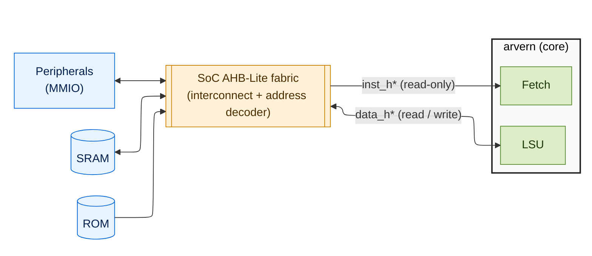

<h1>
  
   
  aRVern Memory Interface and AHB-Lite Contract
   
</h1>

This document is the deep reference for aRVern's two AHB-Lite master interfaces:
exact signal semantics, what transfer types/sizes are used, how error responses
become traps, the wait-state contract, the HSMODE/HPROT privilege encoding, and
the one accepted address-phase-stability deviation tied to `SINGLE_CYCLE_BRANCH`.

For pinout, see [`integration_guide.md` §4](integration_guide.md#4-ahb-bus-interfaces).
For trap-handling of the error responses, see
[`traps_and_interrupts.md`](traps_and_interrupts.md).
For the SoC AHB-Lite fabric IP that fans these two masters out to the
address-decoded slaves (the `Fabric` block in §1's topology diagram), see the
[`ahb_interconnect` IP documentation](../../arvern-ips/ahb_interconnect/doc/ahb_interconnect.md).

---

## Table of Contents

1. [Bus Topology](#1-bus-topology)
2. [Instruction Bus](#2-instruction-bus)
3. [Data Bus](#3-data-bus)
4. [Transfer Sizes and Byte Lanes](#4-transfer-sizes-and-byte-lanes)
5. [HPROT and HSMODE — Privilege Encoding](#5-hprot-and-hsmode--privilege-encoding)
6. [Wait States](#6-wait-states)
7. [Error Response → Trap](#7-error-response--trap)
8. [Pipelined Access Patterns](#8-pipelined-access-patterns)
9. [SINGLE_CYCLE_BRANCH Address-Phase Stability](#9-single_cycle_branch-address-phase-stability)
10. [Integration Requirements](#10-integration-requirements)

---

## 1. Bus Topology

Two **independent** AHB-Lite masters:

| Master | Prefix | Use | Writes? |
|---|---|---|---|
| Instruction | `inst_h*` | Code fetch | No (always read) |
| Data | `data_h*` | Loads, stores, MMIO | Yes |

Both follow the ARM AMBA AHB-Lite spec (IHI 0033) with the following arvern-specific properties:

| Property | Value | Notes |
|---|---|---|
| `HTRANS` codes used | `2'b00` (IDLE), `2'b10` (NONSEQ) | No SEQ, no BUSY — every transfer is a fresh NONSEQ |
| `HBURST` | `3'b000` (SINGLE) | Always |
| `HMASTLOCK` | `1'b0` | Always |
| `HRESP` codes used | `1'b0` (OKAY), `1'b1` (ERROR) | No RETRY, no SPLIT (AHB-Lite has neither anyway) |

There is no protocol negotiation — the master just issues NONSEQ + SINGLE
transfers and reacts to `HREADY`/`HRESP`.

---

## 2. Instruction Bus

| Signal | Dir | Width | Value / Notes |
|---|---|---|---|
| `inst_haddr_o` | out | 32 | Byte address of the fetch. For C-extension code, can be 2-byte aligned (`addr[0] == 0`); for non-C code, 4-byte aligned. **Not address-phase-stable across wait states when `SINGLE_CYCLE_BRANCH=1`** — see §9. |
| `inst_htrans_o` | out | 2 | `2'b00` (IDLE) when no fetch in flight; `2'b10` (NSEQ) otherwise. |
| `inst_hsize_o` | out | 3 | Always `3'b010` (word). 16-bit C-extension fetches are word-aligned reads of the containing word — the decoder picks the correct half. |
| `inst_hburst_o` | out | 3 | Always `3'b000` (SINGLE). |
| `inst_hwrite_o` | out | 1 | Always `1'b0` (read). |
| `inst_hwdata_o` | out | 32 | Always `32'h0` (unused). |
| `inst_hprot_o` | out | 4 | `{cacheable=0, bufferable=0, privileged, data=0}`. `privileged=1` in M/S mode, `0` in U mode. |
| `inst_hmastlock_o` | out | 1 | Always `1'b0`. |
| `inst_hsmode_o` | out | 1 | `1` when fetching in S-mode (`priv == 2'b01`). Combine with `HPROT[1]` to fully decode M/S/U — see §5. |
| `inst_hrdata_i` | in | 32 | Fetched word. Sampled on the cycle `inst_hready_i = 1`. |
| `inst_hready_i` | in | 1 | Slave wait extension when low. |
| `inst_hresp_i` | in | 1 | Error response — see §7. |

**Stream behaviour:** the fetch unit issues a new address as soon as the
previous transfer's address phase has been accepted (`inst_hready_i = 1`). It
will speculatively fetch sequential PCs ahead of branch resolution; on a
taken branch the speculative result is discarded.

---

## 3. Data Bus

| Signal | Dir | Width | Value / Notes |
|---|---|---|---|
| `data_haddr_o` | out | 32 | Byte address of the load/store. Native alignment per `data_hsize_o`. |
| `data_htrans_o` | out | 2 | `2'b00` / `2'b10` |
| `data_hsize_o` | out | 3 | `3'b000` (byte), `3'b001` (halfword), `3'b010` (word) — driven from the instruction encoding (`LB`/`LH`/`LW`/`SB`/`SH`/`SW`). |
| `data_hburst_o` | out | 3 | Always `3'b000` (SINGLE). |
| `data_hwrite_o` | out | 1 | `1` for stores, `0` for loads. |
| `data_hwdata_o` | out | 32 | Store data, replicated/aligned per byte lane (see §4). |
| `data_hprot_o` | out | 4 | `{cacheable=0, bufferable=0, privileged, data=1}`. `privileged` is **MPRV-aware** — when `mstatus.MPRV=1`, this reflects `mstatus.MPP` rather than the current priv mode. |
| `data_hmastlock_o` | out | 1 | Always `1'b0`. |
| `data_hsmode_o` | out | 1 | `1` when the effective priv level (MPRV-aware) is S-mode. |
| `data_hrdata_i` | in | 32 | Load data. Aligned per `data_hsize_o`/`data_haddr_o[1:0]` (see §4). |
| `data_hready_i` | in | 1 | Slave wait extension. |
| `data_hresp_i` | in | 1 | Error response — see §7. |

**Posted-store contract:** aRVern issues a store, then immediately accepts the
next instruction's dispatch. The store's data phase (and any error response)
arrives later. This is standard pipelined AHB-Lite. See the accepted deviation
[*store-access-fault may be lost if NMI/IRQ preempts an in-flight posted
store*](spec_compliance_notes.md#store-access-fault-may-be-lost-if-an-nmiirq-preempts-an-in-flight-posted-store).

---

## 4. Transfer Sizes and Byte Lanes

aRVern uses **byte-lane-aligned** AHB transfers per the ARM spec.

### Loads

| Instruction | `HSIZE` | `HADDR[1:0]` | Slave returns on `HRDATA[31:0]` |
|---|---|---|---|
| `LB`/`LBU`  | 000 | xx | The byte at `addr[1:0]` on its native lane; other lanes don't-care |
| `LH`/`LHU`  | 001 | x0 | The halfword at `addr[1]` on its native lane; other lanes don't-care |
| `LW`        | 010 | 00 | The full word |

For sub-word loads the core extracts and (zero/sign-)extends; the slave is
**not** required to align — it just drives the natural lane.

### Stores

| Instruction | `HSIZE` | `HADDR[1:0]` | `HWDATA[31:0]` lane usage |
|---|---|---|---|
| `SB`  | 000 | xx | Byte at `addr[1:0]` carries data; other lanes don't-care |
| `SH`  | 001 | x0 | Halfword at `addr[1]` carries data; other lanes don't-care |
| `SW`  | 010 | 00 | Full word |

The core drives all 32 bits of `HWDATA`, but the slave should mask by the
byte enables implied by `HSIZE` + `HADDR[1:0]`.

### Misalignment

aRVern does **not** support hardware misalignment fixup. An LH/LW with
non-natural alignment raises **load address misaligned** (cause 4); SH/SW
similarly raises **store address misaligned** (cause 6).

### Endianness

Little-endian only (standard RV32).

---

## 5. HPROT and HSMODE — Privilege Encoding

The standard `HPROT[3:0]` carries cacheable/bufferable/privileged/data:

| Bit | Meaning | aRVern value |
|----:|---|---|
| 3 | Cacheable | Always `0` (uncached) |
| 2 | Bufferable | Always `0` |
| 1 | Privileged | `1` in M-mode or S-mode; `0` in U-mode (data bus: MPRV-aware) |
| 0 | Data access | `0` for instruction fetch, `1` for data bus |

`HPROT[1]` alone cannot distinguish M from S — it's `1` for both. aRVern adds
the dedicated **`HSMODE`** output (`inst_hsmode_o` / `data_hsmode_o`) to
disambiguate.

### Full M / S / U decode

| `HPROT[1]` | `HSMODE` | Effective privilege |
|:----------:|:--------:|---------------------|
| `1` | `0` | Machine (M) |
| `1` | `1` | Supervisor (S) |
| `0` | `0` | User (U) |
| `0` | `1` | — (unused; never asserted by aRVern) |

**Wiring:** connect `*_hsmode_o` to the `HAUSER` user-signal of an AHB-Lite
interconnect that supports user attributes (arvern-ips's `ahb_interconnect`
exposes such a side-channel). For protection-aware routing, decode
`{HPROT[1], HSMODE}` in the fabric and accept/reject per region.

### MPRV interaction (data bus only)

When `mstatus.MPRV = 1` (set in M-mode for a single load/store to "speak as"
the previous privilege level), aRVern's data-bus `HPROT[1]` and `HSMODE`
reflect `mstatus.MPP` instead of the current priv. The instruction bus is
**not** MPRV-aware — fetches always reflect the current priv level.

---

## 6. Wait States

Standard AHB-Lite wait-state behaviour. The slave drops `HREADY` low to extend
the data phase of the current transfer (and, by AHB-Lite's pipelining, the
address phase of the next transfer).

### Bounded backpressure

There is **no internal queueing** in arvern. While `HREADY` is low:

- **Inst bus:** the fetch unit holds the speculative next address (subject to the
  §9 caveat). The decoder may continue to dispatch from the prefetch buffer if
  buffered, otherwise it stalls.
- **Data bus:** the LSU stalls the pipeline (decode emits no further loads/
  stores until the current data phase commits).

There is no wait-state timeout in the RTL — a slave that holds `HREADY` low
forever will hang the core. Use a watchdog in the SoC if this is a concern.

### Fabric arbitration

aRVern is a master, not an interconnect. When sharing a fabric with other
masters, the AHB interconnect's arbiter decides when aRVern is granted —
aRVern stalls on whatever `HREADY` it sees.

---

## 7. Error Response → Trap

A slave asserts `HRESP = 1` to signal an error response. Per AHB-Lite, this is
a **two-cycle** sequence: ERROR1 (HREADY low, HRESP high) followed by ERROR2
(HREADY high, HRESP high). The master samples the error on the cycle HREADY
returns high.

aRVern translates each error to a synchronous exception:

| Bus | Trigger | Cause | `mtval` |
|---|---|------:|---|
| Inst | `inst_hresp_i = 1` for the fetch of the trapping PC | 1 (instruction access fault) | The faulting address (see deviation note) |
| Data, load | `data_hresp_i = 1` on a load data phase | 5 (load access fault) | The faulting address |
| Data, store | `data_hresp_i = 1` on a store data phase | 7 (store access fault) | The faulting address |

> **Posted-store fault drop deviation.** If an NMI / IRQ takes the pipeline
> away during an in-flight posted store's data phase, the late `HRESP`
> response is dropped (the store was already committed bus-side). See
> [`spec_compliance_notes.md`](spec_compliance_notes.md#store-access-fault-may-be-lost-if-an-nmiirq-preempts-an-in-flight-posted-store).

---

## 8. Pipelined Access Patterns

### Best-case throughput

- **Inst bus:** 1 fetch / cycle when `HREADY = 1` continuously. With wait
  states, throughput drops linearly.
- **Data bus:** 1 load **OR** 1 store / cycle (single LSU port).

### Pipelining

AHB-Lite overlaps the *data phase of transfer N* with the *address phase of
transfer N+1*. aRVern issues the next address as soon as the previous address
phase is accepted. On a taken branch, the in-flight speculative fetch's data
phase still completes (the slave doesn't know it's been discarded) — the
discarded word is dropped at the decoder.

### Single-cycle branch

When `SINGLE_CYCLE_BRANCH = 1`, the branch target is a combinational function
of `inst_hrdata_i` of the branch instruction — i.e. it appears on `inst_haddr_o`
on the same cycle the branch fetch's data phase commits. This is the source
of the §9 deviation.

---

## 9. SINGLE_CYCLE_BRANCH Address-Phase Stability

> **No functional impact on any conformant AHB-Lite consumer.** When
> `SINGLE_CYCLE_BRANCH = 1` (the high-IPC setting), the instruction-bus
> address phase is not held byte-stable across wait states — a transient
> intra-wait observation that conformant slaves and interconnects (which
> commit address phases only on HREADY-high) never observe. A strict
> AHB protocol checker that monitors intra-wait stability will flag it.
> The choice between `=0` and `=1` is an Fmax / IPC trade-off — see
> [`integration_guide.md` §1](integration_guide.md#1-configuration-parameters).

### What the AHB-Lite spec says

Once a master presents a non-IDLE transfer it must hold `HADDR / HTRANS /
HSIZE / HWRITE / HBURST` byte-stable until the slave accepts it (`HREADY` high).

### What aRVern does with `SINGLE_CYCLE_BRANCH = 1`

The instruction master does **not** hold `HADDR`/`HTRANS` stable across wait
states when a single-cycle branch resolves during the previous fetch's data
phase wait. The branch target is `inst_hrdata_i → [branch decode] →
inst_haddr_o` — a combinational function of data that does not exist until
the wait ends. The target appears on `inst_haddr_o` exactly on the
HREADY-high cycle.

### Why this is benign

Conformant AHB-Lite slaves and interconnects commit the address phase only on
the HREADY-high cycle (`HSEL & HTRANS != IDLE & HREADY`). The transient
HSEL/HADDR instability during the wait is a non-event because the in-flight
transfer's HREADYOUT is routed by the **registered** data-phase select, not
the current-cycle combinational HSEL. **All conformant consumers are
unaffected**.

### When this matters

A non-conformant consumer that commits an address mid-wait (without HREADY
gating) would mishandle it. Such IP is broken AHB-Lite independent of arvern.

### If a strict protocol checker objects

`SINGLE_CYCLE_BRANCH = 0` registers the branch target, so the address phase
becomes byte-stable across wait states and a strict address-phase-stability
check will pass. Trade-off: one extra bubble per taken branch (~8–12 % IPC
loss on CoreMark/Dhrystone). The default RTL value is **0**; the regression
sweep covers both.

Full rationale and trade-off discussion:
[`spec_compliance_notes.md`](spec_compliance_notes.md#instruction-bus-address-phase-not-held-stable-across-wait-states-single-cycle-branch).

---

## 10. Integration Requirements

### Always required

- Both buses **must** be wired into AHB-Lite slaves/fabrics that gate address
  capture on `HREADY` (the standard AHB-Lite rule). The protocol checker in
  `bench/verilog/ahb_protocol_checker.v` enforces this at simulation time when
  invoked with `-ahb_check`.
- The fabric must respond on the instruction bus at `reset_vector_i` after
  reset deassertion (otherwise the very first fetch hangs).
- Sub-word loads/stores need the slave to drive the natural byte lane of
  `HRDATA`/accept the natural byte lane of `HWDATA`.

### Recommended

- Decode `{HPROT[1], HSMODE}` at the interconnect for privilege-aware routing
  (M-only regions, S+M regions, U-accessible regions).
- Provide an SoC-level **bus watchdog** so a runaway transaction can't hang the
  core indefinitely (aRVern has no internal timeout).
- For low-power SoCs, drive `hclk_en_o` into the clock gate cell so WFI
  actually gates the clock.

### Not required

- No burst support is needed.
- No SPLIT/RETRY support (AHB-Lite has neither).
- No address-phase-hold workaround if `SINGLE_CYCLE_BRANCH = 0` (the
  default).

---

## See Also

- [`integration_guide.md` §4](integration_guide.md#4-ahb-bus-interfaces) — port reference
- [`traps_and_interrupts.md`](traps_and_interrupts.md) — what to do with the access-fault traps
- [`spec_compliance_notes.md`](spec_compliance_notes.md) — the three AHB-related deviations in detail
- `bench/verilog/ahb_protocol_checker.v` — runtime protocol checker (toggle via `-ahb_check`)
- `rtl/verilog/arv_fetch.v`, `rtl/verilog/arv_load_store.v` — the two AHB masters
