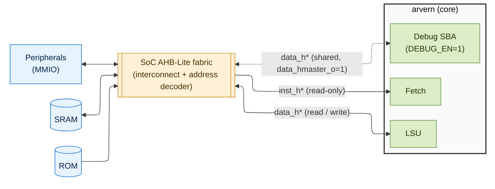

<h1>
  
   
  aRVern Memory Interface and AHB-Lite Contract
   
</h1>

This document is the deep reference for aRVern's two AHB-Lite master interfaces:
exact signal semantics, what transfer types/sizes are used, how error responses
become traps, the wait-state contract, the HSMODE/HPROT privilege encoding, and
instruction-bus address-phase conformance.

For pinout, see [`integration_guide.md` §4](integration_guide.md#4-ahb-bus-interfaces).
For trap-handling of the error responses, see
[`traps_and_interrupts.md`](traps_and_interrupts.md).
For the SoC AHB-Lite fabric IP that fans these two masters out to the
address-decoded slaves (the `Fabric` block in §1's topology diagram), see the
[`ahb_interconnect` IP documentation](https://github.com/Arvern-Silicon/arvern-ips/tree/main/ahb_interconnect/doc/ahb_interconnect.md).

---

## Table of Contents

1. [Bus Topology](#1-bus-topology)
2. [Instruction Bus](#2-instruction-bus)
3. [Data Bus](#3-data-bus)
4. [Transfer Sizes and Byte Lanes](#4-transfer-sizes-and-byte-lanes)
5. [HPROT and HSMODE — Privilege Encoding](#5-hprot-and-hsmode--privilege-encoding)
6. [Wait States](#6-wait-states)
7. [Error Response → Trap](#7-error-response--trap)
8. [Pipelined Access Patterns](#8-pipelined-access-patterns)
9. [Integration Requirements](#9-integration-requirements)

---

## 1. Bus Topology

```mermaid
%%{init: {"flowchart": {"defaultRenderer": "elk"}}}%%
flowchart LR
    %% Slaves on the left, stacked vertically
    subgraph Slaves[" "]
      direction TB
      ROM[(ROM)]
      SRAM[(SRAM)]
      Periph["Peripherals<br/>(MMIO)"]
    end

    %% Shared SoC interconnect in the middle
    Fabric[["SoC AHB-Lite fabric<br/>(interconnect + address decoder)"]]

    %% Core boundary on the right; direction TB keeps Fetch above LSU
    subgraph aRVern["arvern (core)"]
      direction TB
      Fetch
      LSU
      SBA["Debug SBA<br/>(DEBUG_EN=1)"]
    end

    %% Slave-side edges (declare with the slave first so ELK puts it on the left)
    ROM     --> Fabric
    SRAM   <--> Fabric
    Periph <--> Fabric

    %% Core-side edges (declare with Fabric first so ELK puts the core on the right)
    Fabric -->|"inst_h* (read-only)"| Fetch
    Fabric <-->|"data_h* (read / write)"| LSU
    Fabric <-.->|"data_h* (shared, data_hmaster_o=1)"| SBA

    classDef stage  fill:#dcedc8,stroke:#558b2f,stroke-width:1px,color:#1b3804;
    classDef fabric fill:#fff0d8,stroke:#cc8400,stroke-width:1px,color:#4a2e00;
    classDef slave  fill:#e8f4fd,stroke:#0366d6,stroke-width:1px,color:#03204c;

    class LSU,Fetch,SBA stage;
    class Fabric fabric;
    class ROM,SRAM,Periph slave;

    style aRVern fill:#fafafa,stroke:#222,stroke-width:2px,color:#000;
    style Slaves fill:none,stroke:none;
```

Two **independent** AHB-Lite masters:

| Master | Prefix | Use | Writes? |
|---|---|---|---|
| Instruction | `inst_h*` | Code fetch | No (always read) |
| Data | `data_h*` | Loads, stores, MMIO | Yes |

With `DEBUG_EN = 1` the Debug Module's System Bus Access master is a third source of
transfers, arbitrated onto `data_h*` inside the core and tagged by `data_hmaster_o`
(§6, "SBA arbitration"); no third bus port is added.

Both follow the ARM AMBA AHB-Lite spec (IHI 0033) with the following arvern-specific properties:

| Property | Value | Notes |
|---|---|---|
| `HTRANS` codes used | `2'b00` (IDLE), `2'b10` (NONSEQ) | No SEQ, no BUSY — every transfer is a fresh NONSEQ |
| `HBURST` | `3'b000` (SINGLE) | Always |
| `HMASTLOCK` | `1'b0` | Always |
| `HRESP` codes used | `1'b0` (OKAY), `1'b1` (ERROR) | No RETRY, no SPLIT (AHB-Lite has neither anyway) |

There is no protocol negotiation — the master just issues NONSEQ + SINGLE
transfers and reacts to `HREADY`/`HRESP`.

---

## 2. Instruction Bus

| Signal | Dir | Width | Value / Notes |
|---|---|---|---|
| `inst_haddr_o` | out | 32 | Byte address of the fetch. **Always word-aligned** — `addr[1:0]` is hard-zeroed on every fetch (`arv_fetch.v`), including C-extension code; a 16-bit instruction is read as the containing word and the decoder picks the correct half (see `inst_hsize_o`). While `inst_hready_i` is low the master presents IDLE and the address is don't-care; NONSEQ appears only on cycles the transfer is accepted (§6). |
| `inst_htrans_o` | out | 2 | `2'b00` (IDLE) when no fetch in flight; `2'b10` (NSEQ) otherwise. |
| `inst_hsize_o` | out | 3 | Always `3'b010` (word). 16-bit C-extension fetches are word-aligned reads of the containing word — the decoder picks the correct half. |
| `inst_hburst_o` | out | 3 | Always `3'b000` (SINGLE). |
| `inst_hwrite_o` | out | 1 | Always `1'b0` (read). |
| `inst_hwdata_o` | out | 32 | Always `32'h0` (unused). |
| `inst_hprot_o` | out | 4 | `{cacheable=0, bufferable=0, privileged, data=0}`. `privileged=1` in M/S mode, `0` in U mode. |
| `inst_hmastlock_o` | out | 1 | Always `1'b0`. |
| `inst_hsmode_o` | out | 1 | `1` when fetching in S-mode (`priv == 2'b01`). Combine with `HPROT[1]` to fully decode M/S/U — see §5. |
| `inst_hrdata_i` | in | 32 | Fetched word. Sampled on the cycle `inst_hready_i = 1`. |
| `inst_hready_i` | in | 1 | Slave wait extension when low. |
| `inst_hresp_i` | in | 1 | Error response — see §7. |

**Stream behaviour:** the fetch unit issues a new address as soon as the
previous transfer's address phase has been accepted (`inst_hready_i = 1`). It
will speculatively fetch sequential PCs ahead of branch resolution; on a
taken branch the speculative result is discarded.

---

## 3. Data Bus

| Signal | Dir | Width | Value / Notes |
|---|---|---|---|
| `data_haddr_o` | out | 32 | Byte address of the load/store. Native alignment per `data_hsize_o`. |
| `data_htrans_o` | out | 2 | `2'b00` / `2'b10` |
| `data_hsize_o` | out | 3 | `3'b000` (byte), `3'b001` (halfword), `3'b010` (word) — driven from the instruction encoding (`LB`/`LH`/`LW`/`SB`/`SH`/`SW`). |
| `data_hburst_o` | out | 3 | Always `3'b000` (SINGLE). |
| `data_hwrite_o` | out | 1 | `1` for stores, `0` for loads. |
| `data_hwdata_o` | out | 32 | Store data, replicated/aligned per byte lane (see §4). |
| `data_hprot_o` | out | 4 | `{cacheable=0, bufferable=0, privileged, data=1}`. `privileged` is **MPRV-aware** — when `mstatus.MPRV=1`, this reflects `mstatus.MPP` rather than the current priv mode. |
| `data_hmastlock_o` | out | 1 | Always `1'b0`. |
| `data_hsmode_o` | out | 1 | `1` when the effective priv level (MPRV-aware) is S-mode. |
| `data_hmaster_o` | out | 1 | Transfer-master tag: `1`=Debug Module SBA (debugger) access, `0`=hart software access. High for **both** the address and the data phase of an SBA transfer; tied `0` when `DEBUG_EN=0`. See §6 and `debug_interface.md`. |
| `data_hrdata_i` | in | 32 | Load data. Aligned per `data_hsize_o`/`data_haddr_o[1:0]` (see §4). |
| `data_hready_i` | in | 1 | Slave wait extension. |
| `data_hresp_i` | in | 1 | Error response — see §7. |

**Write data timing:** `data_hwdata_o` is registered — loaded when the store's address
phase is accepted, held through the data phase, and returned to `32'h0` when the data
phase completes. Sub-word data is replicated across all lanes (§4).

**Posted-store contract:** aRVern issues a store, then immediately accepts the
next instruction's dispatch. The store's data phase (and any error response)
arrives later. This is standard pipelined AHB-Lite; an ERROR on that data phase is
reported as the resumable NMI of §7.

**Zcmt table reads (`C_EXTENSION = 4`):** `cm.jt`/`cm.jalt` read their jump-table entry
on the **data** bus as a word load, so the `jvt` table must be reachable from `data_h*`,
not only from `inst_h*`. For PMP the read is treated as an instruction fetch (X
permission, cause 1).

---

## 4. Transfer Sizes and Byte Lanes

aRVern uses **byte-lane-aligned** AHB transfers per the ARM spec.

### Loads

| Instruction | `HSIZE` | `HADDR[1:0]` | Slave returns on `HRDATA[31:0]` |
|---|---|---|---|
| `LB`/`LBU`  | 000 | xx | The byte at `addr[1:0]` on its native lane; other lanes don't-care |
| `LH`/`LHU`  | 001 | x0 | The halfword at `addr[1]` on its native lane; other lanes don't-care |
| `LW`        | 010 | 00 | The full word |

For sub-word loads the core extracts and (zero/sign-)extends; the slave is
**not** required to align — it just drives the natural lane.

### Stores

| Instruction | `HSIZE` | `HADDR[1:0]` | `HWDATA[31:0]` lane usage |
|---|---|---|---|
| `SB`  | 000 | xx | Byte at `addr[1:0]` carries data; other lanes don't-care |
| `SH`  | 001 | x0 | Halfword at `addr[1]` carries data; other lanes don't-care |
| `SW`  | 010 | 00 | Full word |

The core drives all 32 bits of `HWDATA`, but the slave should mask by the
byte enables implied by `HSIZE` + `HADDR[1:0]`.

### Misalignment

aRVern does **not** support hardware misalignment fixup. An LH/LW with
non-natural alignment raises **load address misaligned** (cause 4); SH/SW
similarly raises **store address misaligned** (cause 6). A misaligned access never
reaches the bus. If the address is also PMP-denied, the access fault (5/7) is reported
instead of the misalignment — see `spec_compliance_notes.md`, "Misaligned load/store
into a PMP-denied region".

### Endianness

Little-endian only (standard RV32).

---

## 5. HPROT and HSMODE — Privilege Encoding

The standard `HPROT[3:0]` carries cacheable/bufferable/privileged/data:

| Bit | Meaning | aRVern value |
|----:|---|---|
| 3 | Cacheable | Always `0` (uncached) |
| 2 | Bufferable | Always `0` |
| 1 | Privileged | `1` in M-mode or S-mode; `0` in U-mode (data bus: MPRV-aware) |
| 0 | Data access | `0` for instruction fetch, `1` for data bus |

`HPROT[1]` alone cannot distinguish M from S — it's `1` for both. aRVern adds
the dedicated **`HSMODE`** output (`inst_hsmode_o` / `data_hsmode_o`) to
disambiguate.

### Full M / S / U decode

| `HPROT[1]` | `HSMODE` | Effective privilege |
|:----------:|:--------:|---------------------|
| `1` | `0` | Machine (M) |
| `1` | `1` | Supervisor (S) |
| `0` | `0` | User (U) |
| `0` | `1` | — (unused; never asserted by aRVern) |

**Wiring:** connect `*_hsmode_o` to the `HAUSER` user-signal of an AHB-Lite
interconnect that supports user attributes (arvern-ips's `ahb_interconnect`
exposes such a side-channel). For protection-aware routing, decode
`{HPROT[1], HSMODE}` in the fabric and accept/reject per region. This is the intended
mechanism for a build that wants privilege separation without in-core PMP
(`SU_MODE_EN = 1`, `PMP_NR = 0`), and the natural way to gate the sparse peripheral
space per block even when PMP protects the memories — see `integration_guide.md` §4.7.

### MPRV interaction (data bus only)

When `mstatus.MPRV = 1` and the hart is in M-mode, the data-bus `HPROT[1]` and
`HSMODE` reflect `mstatus.MPP` instead of the current privilege. MPRV is ignored inside
an RNMI handler (`mnstatus.NMIE = 0`). The instruction bus is **not** MPRV-aware —
fetches always reflect the current privilege level.

### M-only builds (`SU_MODE_EN = 0`)

Both buses always signal M-mode: `HPROT[1] = 1` and `HSMODE = 0` on every transfer.

### Protection in the fabric (`SU_MODE_EN = 1`, `PMP_NR = 0`)

No in-core checker exists in this configuration. Every load, store and fetch is issued
with its effective privilege on `HPROT[1]`/`HSMODE`, and a protection unit in the fabric
enforces the per-region policy. A fabric denial can only be signalled back as an AHB
ERROR, which on the data bus arrives as the RNMI of §7 — never as `mcause` 5/7 — and on
the instruction bus as `mcause` 1. `integration_guide.md` §4.7 gives the platform-level
trade-off.

---

## 6. Wait States

Standard AHB-Lite wait-state behaviour. The slave drops `HREADY` low to extend
the data phase of the current transfer (and, by AHB-Lite's pipelining, the
address phase of the next transfer).

### Bounded backpressure

There is **no outstanding-transaction queue** in arvern — at most one transfer per bus is
in flight. While `HREADY` is low:

- **Inst bus:** the master presents IDLE — the next address is not pending on the bus,
  and `inst_haddr_o` may change while `HTRANS = IDLE`, which AHB-Lite permits (the
  address is don't-care during IDLE) but a monitor that latches the next address during
  a wait state will flag. The decoder may continue to dispatch from the prefetch
  buffer if instructions are buffered, otherwise it stalls.
- **Data bus:** the access in EX keeps NONSEQ asserted — `data_htrans_o` is not gated by
  `HREADY`, unlike the instruction bus. Address and control stay stable because the
  pipeline stall freezes the EX-stage access. The next load/store issues its address
  phase on the first `HREADY = 1` cycle, pipelined behind the previous data phase.

The two masters therefore differ under wait states: an interconnect that keys on "NONSEQ
pending" sees a pending transfer on `data_h*` but never on `inst_h*`.

There is no wait-state timeout in the RTL — a slave that holds `HREADY` low
forever will hang the core. Use a watchdog in the SoC if this is a concern.

### Fabric arbitration

aRVern is a master, not an interconnect. When sharing a fabric with other
masters, the AHB interconnect's arbiter decides when aRVern is granted —
aRVern stalls on whatever `HREADY` it sees.

### SBA arbitration (`DEBUG_EN = 1`)

The Debug Module's System Bus Access master shares `data_h*` with the LSU; the
arbitration is inside the core and works with the hart halted or running:

- The SBA is granted only when the LSU presents IDLE with `HREADY = 1`; it cannot
  pre-empt an LSU transfer.
- During the SBA address and data phases the LSU sees `HREADY = 0` and `HRESP = 0` — to
  the pipeline the SBA transfer looks like a slow slave.
- SBA transfers drive `HPROT = 4'b0011` (M-mode data access), `HSMODE = 0`,
  `HMASTLOCK = 0` and `data_hmaster_o = 1` for both phases. The tag is what a subordinate
  keys on if debugger accesses need their own protection policy; the bundled
  `ahb_interconnect` carries it as a manager-supplied HMASTER bit — see
  `integration_guide.md` §10.3.

See `integration_guide.md` §10.3 and `debug_interface.md` for the debugger-side contract.

---

## 7. Error Response → Trap

### 7.1 Error response protocol and master behaviour

A slave asserts `HRESP = 1` to signal an error response. Per AHB-Lite, this is
a **two-cycle** sequence: ERROR1 (HREADY low, HRESP high) followed by ERROR2
(HREADY high, HRESP high). Both masters detect the error on the **first** ERROR cycle
(`HRESP = 1` with `HREADY = 0`), register it, and act on it in the second cycle. A slave
that raises `HRESP` only together with `HREADY = 1` (a one-cycle error) is not detected.

What the master does after an ERROR:

- **Data bus.** No address phase is issued on the second ERROR cycle; the access that was
  about to issue is held one cycle, not dropped. A failed load does not write its
  destination register.
- **Instruction bus.** Fetch freezes on the error and the instruction bus stays IDLE until
  a confirmed redirect — the trap-vector fetch. Errors on speculative prefetches that are
  never executed are **discarded**, not reported: the instruction bus routinely reads past
  the end of a ROM or past a taken branch, so an ERROR there is normal and must not be
  treated as fatal in the fabric. A correct-path error is deferred until every buffered
  pre-fault instruction has retired, so the trap is precise.

### 7.2 What each bus reports

The two buses report errors differently, and deliberately so:

| Bus | Trigger | Reported as | Evidence |
|---|---|---|---|
| Inst | `inst_hresp_i = 1` for the fetch of the trapping PC | **synchronous** `mcause = 1` (instruction access fault) | `mtval` = the address of the faulting **parcel** (`PC + 2` when only the upper half of a straddling 32-bit instruction faulted) |
| Data, load or store | `data_hresp_i = 1` on the data phase | **resumable NMI**, `mncause = 0x8000_0003` — *not* `mcause` 5/7 | `marv_epc` / `marv_eaddr` / `marv_estat`, latched on the faulting address phase |

A data-bus error is known only after the access has been issued and the pipeline has moved
on, so reporting it as a synchronous exception would claim an attribution the hardware
cannot support. The error is latched as a pending RNMI regardless of pipeline state — a
posted store whose data phase fails after the pipeline has moved on is reported the same
way. `integration_guide.md` §4.4 gives the platform contract and
`spec_compliance_notes.md` the full rationale.

### 7.3 Access faults from PMP, not from the bus

With `PMP_NR > 0`, causes **5** (load), **7** (store) and **1** (instruction fetch) are
raised by the PMP checkers. These are decided from the address *before* the access is
issued, which is what lets them be precise:

| Denial | Bus activity |
|---|---|
| Load or store | **None.** The address phase is gated, so no transfer is issued and a denied store cannot partially land |
| Instruction fetch | The transfer **is** issued; the returned parcel is refused entry to the instruction buffer and never executed. See `integration_guide.md` §4.6 for the platform requirement this places on the instruction bus |

So on the data bus the two sources are cleanly separated — `mcause` 5/7 always mean a
permission violation, and a memory-system failure always arrives as the RNMI.

---

## 8. Pipelined Access Patterns

### Best-case throughput

- **Inst bus:** 1 fetch / cycle when `HREADY = 1` continuously. With wait
  states, throughput drops linearly.
- **Data bus:** 1 load **OR** 1 store / cycle (single LSU port).

### Pipelining

AHB-Lite overlaps the *data phase of transfer N* with the *address phase of
transfer N+1*. aRVern issues the next address as soon as the previous address
phase is accepted. On a taken branch, the in-flight speculative fetch's data
phase still completes (the slave doesn't know it's been discarded) — the
discarded word is dropped by the fetch unit and never reaches the decoder.

---

## 9. Integration Requirements

### Always required

- Both buses **must** be wired into AHB-Lite slaves/fabrics that gate address
  capture on `HREADY` (the standard AHB-Lite rule). The instruction-bus master
  issues `NONSEQ` only on accepted cycles and never holds a transfer across a wait
  state, in either `SINGLE_CYCLE_BRANCH` setting; `inst_haddr_o` may change while
  `HTRANS = IDLE` (§6).
- The fabric must respond on the instruction bus at `reset_vector_i` after
  reset deassertion (otherwise the very first fetch hangs). `reset_vector_i` must be
  stable from before until at least one `hclk_i` edge after `hresetn_i` deasserts; bits
  `[1:0]` are ignored. The first instruction address phase is issued on the second cycle
  after reset release.
- Sub-word loads/stores need the slave to drive the natural byte lane of
  `HRDATA`/accept the natural byte lane of `HWDATA`.

### Recommended

- Decode `{HPROT[1], HSMODE}` at the interconnect for privilege-aware routing
  (M-only regions, S+M regions, U-accessible regions).
- Provide an SoC-level **bus watchdog** so a runaway transaction can't hang the
  core indefinitely (aRVern has no internal timeout).
- For low-power SoCs, drive `hclk_en_o` into the clock gate cell so WFI
  actually gates the clock.

### Not required

- No burst support is needed.
- No SPLIT/RETRY support (AHB-Lite has neither).
- No address-phase-hold workaround, whatever the `SINGLE_CYCLE_BRANCH` setting.

---

## See Also

- [`integration_guide.md` §4](integration_guide.md#4-ahb-bus-interfaces) — port reference
- [`traps_and_interrupts.md`](traps_and_interrupts.md) — what to do with the access-fault traps
- [`spec_compliance_notes.md`](spec_compliance_notes.md) — the data-bus-error RNMI rationale and evidence CSRs
- `rtl/verilog/arv_fetch.v`, `rtl/verilog/arv_load_store.v` — the two AHB masters
