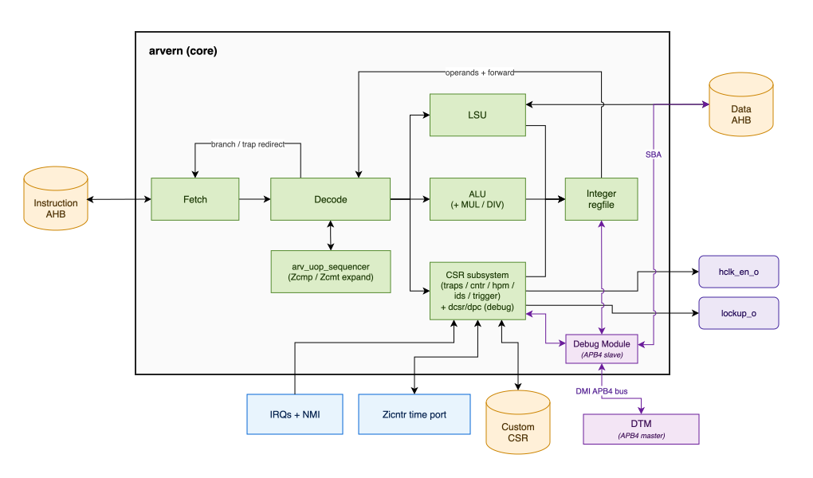

<h1>
  
  <br>
  aRVern Microarchitecture
  <br clear="all">
</h1>

This document is the microarchitectural deep-dive: pipeline structure, the
unified compressed decoder, register file with the JALR shadow register, CSR
subsystem topology, the UOP sequencer, critical paths, and how configuration
parameters move the design points.

It targets **RTL contributors** and anyone trying to understand *why* the
RTL looks the way it does. For port-level integration, see
[`integration_guide.md`](integration_guide.md); for the ISA reference, see
[`arvern_instructions.md`](arvern_instructions.md).

---

## Table of Contents

1. [Top-Level Block Diagram](#1-top-level-block-diagram)
2. [Pipeline](#2-pipeline)
3. [Fetch (`arv_fetch.v`)](#3-fetch-arv_fetchv)
4. [Decode (`arv_decode.v`)](#4-decode-arv_decodev)
5. [Register File (`arv_int_registers.v`)](#5-register-file-arv_int_registersv)
6. [ALU and MUL/DIV (`arv_alu.v`, `arv_alu_muldiv.v`)](#6-alu-and-muldiv-arv_aluv-arv_alu_muldivv)
7. [Load/Store Unit (`arv_load_store.v`)](#7-loadstore-unit-arv_load_storev)
8. [CSR Subsystem (`arv_csr_*.v`)](#8-csr-subsystem-arv_csr_v)
9. [UOP Sequencer (`arv_uop_sequencer.v`)](#9-uop-sequencer-arv_uop_sequencerv)
10. [Critical Paths](#10-critical-paths)
11. [Configuration Parameter Effects](#11-configuration-parameter-effects)
12. [Reset, Clocking, and WFI Power-Down](#12-reset-clocking-and-wfi-power-down)
13. [External Debug (`DEBUG_EN`)](#13-external-debug-debug_en)

---

## 1. Top-Level Block Diagram



- **Fetch** (`arv_fetch`) — drives the instruction AHB master, holds the
  speculative `if_pc`, buffers parcels for compressed-instruction alignment, and
  applies the branch / trap / return redirect. The *Instruction AHB* port and the
  *branch / trap redirect* arrow attach here. See §3.
- **Decode** (`arv_decode`) — the unified RV32I + compressed decoder, the
  branch-target adder, and the central stall arbiter; it issues the regfile
  source selectors and the redirect target. See §4.
- **Integer regfile** (`arv_int_registers`) — flop-array register file plus the
  JALR shadow register. Drawn as one bidirectional arrow: Decode issues source
  selectors and receives forwarded read data (*operands + forward*), while ALU,
  LSU, and CSR each drive a writeback port. See §5.
- **ALU** (`arv_alu`) — combinational base + B-extension ALU; it absorbs
  `arv_alu_muldiv` (M / Zmmul) when `M_EXTENSION ≥ 1`. See §6.
- **LSU** (`arv_load_store`) — the load/store unit and data AHB master: address /
  size / write-data generation, load extract-and-extend, and misalignment /
  access-fault detection. The *Data AHB* port attaches here. See §7.
- **CSR subsystem** (`arv_csr_top`) — the six-block fan-in / read-mux
  composition over `arv_csr_traps`, `arv_csr_pmp` (PMP state, `PMP_NR>0`),
  `arv_csr_cntr` (Zicntr), `arv_csr_hpm` (Zihpm), `arv_csr_ids`, and
  `arv_debug_trigger` (Sdtrig, when `DEBUG_EN=1`), plus the optional `ccsr_*`
  *Custom CSR* port. `arv_csr_debug` (dcsr/dpc) nests under `arv_csr_traps`.
  The *IRQs + NMI* inputs and the *Zicntr time* port land here; the trap
  controller drives the branch redirect, the WFI gate (`hclk_en_o`), and
  `lockup_o`. See §8.
- **uOP sequencer** (`arv_uop_sequencer`) — when active it drives the ALU / LSU /
  regfile control buses directly while Decode is held stalled, expanding Zcmp /
  Zcmt instructions into micro-op (UOP) sequences. See §9.

Twenty-one RTL files under `rtl/verilog/`:

| File | Role |
|---|---|
| `arvern.v` | Top — wires all submodules + parameter sanitisation (`*_USE` / `*_PROC` localparams + `$fatal` range checks) |
| `arv_fetch.v` | Instruction fetch + speculative prefetch + AHB master |
| `arv_decode.v` | Unified RV32I + compressed decoder, branch-target ALU, pipeline stall control |
| `arv_int_registers.v` | Integer register file (32 or 16 regs) + JALR shadow register |
| `arv_alu.v` | ALU (base + B-extension) |
| `arv_alu_muldiv.v` | M / Zmmul (multiplier + optional divider) |
| `arv_load_store.v` | LSU + data-bus AHB master |
| `arv_csr_top.v` | CSR address bank decode + read mux + write-data composition |
| `arv_csr_traps.v` | mstatus/mie/mip/mtvec/mepc/mcause/mtval + S-mode shadows + mideleg/medeleg + trap FSM + IRQ/NMI prioritisation + WFI sleep + lockup detection + IRQ kill |
| `arv_csr_pmp.v` | PMP entry state (`pmpcfg*` / `pmpaddr*`) + Smepmp `mseccfg(h)`: WARL, lock semantics, MML write restriction — state only, no matching. See §7a |
| `arv_pmp_check.v` | Combinational PMP matcher + permission function; one instance per checked port (LSU, fetch). See §7a |
| `arv_csr_cntr.v` | Zicntr (mcycle / minstret + U-mode shadows) + `mcounteren` / `mcountinhibit` bits [2:0] (bits [10:3] live in `arv_csr_hpm.v`) |
| `arv_csr_hpm.v` | Zihpm (mhpmcounter3–10 + mhpmevent3–10, `mcounteren` / `mcountinhibit` bits [10:3]) |
| `arv_csr_ids.v` | mvendorid / marchid / mimpid / mhartid / misa |
| `arv_uop_sequencer.v` | Zcmp / Zcmt micro-op sequencing |
| `arv_csr_debug.v` | Hart-side external debug (`DEBUG_EN`): dcsr/dpc + debug-mode FSM. See §13 |
| `arv_debug_dm.v` | Debug Module: DMI APB4 slave + abstract command engine + GPR/CSR side-ports. See §13 |
| `arv_debug_sba.v` | System Bus Access AHB-Lite master (child of the DM). See §13 |
| `arv_debug_trigger.v` | Sdtrig `mcontrol6` triggers (`DM_TRIGGER_NR`). See §13 |
| `arv_dff.v` | Shared D-flop primitive — build-time async/sync reset select (`ASYNC_RST_EN`); used by the core's sequential logic |
| `arv_dff_sinit.v` | D-flop primitive with a synchronous soft-init (for `dmactive`-cleared DM state). See §13 |

---

## 2. Pipeline

Classic single-issue, in-order 4-stage RISC pipeline:

| Stage | Prefix | Function |
|---|---|---|
| **IF** — Instruction Fetch | `if_` | Inst AHB read address-phase, prefetch buffer, branch-target redirect |
| **ID** — Instruction Decode | `id_` | Decode (Inst AHB data-phase) + register-file read, branch-target computation, stall determination |
| **EX** — Execute | `ex_` | ALU / MUL / DIV / CSR access / LSU data AHB address-phase |
| **WB** — Write-Back | `wb_` | LSU data AHB data-phase (loads *and* stores); regfile write commit for loads |

**Where each instruction class commits.** "4-stage" is the depth of the load
path; the regfile has two write ports (`ex_reg_dest_wdata`, `wb_reg_dest_wdata`
— `arv_int_registers.v`), so most instructions leave the pipeline earlier:

| Class | Resolves / commits in | Notes |
|---|---|---|
| Branch / jump | ID | target on `inst_haddr_o` from the decode stage (§4) |
| ALU / CSR | EX | regfile write from EX; effectively 3 stages |
| Load | WB | `data_hrdata_i` sampled in WB, regfile write from WB |
| Store | WB (no regfile write) | `data_hwdata_o` driven in WB; both directions take their access-fault sample there (`dph_error → wb_excp_*_access_fault_o`) |

**Hazards** are handled by stall-and-bypass: ID stalls when a producer in EX
hasn't committed yet, and a small bypass network forwards EX/WB results to
ID-stage operand reads so back-to-back dependencies don't always stall.
Load-use hazards cost one bubble (the dependent op waits for the WB-committed
load, then takes the WB→ID bypass):

```
cyc:      0    1    2    3    4
lw  x5    IF   ID   EX   WB              ; load result committed at WB (cyc 3)
add x5..       IF   ID   ID   EX   WB    ; ID held 1 cycle, then bypasses WB→ID
```

**Branch resolution** happens in ID in both `SINGLE_CYCLE_BRANCH` settings —
nothing on the branch path is registered. Conditional branches are dispatched
as taken and the instruction buffer is flushed only once the direction is
known (§3, *Conditional branches*). With `SINGLE_CYCLE_BRANCH = 1` the
decoder sees the branch word on `inst_hrdata_i` the cycle it arrives and the
target is on `inst_haddr_o` the same cycle (zero bubble). With `= 0` the word
is first registered in `inst_buf`, so the target is issued one cycle later
(one bubble) — see §10:

```
cyc:      0    1    2    3
br        IF   ID   EX                   ; word registered in inst_buf, decoded next cycle
(spec)         IF   --                   ; speculative sequential fetch squashed
target              IF   ID   EX         ; 1-cycle bubble
```

The whole core is a **single clock domain** (`hclk_i`) with no internal
clock-domain crossing — see §12.

---

## 3. Fetch (`arv_fetch.v`)

### Responsibilities

- Drive the instruction AHB master (`inst_h*`).
- Maintain the speculative `if_pc` register.
- Buffer pre-fetched parcels (for C-extension half-word alignment) in
  `inst_buf[]` / `inst_buf_valid[]`.
- Redirect `if_pc` on branches, traps, returns, Zcmt table jumps, `FENCE.I`
  and the PMP-CSR-write refetch (§4, *Branch-target computation*).
- Deliver assembled 16- or 32-bit instructions to ID with `id_instruction_o`
  / `id_instruction_valid_o` / `id_pc_o`.
- Register `dph_error` (one cycle) from `inst_hresp_i`, hold it in the sticky
  `fetch_fault_freeze` until a confirmed redirect, and deliver
  `id_excp_inst_access_fault_o` + `id_inst_fault_addr_o` precisely.

### Speculative prefetch

The fetch unit issues sequential PCs ahead of branch resolution. When the
decoder reports a branch (`id_branch_detect_i`), `if_pc` is overwritten with
the target and the in-flight speculative result is discarded in the fetch unit
(`incoming_inst` gating) — it never reaches the decoder.

### Conditional branches: predict taken, flush late

Every conditional branch is dispatched as **taken**: in its dispatch cycle the
target goes out on `inst_haddr_o` (zero bubble with `SINGLE_CYCLE_BRANCH = 1`)
while the comparison runs in parallel in ID and is registered. One cycle later
`id_branch_cancel_o = id_branch_dispatch_reg & ~id_branch_taken_reg` tells the
fetch unit which way it went:

- **Taken** (`branch_confirmed`): the instruction buffer is invalidated
  (`effective_buf_valid = 0`) and the target word, already arriving, is
  consumed directly. Cost: 0 cycles.
- **Not taken** (`branch_cancelled`): the buffer was *not* flushed at dispatch,
  so the fall-through instructions it already holds stay valid and the decoder
  keeps dispatching from it; `if_pc` is restored from `branch_if_pc_saved` (the
  sequential address saved at dispatch) and the target fetch in flight is
  dropped (`ignore_incoming`, `~branch_target_fetched` gating). Cost: 0 cycles
  when the buffer already holds the fall-through instruction, 1 cycle when the
  fetch slot spent on the target was the one that would have fetched it.

The flush is deferred until the direction is known, so a mispredicted "taken"
costs at most the one fetch slot it borrowed — there is no pipeline to drain,
because the branch never left ID. Compressed code fills the 6-parcel buffer
faster than the decoder drains it, so with the C extension a large share of
not-taken branches also run at zero cost; straight 32-bit code more often pays
the one cycle. Static predict-taken is a good match for loop-closing backward
branches, which dominate the dynamic branch count of the bundled benchmarks.

### Instruction buffer

`inst_buf` is a 3-word (6-parcel) buffer that absorbs:

- C-extension parcel alignment (a 32-bit instruction can straddle a 4-byte
  boundary).
- Single-cycle wait-state hiding (one extra fetch latency tolerated).

### Precise-exception deferral

When an upper-parcel fetch errors mid-stream of a straddling 32-bit instruction,
the fault is **deferred** until the buffer drains. `id_excp_inst_access_fault_o`
asserts only when:

```
fault_pending & (fetch_buf_drained | buffered_inst_incomplete) & ~ex_uop_has_branch_i & ~branch_confirmed
```

This logic is in `arv_fetch.v`. The `~ex_uop_has_branch_i` term holds the
release while a Zcmp/Zcmt **UOP-final branch** (`CM.POPRET`/`POPRETZ`/`JT`/`JALT`)
is in flight: such a branch resolves only after its multi-cycle micro-op sequence,
so the speculative sequential fetch past it must not deliver an IAF for an address
the branch is about to redirect away from. The `~branch_confirmed` term masks a
fault still pending on the confirm cycle: that fault is being discarded at the
same edge. The freeze clears only on a **confirmed**
redirect (`fetch_fault_clear = id_slow_branch_i | branch_confirmed`, `arv_fetch.v`) —
i.e. one cycle after detect and only if the speculation was *not* cancelled; a
cancelled speculation deliberately *keeps* the freeze, since `if_pc` has already
advanced past the erroring word and that word is never refetched. See the comment
block above the assignment for the full rationale.

---

## 4. Decode (`arv_decode.v`)

### The unified decoder

An important choice in arvern: **compressed and
32-bit instructions are decoded in one pass**, not via a translate stage. The
opcode/funct fields, register selectors, and immediates are extracted **in
parallel** from both formats; a small final mux (`id_use_std_path` /
`id_use_c_path`) picks the right one.

This avoids the latency of (translate ⇒ standard decode) but exposes the
decode logic to more inputs, so the decode path gets longer relative to a
pure RV32I core. The path is kept shallow by construction:

- **Early path prediction.** `id_use_c_path` / `id_use_std_path` come straight
  from `id_instruction_i[1:0]` (compressed ⇔ bits ≠ `2'b11`), gating the
  standard and compressed cones apart at the very front so the synthesiser
  optimises them independently (`arv_decode.v`).
- **Parallel pre-decode.** The compressed funct3 (`id_c_funct3 =
  id_c_instruction[15:13]`) and every compressed opcode/operand decode
  (`id_c_*`) are computed in parallel; a single std-vs-C mux picks the result.
- **One-hot register-selection classes.** Compressed instructions are grouped
  by register-selection pattern into one-hot classes (`id_c_class_rs1_prime`,
  `id_c_class_rs1_sp`, `id_c_class_rs2_prime`, `id_c_class_rs2_rs2`, …) so
  source selection and the EX/WB hazard comparators collapse to a
  sum-of-products — all per-class ANDs in one level, then a shallow OR tree —
  instead of a deep priority chain (the hazard comparators in `arv_decode.v`,
  with the rationale in an in-RTL comment there).
- **Parallel immediate generation.** Every compressed immediate format
  (`id_c_imm_addi4spn`, `id_c_imm_lwsw`, `id_c_imm_lui`, …) is extracted in
  parallel and selected by the decoded instruction (`arv_decode.v`).

The net depth lands close to a pure RV32I decoder's, which matters because this
cone feeds the branch-target path below — the critical path under
`SINGLE_CYCLE_BRANCH = 1` (§10).

### Pipeline-stall control

Decode is also the central stall arbiter. `id_instruction_request_o` (the
"go" signal to fetch and to itself) is the NOR of every stall term
(`arv_decode.v`):

```verilog
assign id_instruction_request_o = ~(fetch_stall_from_ex        |   // wait state in EX
                                    fetch_stall_from_jalr      |   // rs1 hazard / shadow miss (§5)
                                    fetch_stall_from_branch    |   // rs1/rs2 hazard
                                    fetch_stall_from_opimm     |
                                    fetch_stall_from_opreg     |
                                    fetch_stall_from_csr       |
                                    fetch_stall_from_uop       |   // Zcmp: sp hazard
                                    fetch_stall_from_fence     |   // FENCE with I/O bits: drain LSU
                                    fetch_stall_from_fence_i   |   // FENCE.I: drain LSU
                                    fetch_stall_from_xret      |   // xRET behind a busy CSR op
                                    fetch_stall_from_trap      |   // trap_stall_i (entry / lockup)
                                    fetch_stall_from_jt_branch |   // Zcmt table jump in flight
                                    fetch_stall_from_wfi       |   // WFI sleep
                                    fetch_stall_from_pmp_wr    |   // PMP-CSR write refetch hold
                                    fetch_stall_from_debug     |   // debug halt / entry hold (DEBUG_EN)
                                    trig_break_issue_kill_eff  );  // Sdtrig execute-break kill
```

Loads and stores do not stall in ID: their operands are consumed in EX and the
hazard is handled inside the LSU. A reduced form, `id_request_fast` (the
flop-sourced terms only — no operand-hazard comparators), qualifies
`id_branch_detect_o` so the full NOR stays off the critical loop (§10).

`id_inst_retired_o` (the +1 to `minstret`) fires exactly when an instruction
dispatches and isn't the UOP-final-branch shadow cycle:

```verilog
assign id_inst_retired_o = id_instruction_request_o
                         & id_instruction_valid_i
                         & ~ex_uop_has_branch;   // arv_decode.v
```

The `~ex_uop_has_branch` form also covers `C_EXTENSION = 0`, where an
`inst[1:0] != 2'b11` encoding matches neither path enable but must still count
as retired before its illegal-instruction trap un-retires it.

### Branch-target computation

The decoder computes `id_branch_target_o` for every taken branch. Rather than a
single `base + immediate` adder, the six possible targets are computed **in
parallel**. The four PC-relative targets (`id_bt_std_jal`, `id_bt_c_j`,
`id_bt_std_br`, `id_bt_c_b`) use carry-select adders whose low half is the
immediate width (20 / 11 / 12 / 8 bits) with the high halves pre-computed from
the registered `id_pc_i`; `id_bt_std_jalr` is a plain adder off the JALR shadow
register (§5); `id_bt_jalr_0 = jalr_shadow_rdata & ~1` is adder-free. A
priority-encoded one-hot selector then picks one with a flat 6-term AND-OR mux
(no cascaded priority chain):

```verilog
// arv_decode.v — priority: jalr_0 > std-JALR > C.JAL > std-JAL > C.BRANCH > std-BRANCH
assign id_branch_target_o = ({32{bt_s_jalr0 }} & id_bt_jalr_0 ) |
                            ({32{bt_s_stdjr }} & id_bt_std_jalr) |
                            ({32{bt_s_cjal  }} & id_bt_c_j     ) |
                            ({32{bt_s_stdjal}} & id_bt_std_jal ) |
                            ({32{bt_s_cbr   }} & id_bt_c_b     ) |
                            ({32{bt_s_stdbr }} & id_bt_std_br  ) ;
```

This fast 6-term tree carries only the performance-critical branches (JALR, JAL,
taken conditional branches), all sourced from `inst_hrdata_i` through the decode
data path — it is the **critical timing path of the design** when
`SINGLE_CYCLE_BRANCH = 1` (§10). The **slow-branch** cases are deliberately
kept off this tree (`id_slow_branch_o = bt_s_trap | bt_s_uopjt | id_slow_fence_i
| id_slow_pmp_csr`): they drive `id_slow_branch_target_o`, which updates `if_pc`
one cycle after the detect and discards the stale AHB address via the fetch
ignore/`~branch_target_fetched` path:

- trap redirect (`bt_s_trap`) and the Zcmt UOP-JT target (`bt_s_uopjt`);
- `FENCE.I` — a refetch of the instruction after it, so the prefetch buffer
  is discarded;
- a write to any PMP CSR (`pmpcfg*`, `pmpaddr*`, `mseccfg(h)`; built only when
  `PMP_NR > 0`, `g_pmp_refetch`; a read — `csrr`, `csrrs`/`csrrc` with `rs1 = x0`,
  `csrrsi`/`csrrci` with `uimm = 0` — does not) — the address decode is flopped at dispatch
  and, one cycle later with the CSR op in EX, `fetch_stall_from_pmp_wr` holds ID
  and the slow branch targets `id_pc_i` (the instruction after the CSR op),
  FENCE.I-style, so every refetched parcel is checked against the new
  configuration.

---

## 5. Register File (`arv_int_registers.v`)

### Two configurations

| `RV32E_EN` | Registers | Generate-block |
|---:|:---:|---|
| 0 | x0–x31 (RV32I, 32 regs) | `RV32I_MODE` |
| 1 | x0–x15 (RV32E, 16 regs) | `RV32E_MODE` — x16–x31 flops not instantiated, reads tied to 0, writes dropped |

The decoder is **bit-identical** between RV32I and RV32E modes — the narrowing
lives entirely in this module, including the decode-port forwarding comparators
(an in-flight write to x16–x31 never forwards, so a back-to-back write→read of an
upper register reads 0 in every window). This preserves verification locality:
the full RV32I regression covers RV32E decode for free, and RV32E-specific
verification reduces to this module's x16–x31 contract plus `misa`. Keep decode
RV32I/RV32E bit-identical so that property holds.

### Flop-array register file, multiple read ports

The register file is a **flop array** — an `arv_dff` bank per architectural
register with a per-register next-state mux — not an SRAM macro. That makes
extra read ports cheap (each is a one-hot mux over the register flops), and the
design exposes several:

| Read-port pair | Output | Forwarded? | Consumer |
|---|---|:---:|---|
| ID operands | `id_reg_src1/2_rdata_w_fwd_o` | yes | ALU / CSR / LSU operands |
| Branch operands | `id_branch_rs1/2_rdata_w_fwd_o` | yes | branch condition + branch-target path (§10) |
| EX operands | `ex_reg_src1/2_rdata_wo_fwd_o` | no | execute-stage committed-state reads |
| JALR shadow | `id_jalr_shadow_rdata_o` | special | JALR target (below) |

The **separate branch read port** is what lets the branch-target adder run off
the register file in parallel with the ALU operand path — central to the
single-cycle-branch critical path (§10).

**Two write data sources, muxed per register.** Each register's next-state mux
selects an EX-stage commit (`ex_reg_dest_wdata` — ALU/CSR results) or a WB-stage
commit (`wb_reg_dest_wdata` — load results), per `arv_int_registers.v`.
So ALU/CSR ops retire from EX (3 effective stages) and loads retire from WB (§2).

With `DEBUG_EN = 1` the Debug Module's abstract GPR access borrows the EX read
port and the EX write port here (safe because the hart is frozen while halted) —
no dedicated debug read/write structure is added. See §13.

**Forwarding network.** The `*_w_fwd` ports apply EX→ID and WB→ID bypass: when a
source matches an in-flight EX or WB destination (`*_eq_dest` comparators), the
producer's write data is substituted for the stale register read
(the `*_w_fwd` read assigns in `arv_int_registers.v`). The `ex_*_wo_fwd` ports deliberately
skip this and read committed state directly. This is why a load-use hazard still
costs one bubble — the dependent op can only bypass once the load result lands
at WB.

### JALR shadow register

The JALR critical path normally goes:

```
ID-read rs1 → register-file read → JALR address compute → inst_haddr
```

To break this, aRVern keeps a **shadow register** (`u_shadow_sel` /
`u_shadow_rdata`, both `arv_dff`) mirroring the rs1 of the most recent
JALR — or `x1` after a `CM.POPRET`. When the decoder issues a JALR whose
`rs1 == shadow_sel`, the *shadow's contents* drive the JALR target
*combinationally*, bypassing the regfile read. On a JALR whose `rs1 ≠
shadow_sel` the pipeline stalls one cycle (`fetch_stall_from_jalr`) while
`shadow_sel` and the copy are reloaded. `shadow_sel` resets to `x13` when
`C_EXTENSION > 0` and to `x1` otherwise.

The copy refreshes on every EX or WB write whose destination equals
`shadow_sel`, with one extra gate to honour the RV32E narrowing contract
(x16–x31 don't exist, so the shadow must not capture writes to them via
the `==` comparator when their flops aren't there):

```verilog
rv32e_shadow_sel_upper = ~RV32I_EN & shadow_sel[4];      // shadow points at x16..x31 under RV32E
shadow_wr_from_ex      = ex_reg_dest_wr & (ex_reg_dest_sel_mux == shadow_sel) & (shadow_sel != 0) & ~rv32e_shadow_sel_upper;
shadow_wr_from_wb      = wb_reg_dest_wr & (wb_reg_dest_sel_i   == shadow_sel) & (shadow_sel != 0) & ~rv32e_shadow_sel_upper;
```

A matching `rv32e_load_zero` gate on the JALR-miss data-load path forces
`id_jalr_shadow_rdata_o <= 0` when rs1 is in x16–x31 under RV32E, closing
the forwarding-mux leak the load would otherwise import from
`id_reg_src1_rdata_w_fwd_o`. `shadow_sel` itself is *not* gated — it's
still allowed to load the upper selector on a miss so the pipeline doesn't
deadlock waiting for `id_jalr_shadow_valid` (the data path forces 0,
which is the architecturally correct value).

---

## 6. ALU and MUL/DIV (`arv_alu.v`, `arv_alu_muldiv.v`)

### `arv_alu.v`

A combinational ALU implementing:

- Base RV32I (ADD/SUB, AND/OR/XOR, SLT/SLTU, SLL/SRL/SRA, immediate variants).
- Zbb (ANDN/ORN/XNOR, CLZ/CTZ/CPOP, MAX/MAXU/MIN/MINU, SEXT.B/SEXT.H/ZEXT.H,
  ROL/ROR/RORI, ORC.B, REV8).
- Zba (SH1ADD/SH2ADD/SH3ADD).
- Zbs (BCLR/BEXT/BINV/BSET + immediate forms).
- Zbc (CLMUL/CLMULH/CLMULR — combinational tree in `arv_alu.v`).

Output is `ex_alu_reg_dest_wdata_o` (internal `result`); the LSU and CSR units
use independent address-phase paths.

### `arv_alu_muldiv.v`

The multiplier and divider, gated by `M_EXTENSION`. Implementation latency
is controlled by `MUL_TYPE` and `DIV_TYPE`:

| `MUL_TYPE` | Implementation | Cycles |
|---:|---|---:|
| 1 | Combinational 32×32 → 64 | 1 |
| 2 | Iterative — 16×16 partial-product, 4-cycle accumulate | 4 |
| 3 | Iterative — lowest-area | 16 |

| `DIV_TYPE` | Implementation | Cycles |
|---:|---|---:|
| 1 | Radix-8 | 12 |
| 2 | Radix-4 | 17 |
| 3 | Radix-2 | 33 |

The multi-cycle implementations stall ID until done. A kill can abort a
multi-cycle op mid-flight — `mepc` names the op and it is replayed after
`MRET` (the LSU/regfile state is unchanged because the op never committed).
The kill condition (`arv_csr_traps.v`):

```verilog
assign trap_kill_muldiv_o = ((irqkill_muldiv_en & trap_is_irq) | trap_is_nmi) &
                             trap_pending & ex_alu_is_killable_i & ~(muldiv_kill_suppress & livelock_prot_en);
```

`irqkill_muldiv_en` is `marv_ctl[0]`; an NMI kills regardless of `marv_ctl`.
`livelock_prot_en` (`marv_ctl[2]`) suppresses a second kill of the same
restarted op until it completes. The UOP kill (§9) has the same shape with
`marv_ctl[1]`.

---

## 7. Load/Store Unit (`arv_load_store.v`)

The LSU sits between ID and the data AHB master. It:

- Generates `data_haddr_o` / `data_hwrite_o` / `data_hsize_o` from the load/store
  instruction (`LB/LH/LW/SB/SH/SW`).
- Drives `data_hwdata_o` with the store data on its natural byte lane.
- Receives `data_hrdata_i` and extracts/extends (zero/sign) the loaded
  byte/halfword/word.
- Detects address misalignment combinationally and produces
  `excp_load_address_misaligned` / `excp_store_address_misaligned`.
- Tracks the in-flight posted store's data phase and reports `data_hresp_i` errors as a
  resumable NMI, not as a synchronous exception.
- Checks every access against PMP (`PMP_NR > 0`) and produces
  `excp_load_access_fault` / `excp_store_access_fault` (causes 5 / 7) from that check.
- Carries the MPRV-aware effective privilege through to `data_hprot_o` /
  `data_hsmode_o`.

No load-store queue, no MMU, no caches — purely a single-transaction LSU.

---

## 7a. PMP Checkers (`arv_pmp_check.v`)

`arv_csr_pmp.v` holds the entry state; the matching lives with the consumers. One
combinational `arv_pmp_check` instance sits in the LSU and one in the fetch unit, each
reading the same 16 entries and differing only in what they check and when.

### The matcher

Address matching is a per-entry compare against `pmpaddr[33:2]`, with the lowest-numbered
match winning:

- **NA4 / NAPOT** — one masked equality. The NAPOT mask is derived from the trailing ones
  of `pmpaddr` (`x ^ (x+1)`), which depends only on the CSR and so settles long before the
  address arrives. NA4 is the same comparator with a zero mask.
- **TOR** — entry `g` spans `[pmpaddr[g-1], pmpaddr[g])`. The lower bound is the negation
  of entry `g-1`'s upper bound, so one magnitude comparison per entry serves both: one
  magnitude comparator per implemented entry instead of two.
- **Priority** — a parallel prefix-OR selects the lowest set match bit in log depth, and
  yields "any match" from its top bit for free.

The **permission** of an entry depends only on its own `pmpcfg`, the privilege and
`mseccfg` — never on the address. It is therefore computed per entry in parallel with the
comparators rather than behind the match mux, which keeps the whole Smepmp MML truth table
off the address path.

Entries at or above `PMP_NR` are read-only zero, so their `A` field is OFF and they match
nothing; no comparator is built for them. That is what makes `PMP_NR` an area knob rather
than a decoration.

### Why the two checkers are placed differently

| | load/store | instruction fetch |
|---|---|---|
| address checked | `data_haddr_o`, the EX-stage sum | the **registered** address of the transfer in flight |
| when | address phase, before issue | data phase, while the transfer runs |
| effect of a denial | `aph_ongoing` is gated: no bus transfer occurs | the transfer happens; the returned parcel is refused entry to the instruction buffer |
| privilege | `priv_mode_ldst` (MPRV-aware) | raw current mode — MPRV never applies to fetch |
| fault | causes 5 / 7, EX-stage, alongside misalignment | cause 1, riding the same sticky `fetch_fault_freeze` as a bus error |

The asymmetry is deliberate. A store that must not happen has no read-and-discard
equivalent, so the LSU has to decide before issuing — and it can afford to, because the
data path has the slack. The fetch address does not: `inst_haddr_o` carries the speculative
branch target, so gating the bus request on the match would put the comparators between
the branch-target adder and `inst_htrans_o`, on the core's critical `inst_hrdata →
inst_haddr` loop (§10). Checking
the registered address instead makes the matcher a register-to-register path and preserves
the property that matters — no instruction executes from a non-executable region — at the
cost of the bus read having happened. See `spec_compliance_notes.md` and
`integration_guide.md` §4.6.

Because the fetch fault rides the bus-error machinery, it inherits that machinery's
qualifications: it is a one-cycle event on the completing beat (`dph_last`), and it carries
the same wrong-path terms as `dph_error_1st`, so a denial belonging to an abandoned
speculative prefetch is discarded exactly as its data would have been.

**Zcmt table read.** The `cm.jt`/`cm.jalt` table entry is read by the LSU on the
*data* bus but is PMP-checked as an instruction fetch: X permission at the
current privilege, never MPRV, and a denial is cause 1 (instruction access
fault), not 5 (`arv_load_store.v`, `arv_csr_traps.v`). A data-bus error during
that read is the non-resumable `cm.jt` case of `spec_compliance_notes.md`.

---

## 8. CSR Subsystem (`arv_csr_*.v`)

CSR access is decoded centrally in `arv_csr_top.v`, which fans out to six
specialised modules (`arv_csr_pmp` only when `PMP_NR>0`, `arv_debug_trigger`
only when `DEBUG_EN=1`):

```
arv_csr_top.v
├── bank decode (any_bank_known, register_select)
├── read mux (combines per-module read data)
├── write data composition (CSRRW / CSRRS / CSRRC unification)
│
├──▶ arv_csr_traps.v       ← trap FSM, mstatus/mip/mie/mtvec/mepc/mcause/mtval
│    │                           + S-mode shadows, mideleg/medeleg, NMI, IRQ
│    │                             priority, WFI, lockup, IRQ-kill
│    └──▶ arv_csr_debug.v  ← (DEBUG_EN) dcsr/dpc + debug-mode FSM — §13
├──▶ arv_csr_pmp.v         ← (PMP_NR>0) pmpcfg0-3 / pmpaddr0-15 / mseccfg(h) entry state;
│                             the matchers live in the LSU and fetch — §7a
├──▶ arv_csr_cntr.v        ← Zicntr: mcycle/minstret + U-mode shadows, mcounteren/mcountinhibit[2:0]
├──▶ arv_csr_hpm.v         ← Zihpm: mhpmcounter3–10 + mhpmevent3–10, mcounteren/mcountinhibit[10:3]
├──▶ arv_debug_trigger.v   ← (DM_TRIGGER_NR) Sdtrig mcontrol6 trigger CSRs — §13
└──▶ arv_csr_ids.v         ← mvendorid / marchid / mimpid / mhartid / misa
```

(`arv_csr_debug` is a child of `arv_csr_traps`, not of `arv_csr_top` — the
debug-mode FSM is tightly coupled to the trap FSM, e.g. IRQ masking and the shared
redirect mux. The `ccsr_*` custom-CSR interface is an external port, and the `jvt`
(Zcmt) register lives in `arv_csr_top` itself; both are covered below.)

Beyond the fan-out modules, when `DEBUG_EN = 1` `arv_csr_top` also carries a DM
abstract-CSR side-port (`dm_acsr_*`) that reuses this same one-hot decode + read
mux, letting the Debug Module read/write any CSR of a halted hart with the
privilege check bypassed. See §13.

### Bank-level decode

CSR addresses are decoded by **bank** (`addr[11:6]`), not per address. A
read of an unknown bank traps; a read of an unimplemented CSR within a
*known* bank is silently RAZ/WI. This is an accepted deviation — see
[`spec_compliance_notes.md`](spec_compliance_notes.md#non-existent-csrs-in-known-banks-read-as-0-razwi-do-not-trap).

### Write semantics

`register_value_nxt` is computed once per access in `arv_csr_top.v`:

```verilog
register_value_nxt = is_csrrw ?                     rs1  :    // CSRRW
                     is_csrrs ? (read_dest_wdata |  rs1) :    // CSRRS
                                (read_dest_wdata & ~rs1) ;    // CSRRC
```

Each per-CSR module then samples `register_value_nxt_i` when its `*_wr` strobe
fires.

### MIP[9] (SEIP) write-back asymmetry

The unified CSRRS/CSRRC formula above feeds the OR'd read value back into
the next-CSR-value, which would latch the external SEIP signal into the
SW-writable bit. RISC-V Priv §3.1.9 mandates that
*"only the software-writable SEIP bit participates in the read-modify-write
sequence"* — so `mip[9]` has a dedicated write-back path in `arv_csr_top.v`
(see `mip_seip_sw_rmw_nxt` near the `register_value_nxt` block) that uses
the SW-writable bit fed back from `arv_csr_traps.v`, not the OR'd read
value. This is the only bit-level asymmetry in the CSR write path; the
architectural read returned in `rd` still includes the external signal.

### Trap entry sequencing

All of this lives in `arv_csr_traps.v`.

- **Acceptance.** An IRQ/NMI is latched only when no EX load/store has an
  unresolved fault status — `async_detect = (irq_detect | nmi_detect) &
  ~ex_ldst_unresolved_i`, where `ex_ldst_unresolved_o` (`arv_load_store.v`) is
  high while the access's base register is still being produced by a WB load.
  Once it resolves, a fault and the interrupt co-fire and the exception wins.
  `trap_pending_set` is also blocked in the cycle of an xRET, an outgoing trap
  redirect, or while halted.
- **Drain.** A synchronous exception raised in stage *S* waits for the older
  stages: `pipeline_drained_for_id = ex_ready & wb_ready` (every EX unit + the
  LSU data phase), `_for_ex = wb_ready`. For an IRQ/NMI
  (`pipeline_drained_for_irq`) a killed MUL/DIV or UOP counts as ready (§6, §9);
  `trap_drained` additionally waits for a UOP-final branch to resolve.
- **Stage record.** `trap_stage[2:0]` records which stage raised the exception
  (IF/ID/EX). No synchronous exception is raised in WB: the load/store access
  faults (causes 5/7) come from the PMP check in EX, and a data-bus error is a
  resumable RNMI, not an exception. The kill-restart override of `mepc` applies
  only when `trap_stage` is clear (IRQ/NMI).
- **Critical-error state (`lockup_o`).** A non-RNMI trap into M is
  *unexpected* when `mstatush.MDT=1` or the hart is in M with
  `mnstatus.NMIE=0`. With NMIE=1 it diverts to the RNMI handler; with NMIE=0
  the hart enters the Smdbltrp critical-error state: `in_lockup` holds
  `trap_stall_o`, execution ceases, `lockup_o` is asserted, and only
  `hresetn_i` clears it. Debug-side consequences are in §13.
- **Signal map for waveform tracing.** Exception priority:
  `excp_vector_prio` / `excp_vector_highest`. IRQ priority: `irq_vector_prio`
  (the priority-table comment directly above it is the authoritative ordering;
  LSB = highest). Global enable: `m_irq_global_en = ~current_in_machine |
  mstatus.MIE`. Smdbltrp detection:
  `m_dbl_trap = trap_taken & trap_to_m & ~trap_is_nmi & (mstatush_mdt |
  (current_in_machine & ~mnstatus_nmie))`. Ssdbltrp routing: the `g_ssdbltrp`
  generate block and the `excp_dbl_trap` / `irq_dbl_trap` terms.

### Zicntr `time` handshake (`arv_csr_cntr.v`)

The port contract (`time_req_o` / `time_gnt_i` / `time_val_i`) is in the
integration guide; the implementation invariants:

- A read completes only via `time_done_r`, the registered conjunction of an
  *outstanding* request and the raw grant (`time_done_r ← time_req_o &
  time_gnt_i`). A stale registered grant can never complete a later read, and a
  grant that lands after a trap-killed request (not outstanding any more) produces
  no spurious completion.
- A new request asserts only while the registered grant is observed low
  (`time_req_o = time_access & ~time_done_r & ~time_gnt_r`), so a re-request
  cannot race the timer's release of the previous handshake.
- With `time_gnt_i` tied high (free-running `hclk`-synchronous counter) no
  request is ever issued and the read completes with zero stall from the live
  value (`time_hs_mode_r` stays 0).
- `time_req_o` is held for the whole time the `csrr time` waits in EX
  (`ex_csr_ready_o = 0`); the grant arms `time_done_r`, and one cycle later the
  request drops, `ex_csr_ready_o` rises and the instruction retires reading
  `time_val_i` live.

### Custom CSR interface

When `CCSR_EN == 1`, an external module (`arv_custom_csr` in
[arvern-ips](https://github.com/Arvern-Silicon/arvern-ips)) can present
additional CSRs through the `ccsr_*` port group. The interface spans 11 CSR
banks across the User / Supervisor / Machine RW and RO ranges. Bank 8
(0x7C0–0x7FF) and bank 10 (0xFC0–0xFFF) each lose their top words to built-in
CSRs (wired internally even when `CCSR_EN == 0`): 0x7FD–0x7FF (`marv_nmvec` /
`marv_estat` / `marv_ctl`) and 0xFFC–0xFFF (`marv_epc` / `marv_eaddr` /
`reset_vector` / `marv_cfg`). Those seven selects are masked off
`ccsr_reg_sel_o`.

---

## 9. UOP Sequencer (`arv_uop_sequencer.v`)

Active when `C_EXTENSION >= 3` (Zcmp) or `C_EXTENSION == 4` (Zcmt). Breaks
complex compressed instructions into a sequence of micro-ops (UOPs) that look
like simple loads/stores/moves to the rest of the pipeline.

### Sequenced operations

| Instruction | Micro-op sequence |
|---|---|
| CM.PUSH ra, ... | Series of `sw` to the stack |
| CM.POP / CM.POPRET / CM.POPRETZ | Series of `lw` from stack + final `jalr` (POPRET[Z]) |
| CM.MVA01S / CM.MVSA01 | Pair of register moves |
| CM.JT / CM.JALT | Fetch jvt-relative target word + jump there |

While a UOP sequence is in flight, the decoder asserts `ex_uop_has_branch_o`,
`ex_uop_ret_branch_o`, etc.; the UOP-final-branch shadow cycle is excluded
from `minstret` by the `~ex_uop_has_branch` gate on `id_inst_retired_o` (§4).
The `cm.jt`/`cm.jalt` table read is a data-bus access PMP-checked as an
instruction fetch — see §7a.

### IRQ kill

When `marv_ctl[1]` is set (see [§9 of traps doc](traps_and_interrupts.md#9-core-feature-control-marv_ctl)), a pending IRQ aborts an
in-flight push/pop sequence; an NMI does so regardless of `marv_ctl`
(`trap_kill_uop_o`, same shape as the MUL/DIV kill in §6). The interrupt is
latched mid-sequence only inside the kill window — a load/store still to be
issued (`kill_window_o`: `uop_counter > 1`) — and only when the kill is
allowed (`uop_async_ok` in `arv_csr_traps.v`). The latched request
(`trap_kill_uop_hold_o`) stops the sequencer issuing new accesses and freezes
its counter; an access still in a wait state is left on the bus until
accepted. The access already on the bus completes its data phase (AHB-Lite
cannot cancel it), after which `is_killable_o`
(`kill window & ~wb_dph_ongoing_i`) fires the kill. If that data phase returns a
bus error instead, the sequence aborts on its own error, but the interrupt is
still taken as a kill (`uop_held_abort`): `mepc` names the `cm.*` instruction and
the resumable bus-error NMI that follows is taken inside the interrupt handler,
where resuming it (`MNRET`) is correct — the sequence replays after `MRET`.
Anywhere else — the SP update, the final RET, `cm.mv*`, `cm.jt`/`cm.jalt`, or the
kill disabled / livelock-suppressed — the interrupt waits for the sequence to
complete, so a fault on a later micro-op is always taken. The debug halt
likewise waits for the sequence (`entry_defer`). `mepc` = the PC of the `cm.*`
instruction; on `MRET` the whole sequence re-executes. That is safe because the loads/stores
are idempotent — `sp` is written last — not because partial state never
escapes; the posted-store caveat is in `spec_compliance_notes.md` ("CM.PUSH not
restartable …").

---

## 10. Critical Paths

Which path is critical depends on which features are enabled and on the
`SINGLE_CYCLE_BRANCH` setting — a pure clock-period / IPC trade-off.

### `SINGLE_CYCLE_BRANCH = 1` (zero-bubble branch)

```
inst_hrdata_i
    └─▶ branch decode (in arv_decode.v)
         └─▶ id_branch_target_o
              └─▶ inst_haddr_o
```

A purely combinational loop from data-in to address-out, single cycle. This
is **the critical path of the design** when enabled. The unified decoder's
shallow-by-construction structure (§4, *The unified decoder*) keeps this cone
close to a pure RV32I decoder's depth, but it remains the tallest combinational
cone in the design in this mode. For synthesized area across configurations see
[`synthesis_guide.md` §2](synthesis_guide.md#2-area-results); for measured
benchmark performance see [`benchmarking_guide.md`](benchmarking_guide.md).

### `SINGLE_CYCLE_BRANCH = 0` (one-bubble branch)

The decoder reads the registered instruction buffer (`inst_buf`) instead of
bypassing live `inst_hrdata_i`, so the loop is broken at the buffer flop:

```
inst_hrdata_i ─▶ FF (inst_buf) ─▶ branch decode ─▶ inst_haddr_o
```

`inst_haddr_o` is still combinational from the decoded branch target; the only
register added versus `=1` is the buffer the decoder reads in this mode. That
costs one extra bubble per taken branch (the redirect lands a cycle later), and
the `inst_hrdata → inst_haddr` loop stops being the limit — the critical path
shifts to wherever the next-tallest cone sits, typically the multiplier (if
`MUL_TYPE = 1`) or the LSU address generation.

### Other potential binders

| Parameter | Path it adds |
|---|---|
| `MUL_TYPE = 1` | 32×32 → 64 partial-product tree + add tree. Drops to 1 cycle. |
| `B_EXTENSION = 4` | Carry-less multiply tree in `arv_alu.v`. Combinational. |
| `C_EXTENSION = 4` | The `jvt` CSR (`arv_csr_top.v`) and the UOP-JT slow-branch leg (`bt_s_uopjt`, off the fast tree). Small. |
| `DM_TRIGGER_NR > 0` | Execute-trigger match on the decode side (`id_pc` compare in `arv_debug_trigger.v`); its issue-kill is built from flops so it stays off the branch-detect path. |
| Many concurrent CSR banks | CSR read mux in `arv_csr_top.v` |

---

## 11. Configuration Parameter Effects

How each parameter ripples through the microarchitecture:

| Parameter | Microarchitectural effect |
|---|---|
| `RV32E_EN = 1` | Removes 16 upper register flops + their write/decode in `arv_int_registers.v`. **No effect on decode logic.** |
| `SU_MODE_EN = 0` | M-mode only — drops S-mode + U-mode: the S-mode CSRs, `mideleg`/`medeleg`, `mcounteren` and `menvcfg`/`menvcfgh` become absent and raise illegal-instruction, `sret` traps as illegal-instruction (`sfence.vma` is illegal in every configuration — no MMU), `mstatus.MPP` is forced to M, and the `misa` S/U bits read 0. Removes the trap-delegation and S-mode shadow logic in `arv_csr_traps.v`. |
| `M_EXTENSION = 0` | Removes the entire `arv_alu_muldiv.v` module. Saves significant area. |
| `M_EXTENSION = 1` (Zmmul) | Multiplier only — omits the divider state machine. |
| `M_EXTENSION = 2` (M) | Adds the divider on top of the multiplier (latency per `DIV_TYPE`). |
| `MUL_TYPE` 1→2→3 | Reduces multiplier area and shortens its combinational path at the cost of latency. |
| `DIV_TYPE` 1→2→3 | Smaller divider, more cycles. |
| `B_EXTENSION` 0→4 | Adds ALU extension logic; CLMUL tree is the largest add. |
| `C_EXTENSION` 0→4 | Adds compressed decode (unified into the standard decoder — minimal extra width) + UOP sequencer (for ≥ 3) + jvt CSR (for == 4). |
| `ZICNTR_EN = 1` | Adds the Zicntr CSRs (`mcycle`/`minstret` flops + U-mode shadows). |
| `ZIHPM_NR` 0→8 | Each implemented HPM counter adds a 64-bit counter + its event mux (see [`synthesis_guide.md` §2.2](synthesis_guide.md#22-per-module-area-breakdown) for measured area). |
| `CCSR_EN = 1` | Exposes the `ccsr_*` external interface; minor extra logic in `arv_csr_top.v` to route reads/writes. |
| `DEBUG_EN = 1` | Instantiates the whole external-debug subsystem (`arv_csr_debug`, `arv_debug_dm`, `arv_debug_sba`) + the second reset domain + the DMI/SBA ports. `0` leaves no debug logic in the netlist (all ports tied off). See §13. |
| `DM_TRIGGER_NR` 0→8 | Number of Sdtrig `mcontrol6` triggers in `arv_debug_trigger.v` (each = comparator + tdata1/tdata2 CSRs). `0` (and always when `DEBUG_EN=0`) removes the module. See §13. |
| `SINGLE_CYCLE_BRANCH` 0/1 | See §10. |
| `ASYNC_RST_EN` 1/0 | Selects asynchronous vs synchronous reset uniformly across every `arv_dff` in the core. See §12. |

### Parameter sanitisation paradigm

`arvern.v` defines two layers:

1. **User-facing parameters** (`RV32E_EN`, `M_EXTENSION`, `MUL_TYPE`, ...) —
   what the integrator sets.
2. **Internal `*_USE` / `*_PROC` localparams** — silently clamp out-of-range
   inputs so the RTL never sees an undefined value.

Range checks (`generate` blocks with `$fatal` inside `pragma translate_off`)
issue an elaboration-time error if a user-facing parameter is out of range —
the simulator catches it cleanly. Synthesis sees the localparam clamping
instead. This pattern is documented in the `// PARAMETER-SANITIZATION
PARADIGM` block in `arvern.v`.

---

## 12. Reset, Clocking, and WFI Power-Down

### Single clock domain

The core has exactly one clock input, `hclk_i`; all pipeline, CSR, and bus
logic is synchronous to it. Every interrupt input, the NMI, and the Zicntr time
interface are specified as `hclk_i`-synchronous (or to be synchronised
externally), so **there is no clock-domain crossing inside the core** — a
deliberate simplification. CDC, where a system needs it, lives in the
surrounding SoC IPs, not here.

### Reset architecture (`ASYNC_RST_EN`)

All sequential state is built from two primitives, `arv_dff` (`WIDTH` /
`RST_VAL` / `en_i`) and `arv_dff_sinit` (the same plus a synchronous soft-init
input), whose reset style is selected at build time by a generate on their
`ARST_EN` parameter so each branch is a statically clean always block:

- `ASYNC_RST_EN = 1` (default) → `always @(posedge clk_i or negedge rst_n_i)`:
  asynchronous active-low reset.
- `ASYNC_RST_EN = 0` → `always @(posedge clk_i)` with `rst_n_i` sampled on the
  edge: synchronous reset (needs a running clock during reset assertion).

The top-level `ASYNC_RST_EN` is range-checked, mapped to `ASYNC_RST_EN_PROC`,
and threaded as `.ARST_EN(...)` into every submodule and on to every primitive
instance in `arvern.v`, so the whole core is uniformly async- or sync-reset from
a single switch. No module writes its own reset `always` block.
`reset_vector_i` supplies the post-reset PC.

The three reset mechanisms:

| Reset | Resets | Notes |
|---|---|---|
| `hresetn_i`   | the hart (all of §§2–11) + the debug CSRs & triggers | the normal core reset; also the source of the DM's `hart_resetn_i` (`havereset` tracking) |
| `dbgresetn_i` | the Debug Module only (`arv_debug_dm` / `arv_debug_sba` / DMI bus) | `DEBUG_EN = 1` only; must survive `ndmreset` |
| `dmactive` (dmcontrol[0]) | the DM's architectural state, via `arv_dff_sinit` | **synchronous** soft-init, not a reset net; `dmactive` itself and the APB response flops reset on `dbgresetn_i` alone so the bus can still raise it |

Both reset inputs use the same `ASYNC_RST_EN` style; there is no generated or
gated asynchronous reset anywhere in the core. The SoC reset-wiring contract
(drive `hresetn` from `ndmreset`, hold `dbgresetn` high) is in
[`debug_interface.md`](debug_interface.md) §4.

Two reset facts for tracing the first cycles: `init_pc_o` (`arv_fetch.v`) is
set for one cycle after reset, during which `if_pc` loads `reset_vector_i` and
no bus request is issued; `shadow_sel` (§5) resets to `x13` with C, `x1`
without.

### WFI clock gating (`hclk_en_o`)

`WFI` lets the SoC stop the core clock while it sleeps. On `WFI` the core parks
and drops `hclk_en_o`:

```verilog
assign hclk_en_o = wfi_wakeup_live | ~wfi_sleep_safe_r | dmi_keepalive | sba_keepalive;   // arvern.v
```

`wfi_sleep_safe_r` records that the core is safely parked (AHB masters drained);
`wfi_wakeup_live` (`wfi_wakeup_live_o`, `arv_csr_traps.v`, bypassing the
registered `mip`) is a *combinational* wake, so the enable can re-assert even
while the clock is gated. The sleep request itself is `id_wfi_active`
(`arv_decode.v`); the two rules that make WFI illegal below M-mode are both in
`id_opcode_wfi_illegal` there. The two debug terms (`DEBUG_EN = 1` only) are
described in §13. The wake condition is any enabled interrupt or an NMI,
independent of the global `mstatus.MIE`:

```verilog
assign wfi_wakeup_o = |(mip & mie) | nmi_detect;          // arv_csr_traps.v
```

A system that doesn't gate the clock can leave `hclk_en_o` unconnected — the
core still runs; the output merely advertises when the clock could be stopped.
See [`traps_and_interrupts.md`](traps_and_interrupts.md) for the full WFI / wake
semantics.

---

## 13. External Debug (`DEBUG_EN`)

Gated entirely by `DEBUG_EN` (0 by default → the whole subsystem collapses to
tie-offs and no debug logic remains in the netlist). This section is
the *microarchitectural* view — how debug wires into the pipeline. The DMI
protocol, register map, and the (off-core) Debug Transport Module live in
[`debug_interface.md`](debug_interface.md).

aRVern implements **RISC-V Debug Spec 1.0** in a **frozen-hart** model: while
halted the hart does not execute, and the Debug Module reaches processor state
through abstract-access side-ports (GPR/CSR) and System Bus Access (memory), with
**no Program Buffer**. That choice is deliberate — it keeps the timing-critical
fetch/branch path (§10) untouched: debug adds *ports and muxes* to the
regfile/CSR/LSU, not *stages* to the pipeline.

### Modules

| File | Role |
|---|---|
| `arv_csr_debug.v`     | dcsr/dpc, debug-mode entry/exit FSM, single-step, dpc capture, halt/resume handshake (hart reset domain) |
| `arv_debug_dm.v`      | DMI APB4 slave, dmcontrol/dmstatus/abstractcs/command/data0, abstract command engine, GPR/CSR side-ports (DM reset domain) |
| `arv_debug_sba.v`     | System Bus Access AHB-Lite master (child of the DM; DM reset domain) |
| `arv_debug_trigger.v` | Sdtrig `mcontrol6` triggers (execute + load/store match), `DM_TRIGGER_NR` of them (hart reset domain) |
| `arv_dff_sinit.v`     | D-flop primitive with a synchronous soft-init input, for DM state that `dmactive` soft-resets |

The reset domains are tabulated in §12.

### Halt as an issue-stall; resume through the trap mux

Debug halt does **not** freeze fetch. `arv_csr_debug` asserts
`debug_issue_hold_o` into the decode stall arbiter (`fetch_stall_from_debug`,
§4) — an issue-stall of the same kind WFI uses — and masks IRQs and keeps the
clock alive. Resume is equally using existing logic: `arv_csr_debug` pulses
`debug_resume_redirect_o` into the **trap-redirect mux** in `arv_csr_traps` (the
same mux `mret`/`sret` use, §8), refetching from `dpc`. So neither entry nor exit
needs a bespoke stall or flush.

Entry sources, prioritised in the debug-mode FSM: external `haltreq`, `ebreak`
(per-privilege `dcsr.ebreak{m,s,u}`, which masks the normal ebreak trap),
single-step completion (`dcsr.step`), a trigger firing, and halt-on-reset
(`resethaltreq` → halt out of reset with `dcsr.cause=5`). Debug entry is
deferred by `entry_defer_i` while an EX load/store's fault status is
unresolved (the same rule that gates IRQ/NMI acceptance, §8). During a
single-step with `dcsr.stepie=0`, IRQs and the NMI are masked at source
(`dbg_step_no_irq`, `arv_csr_traps.v`).

Exit takes no instruction. Since the frozen hart executes no code in Debug Mode,
resume is driven entirely by the DM's `resumereq` handshake
(`resume_req_i` → `debug_resume_redirect_o`, above) — there is **no `dret`**, a
direct consequence of the no-Program-Buffer model, and `arv_decode` accordingly
decodes `mret`/`sret`/`mnret` but not `dret`. The resume redirect applies the
privilege-state rules of a `dret`: `mstatus.MPRV` is cleared when `dcsr.prv < M`,
`mstatush.MDT` is cleared when `dcsr.prv != M`, and `sstatus.SDT` is cleared
when `dcsr.prv == U` (`arv_csr_traps.v`). The D-mode CSRs `0x7B0–0x7B3`
always raise illegal-instruction from software (a frozen hart never executes
in Debug Mode); the DM reads and writes `dcsr`/`dpc` through the abstract-CSR
side-port only, and `dscratch0/1` are unimplemented (an abstract access fails with
`cmderr=3` — with no Program Buffer, nothing needs them).

`dcsr.nmip` reflects both the pin NMI and the data-bus-error RNMI.

### Abstract access side-ports

Because the hart is frozen, the DM borrows the pipeline's own datapath ports with
no hazard — the reason the frozen-hart model is cheap:

- **GPR** (§5) — the abstract Access Register command reads through the regfile's
  EX read port and writes through its EX destination write port. No new
  register-file structure, just a mux select owned by the DM while halted.
- **CSR** (§8) — a DM-driven read/write side-port in `arv_csr_top` (`dm_acsr_*`),
  modelled on the `CCSR_EN` custom-CSR interface: it reuses the one-hot decode +
  read mux and bypasses the privilege check (`~dm_acsr_active_i`) so the debugger
  can touch M-only CSRs from any halted privilege.

### System Bus Access

`arv_debug_sba` is an AHB-Lite master hung off the DM. Rather than add a third AHB
port, it is **muxed onto the core's data AHB port** and arbitrates for it, with the
hart halted or running: `dm_sb_gnt = dm_sb_req & data_hready_i & (data_htrans ==
IDLE)` grants it a cycle where the LSU issues no address phase, the LSU then sees a
wait state (`lsu_hready = ~dm_sb_active & data_hready_i`) for the transfer's
address and data phases, and the engine releases the port. Every SBA transfer is
tagged on `data_hmaster_o` (1 = DM/SBA access, 0 = hart software access) so the
interconnect can tell them apart. `sbcs`/`sbaddress0`/
`sbdata0`, autoincrement, and `readonaddr`/`readondata` live in the SBA module;
`sberror` reports alignment/size/bus-error in-band (the DMI/APB boundary never
raises `pslverr`).

### Triggers (Sdtrig)

`arv_debug_trigger` implements `DM_TRIGGER_NR` (0–8, 0 by default) `mcontrol6`
triggers: instruction-address (execute) match and load/store data-address match,
NAPOT or equal, privilege-gated. A firing trigger routes into the trap/debug-entry
priority *before* the matching instruction/access retires — `action=1` → Debug
Mode with `dcsr.cause=2`, `action=0` → a breakpoint exception (`mcause=3`). Its CSR
file (tselect/tdata1/tdata2/tinfo/tcontrol) is decoded through `arv_csr_top`; with
`DM_TRIGGER_NR=0` the module and its CSRs collapse.

Three reviewer facts: `tcontrol.MTE` is cleared on RNMI entry and restored by
`MNRET` (alongside the M-trap / `MRET` pair); `mcontrol6.s`/`.u` read 0 when
`SU_MODE_EN=0`; data-value match (`select=1`) is not implemented (WARL 0).

**Pipeline-hold timing split.** The decode-stage holds that keep a matched or
halting instruction from dispatching (`trig_break_issue_kill`,
`debug_issue_hold`) are built from the flop-sourced trigger *match* (PC / priv /
MTE compare only) and flop-sourced entry sources — not from the issue-qualified
*fire* — so the Sdtrig/Sdext logic adds no `inst_hrdata`-derived term to the
fetch-loop critical path (§10). The holds are supersets of the precise
conditions (their extra assertion cycles coincide with cycles where nothing can
dispatch); the state-changing consumers (breakpoint trap capture, Debug-Mode
entry) keep the precise issue-qualified fire.

**Timing note.** The `ex_data_addr == tdata2` comparator (equal + NAPOT masked
compare, one per trigger) sits on the data-access address path and feeds the LSU
access-phase gate; it is the path to watch at `DM_TRIGGER_NR=8`.

### Two reset domains

Debug adds the second reset input `dbgresetn_i` so the Debug Module survives an
`ndmreset` (which resets the hart) and can remember `resethaltreq` across the
reset it triggers. The two reset inputs and the `dmactive` synchronous soft-init
are tabulated in §12.

### Critical-error state and debug

Two `spec_compliance_notes.md` entries bear on the debug FSM: `dcsr.cetrig` is
WARL 0 — a critical error (§8, `lockup_o`) always signals the platform and never
self-halts into Debug Mode; and a hart already in the critical-error state may
still be halted, `dpc` naming the instruction it stopped on (`crit_error_pc`,
captured sticky in `arv_csr_traps` inside `g_debug` — it has no reader when
`DEBUG_EN=0`, so it must not be hoisted to module scope); resume returns it to
the critical-error state.

### Keeping the clock alive

A halted or DMI-accessed hart must not be gated away. `arvern.v` adds two debug
terms to the WFI keep-alive (§12): a held `dmi_psel` (`dmi_keepalive =
DEBUG_EN & dmi_psel_i`) ungates `hclk` so a DMI access can wake a WFI-sleeping
hart, and an accepted SBA access (`sba_keepalive = DEBUG_EN & dm_sb_busy`)
holds the clock until it completes — the debugger polls `sbbusy` after the DMI
transaction has ended. Debug-active holds the enable while halted. The DTM must
therefore be clocked from the *ungated* oscillator — see
[`debug_interface.md`](debug_interface.md) §5.

---

## See Also

- [`integration_guide.md`](integration_guide.md) — port-level interface
- [`debug_interface.md`](debug_interface.md) — external debug (DMI protocol, DM register map, DTM)
- [`memory_and_ahb.md`](memory_and_ahb.md) — AHB-Lite contract
- [`traps_and_interrupts.md`](traps_and_interrupts.md) — trap FSM details
- [`spec_compliance_notes.md`](spec_compliance_notes.md) — every accepted divergence, with audit hooks
- [`synthesis_guide.md`](synthesis_guide.md) — how the parameters land in netlist PPA, plus [§2](synthesis_guide.md#2-area-results) measured area across configurations
- [`benchmarking_guide.md`](benchmarking_guide.md) — measured benchmark performance (CoreMark / Dhrystone / Embench) across configurations
